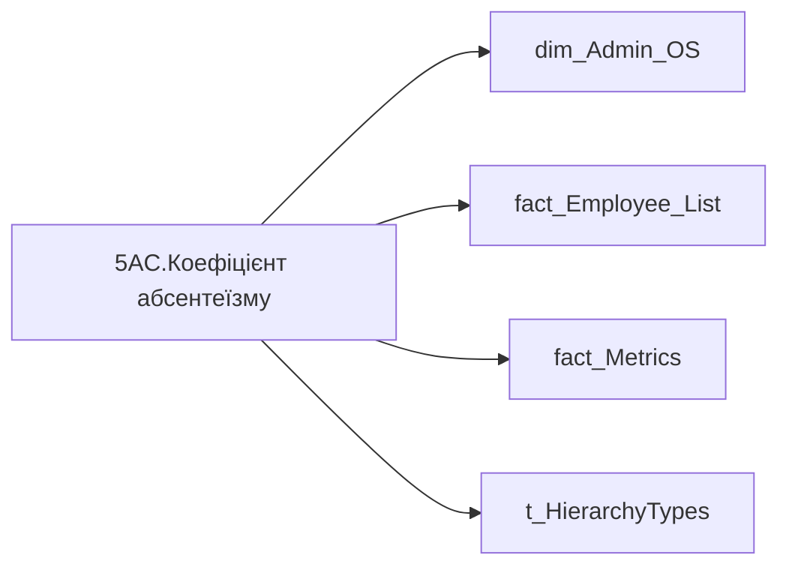

# 5AC.Коефіцієнт абсентеїзму

*тека `Group_Profile\Здоров'я та благополуччя` · формат `#,0.00%;-#,0.00%;#,0.00%`*

## Технічний опис

| Властивість | Значення |
|---|---|
| Тип | міра |
| Home table | _Measures |
| displayFolder | `Group_Profile\Здоров'я та благополуччя` |
| formatString | `#,0.00%;-#,0.00%;#,0.00%` |
| dataType | — |
| Прихована | ні |

### DAX

```dax
//************* ROLE FILTERS **************
VAR _roleIndex = SELECTEDVALUE ( 't_HierarchyTypes'[Index], 1 )   -- 0 = LT, 1 = Admin
VAR _filter_lt= TREATAS ( VALUES ( 'dim_Admin_LT_OS'[USER_ACCESS_ID] ),'dim_Admin_OS'[USER_ACCESS_ID] )

// //***** HEALTH AND WELLBEING FILTERS ******* 
// VAR _employee_list = VALUES('fact_Employee_List'[EMPLOYEE_ID])
// VAR _main_position_employees = 
//     CALCULATETABLE(
//         VALUES('fact_Employee_List'[USER_ACCESS_ID]),
//         REMOVEFILTERS('fact_Employee_List'), 
//         'fact_Employee_List'[STATUS_KEY] IN {"1","4"},
//         'fact_Employee_List'[EMPLOYEE_ID] IN _employee_list,
//         'fact_Employee_List'[IS_MAIN_POSITION] = 1
//     )
// VAR _filter0 = TREATAS(_main_position_employees, 'dim_Admin_OS'[USER_ACCESS_ID])

/* *********** ADMIN *********** */
VAR _admin = 
	CALCULATE(
		DIVIDE(
			SUM('fact_Metrics'[Sick_Leave_Day_Without_Pregnancy]),
			SUMX(
				'fact_Metrics',
				'fact_Metrics'[FTE_WEIGHTED_WORK_DAY_FOR_ABSENTEEISM] + 'fact_Metrics'[Sick_Leave_Day_Without_Pregnancy]
			)
		)
	)

/* *********** LT *********** */
VAR _admin_lt =
	CALCULATE(
		DIVIDE(
			SUM('fact_Metrics'[Sick_Leave_Day_Without_Pregnancy]),
			SUMX(
				'fact_Metrics',
				'fact_Metrics'[FTE_WEIGHTED_WORK_DAY_FOR_ABSENTEEISM] + 'fact_Metrics'[Sick_Leave_Day_Without_Pregnancy]
			)
		),
		REMOVEFILTERS('fact_Metrics'),
		_filter_lt
	)
VAR _res =
	SWITCH (
		_roleIndex,
		0, _admin_lt,    -- LT
		1, _admin,       -- Admin
		_admin
	)

RETURN COALESCE(_res, 0)
```

### Джерела даних

Вихідні таблиці: `DM.vw_R27_dim_Employee_Access_List`

Колонки: `EMPLOYEE_ID`, `FTE_WEIGHTED_WORK_DAY_FOR_ABSENTEEISM`, `IS_MAIN_POSITION`, `Index`, `STATUS_KEY`, `Sick_Leave_Day_Without_Pregnancy`, `USER_ACCESS_ID`

Power Query: `dim_Admin_OS`

### Залежності (таблиці й колонки)

Таблиці: `dim_Admin_OS`, `fact_Employee_List`, `fact_Metrics`, `t_HierarchyTypes`

Колонки: `dim_Admin_LT_OS[USER_ACCESS_ID]`, `dim_Admin_OS[USER_ACCESS_ID]`, `fact_Employee_List[EMPLOYEE_ID]`, `fact_Employee_List[IS_MAIN_POSITION]`, `fact_Employee_List[STATUS_KEY]`, `fact_Employee_List[USER_ACCESS_ID]`, `fact_Metrics[FTE_WEIGHTED_WORK_DAY_FOR_ABSENTEEISM]`, `fact_Metrics[Sick_Leave_Day_Without_Pregnancy]`, `t_HierarchyTypes[Index]`

### Схема



---

## Бізнес-суть

### Опис із ТЗ

1 - Так   0 - Ні

Коефіцієнт абсентизму розраховується по працівнику за попередні 12 місяців, НЕ включаючи поточний місяць.АБСЕНТИЗМ= (Кількість днів на лікарняному без днів на лікарняному по вагітності та пологам)/(відпрацьовані робочі дні у місяці*`FTE_employee` + дні на лік-му (без днів на лікарняному по вагітності та пологам)   = `Sick_Leave_Day_Without_Pregnancy`/(`FTE_weighted_work_day_for_absenteeism`+`Sick_Leave_Day_Without_Pregnancy`)

За виключенням лікарняних, де `is_pregnancy`=0 за останні 12 міс, не включаючи поточний

Розрахункове поле.   Коефіцієнт абсентизму розраховується по команді за попередні 12 місяців, НЕ включаючи поточний місяць.АБСЕНТИЗМ= (Кількість днів на лікарняному, крім днів на лікарняному по вагітності та пологам) по кожному працівнику та періоду/(відпрацьовані робочі дні у місяці*`FTE_employee` + дні на лік-му (без днів на лікарняному по вагітності та пологам)   = `Sick_Leave_Day_Without_Pregnancy`/ (`FTE_weighted_work_day_for_absenteeism`+`Sick_Leave_Day_Without_Pregnancy`)

Розрахункове поле.   Коефіцієнт абсентизму розраховується по команді за попередні 12 місяців, НЕ включаючи поточний місяць. Розрахунок треба проводити за кожен період, так як `FTE_employee` може змінюватися.   АБСЕНТЕЇЗМ= (Кількість днів на лікарняному, крім днів на лікарняному по вагітності та пологам) по кожному працівнику та періоду/(відпрацьовані робочі дні у місяці*`FTE_employee` + дні на лік-му (без днів на лікарняному по вагітності та пологам) по кожному працівнику та періоду, де Кількість днів на лікарняному крім днів на лікарняному по вагітності та пологам = Sick_Leave_Day_Without_PregnancyВідпрацьовані робочих днів у місяці = `FTE_weighted_work_day_for_absenteeism`

??? note "Поля-джерела та пов'язані бізнес-метрики (9)"
    | Поле | Бізнес-метрики |
    |---|---|
    | `FTE_WEIGHTED_WORK_DAY_FOR_ABSENTEEISM` | Відпрацьовані робочі дні у місяці зважені на FTE_employee |
    | `IS_MAIN_POSITION` | Пріоритетне місце роботи · is_main_position |
    | `Sick_Leave_Day_Without_Pregnancy` | <br>Абсентеїзм · Кількість робочих днів на лікарняному зважена на FTE · Коеф. Абсентеїзму, % · Рівень абсентеїзму (%) · Коеф. Абсентизму, % · Абсентеїзм |

**Вимоги (ТЗ):**

- [Індивідуальний профіль працівника › Історія по посадам](https://dev.azure.com/MHPITDepProjects/People%20Digital%20Profile%20%28PDP%29/_wiki/wikis/PDP.wiki?pagePath=/%D0%A4%D1%83%D0%BD%D0%BA%D1%86%D1%96%D0%BE%D0%BD%D0%B0%D0%BB%D1%8C%D0%BD%D1%96%20%D0%B2%D0%B8%D0%BC%D0%BE%D0%B3%D0%B8/%D0%92%D0%B8%D0%BC%D0%BE%D0%B3%D0%B8%20%D0%B4%D0%BE%20%D0%B7%D0%B2%D1%96%D1%82%D1%83%20People%20Digital%20Profile/%D0%86%D0%BD%D0%B4%D0%B8%D0%B2%D1%96%D0%B4%D1%83%D0%B0%D0%BB%D1%8C%D0%BD%D0%B8%D0%B9%20%D0%BF%D1%80%D0%BE%D1%84%D1%96%D0%BB%D1%8C%20%D0%BF%D1%80%D0%B0%D1%86%D1%96%D0%B2%D0%BD%D0%B8%D0%BA%D0%B0/%D0%86%D1%81%D1%82%D0%BE%D1%80%D1%96%D1%8F%20%D0%BF%D0%BE%20%D0%BF%D0%BE%D1%81%D0%B0%D0%B4%D0%B0%D0%BC)
- [Індивідуальний профіль працівника › Історія по посадам › Реліз 1. Історія по посадам](https://dev.azure.com/MHPITDepProjects/People%20Digital%20Profile%20%28PDP%29/_wiki/wikis/PDP.wiki?pagePath=/%D0%A4%D1%83%D0%BD%D0%BA%D1%86%D1%96%D0%BE%D0%BD%D0%B0%D0%BB%D1%8C%D0%BD%D1%96%20%D0%B2%D0%B8%D0%BC%D0%BE%D0%B3%D0%B8/%D0%92%D0%B8%D0%BC%D0%BE%D0%B3%D0%B8%20%D0%B4%D0%BE%20%D0%B7%D0%B2%D1%96%D1%82%D1%83%20People%20Digital%20Profile/%D0%86%D0%BD%D0%B4%D0%B8%D0%B2%D1%96%D0%B4%D1%83%D0%B0%D0%BB%D1%8C%D0%BD%D0%B8%D0%B9%20%D0%BF%D1%80%D0%BE%D1%84%D1%96%D0%BB%D1%8C%20%D0%BF%D1%80%D0%B0%D1%86%D1%96%D0%B2%D0%BD%D0%B8%D0%BA%D0%B0/%D0%86%D1%81%D1%82%D0%BE%D1%80%D1%96%D1%8F%20%D0%BF%D0%BE%20%D0%BF%D0%BE%D1%81%D0%B0%D0%B4%D0%B0%D0%BC/%D0%A0%D0%B5%D0%BB%D1%96%D0%B7%201.%20%D0%86%D1%81%D1%82%D0%BE%D1%80%D1%96%D1%8F%20%D0%BF%D0%BE%20%D0%BF%D0%BE%D1%81%D0%B0%D0%B4%D0%B0%D0%BC)
- [Індивідуальний профіль працівника › Паспортна частина індивідуального профілю співробітника › Деталізація в паспортній частині](https://dev.azure.com/MHPITDepProjects/People%20Digital%20Profile%20%28PDP%29/_wiki/wikis/PDP.wiki?pagePath=/%D0%A4%D1%83%D0%BD%D0%BA%D1%86%D1%96%D0%BE%D0%BD%D0%B0%D0%BB%D1%8C%D0%BD%D1%96%20%D0%B2%D0%B8%D0%BC%D0%BE%D0%B3%D0%B8/%D0%92%D0%B8%D0%BC%D0%BE%D0%B3%D0%B8%20%D0%B4%D0%BE%20%D0%B7%D0%B2%D1%96%D1%82%D1%83%20People%20Digital%20Profile/%D0%86%D0%BD%D0%B4%D0%B8%D0%B2%D1%96%D0%B4%D1%83%D0%B0%D0%BB%D1%8C%D0%BD%D0%B8%D0%B9%20%D0%BF%D1%80%D0%BE%D1%84%D1%96%D0%BB%D1%8C%20%D0%BF%D1%80%D0%B0%D1%86%D1%96%D0%B2%D0%BD%D0%B8%D0%BA%D0%B0/%D0%9F%D0%B0%D1%81%D0%BF%D0%BE%D1%80%D1%82%D0%BD%D0%B0%20%D1%87%D0%B0%D1%81%D1%82%D0%B8%D0%BD%D0%B0%20%D1%96%D0%BD%D0%B4%D0%B8%D0%B2%D1%96%D0%B4%D1%83%D0%B0%D0%BB%D1%8C%D0%BD%D0%BE%D0%B3%D0%BE%20%D0%BF%D1%80%D0%BE%D1%84%D1%96%D0%BB%D1%8E%20%D1%81%D0%BF%D1%96%D0%B2%D1%80%D0%BE%D0%B1%D1%96%D1%82%D0%BD%D0%B8%D0%BA%D0%B0/%D0%94%D0%B5%D1%82%D0%B0%D0%BB%D1%96%D0%B7%D0%B0%D1%86%D1%96%D1%8F%20%D0%B2%20%D0%BF%D0%B0%D1%81%D0%BF%D0%BE%D1%80%D1%82%D0%BD%D1%96%D0%B9%20%D1%87%D0%B0%D1%81%D1%82%D0%B8%D0%BD%D1%96)
- [Індивідуальний профіль працівника › Сторінка Взаємодія Viva та залученість працівника › Сторінка Ефективність працівника › Вітрина Відвідування офісів](https://dev.azure.com/MHPITDepProjects/People%20Digital%20Profile%20%28PDP%29/_wiki/wikis/PDP.wiki?pagePath=/%D0%A4%D1%83%D0%BD%D0%BA%D1%86%D1%96%D0%BE%D0%BD%D0%B0%D0%BB%D1%8C%D0%BD%D1%96%20%D0%B2%D0%B8%D0%BC%D0%BE%D0%B3%D0%B8/%D0%92%D0%B8%D0%BC%D0%BE%D0%B3%D0%B8%20%D0%B4%D0%BE%20%D0%B7%D0%B2%D1%96%D1%82%D1%83%20People%20Digital%20Profile/%D0%86%D0%BD%D0%B4%D0%B8%D0%B2%D1%96%D0%B4%D1%83%D0%B0%D0%BB%D1%8C%D0%BD%D0%B8%D0%B9%20%D0%BF%D1%80%D0%BE%D1%84%D1%96%D0%BB%D1%8C%20%D0%BF%D1%80%D0%B0%D1%86%D1%96%D0%B2%D0%BD%D0%B8%D0%BA%D0%B0/%D0%A1%D1%82%D0%BE%D1%80%D1%96%D0%BD%D0%BA%D0%B0%20%D0%92%D0%B7%D0%B0%D1%94%D0%BC%D0%BE%D0%B4%D1%96%D1%8F%20Viva%20%D1%82%D0%B0%20%D0%B7%D0%B0%D0%BB%D1%83%D1%87%D0%B5%D0%BD%D1%96%D1%81%D1%82%D1%8C%20%D0%BF%D1%80%D0%B0%D1%86%D1%96%D0%B2%D0%BD%D0%B8%D0%BA%D0%B0/%D0%A1%D1%82%D0%BE%D1%80%D1%96%D0%BD%D0%BA%D0%B0%20%D0%95%D1%84%D0%B5%D0%BA%D1%82%D0%B8%D0%B2%D0%BD%D1%96%D1%81%D1%82%D1%8C%20%D0%BF%D1%80%D0%B0%D1%86%D1%96%D0%B2%D0%BD%D0%B8%D0%BA%D0%B0/%D0%92%D1%96%D1%82%D1%80%D0%B8%D0%BD%D0%B0%20%D0%92%D1%96%D0%B4%D0%B2%D1%96%D0%B4%D1%83%D0%B2%D0%B0%D0%BD%D0%BD%D1%8F%20%D0%BE%D1%84%D1%96%D1%81%D1%96%D0%B2)
- [Індивідуальний профіль працівника › Сторінка Загальна інформація про працівника](https://dev.azure.com/MHPITDepProjects/People%20Digital%20Profile%20%28PDP%29/_wiki/wikis/PDP.wiki?pagePath=/%D0%A4%D1%83%D0%BD%D0%BA%D1%86%D1%96%D0%BE%D0%BD%D0%B0%D0%BB%D1%8C%D0%BD%D1%96%20%D0%B2%D0%B8%D0%BC%D0%BE%D0%B3%D0%B8/%D0%92%D0%B8%D0%BC%D0%BE%D0%B3%D0%B8%20%D0%B4%D0%BE%20%D0%B7%D0%B2%D1%96%D1%82%D1%83%20People%20Digital%20Profile/%D0%86%D0%BD%D0%B4%D0%B8%D0%B2%D1%96%D0%B4%D1%83%D0%B0%D0%BB%D1%8C%D0%BD%D0%B8%D0%B9%20%D0%BF%D1%80%D0%BE%D1%84%D1%96%D0%BB%D1%8C%20%D0%BF%D1%80%D0%B0%D1%86%D1%96%D0%B2%D0%BD%D0%B8%D0%BA%D0%B0/%D0%A1%D1%82%D0%BE%D1%80%D1%96%D0%BD%D0%BA%D0%B0%20%D0%97%D0%B0%D0%B3%D0%B0%D0%BB%D1%8C%D0%BD%D0%B0%20%D1%96%D0%BD%D1%84%D0%BE%D1%80%D0%BC%D0%B0%D1%86%D1%96%D1%8F%20%D0%BF%D1%80%D0%BE%20%D0%BF%D1%80%D0%B0%D1%86%D1%96%D0%B2%D0%BD%D0%B8%D0%BA%D0%B0)
- [Індивідуальний профіль працівника › Сторінка Здоров'я та благополуччя працівника](https://dev.azure.com/MHPITDepProjects/People%20Digital%20Profile%20%28PDP%29/_wiki/wikis/PDP.wiki?pagePath=/%D0%A4%D1%83%D0%BD%D0%BA%D1%86%D1%96%D0%BE%D0%BD%D0%B0%D0%BB%D1%8C%D0%BD%D1%96%20%D0%B2%D0%B8%D0%BC%D0%BE%D0%B3%D0%B8/%D0%92%D0%B8%D0%BC%D0%BE%D0%B3%D0%B8%20%D0%B4%D0%BE%20%D0%B7%D0%B2%D1%96%D1%82%D1%83%20People%20Digital%20Profile/%D0%86%D0%BD%D0%B4%D0%B8%D0%B2%D1%96%D0%B4%D1%83%D0%B0%D0%BB%D1%8C%D0%BD%D0%B8%D0%B9%20%D0%BF%D1%80%D0%BE%D1%84%D1%96%D0%BB%D1%8C%20%D0%BF%D1%80%D0%B0%D1%86%D1%96%D0%B2%D0%BD%D0%B8%D0%BA%D0%B0/%D0%A1%D1%82%D0%BE%D1%80%D1%96%D0%BD%D0%BA%D0%B0%20%D0%97%D0%B4%D0%BE%D1%80%D0%BE%D0%B2%27%D1%8F%20%D1%82%D0%B0%20%D0%B1%D0%BB%D0%B0%D0%B3%D0%BE%D0%BF%D0%BE%D0%BB%D1%83%D1%87%D1%87%D1%8F%20%D0%BF%D1%80%D0%B0%D1%86%D1%96%D0%B2%D0%BD%D0%B8%D0%BA%D0%B0)
- [Командний профіль › Паспортна частина групового профілю › Редизайн паспортної частини групового профілю](https://dev.azure.com/MHPITDepProjects/People%20Digital%20Profile%20%28PDP%29/_wiki/wikis/PDP.wiki?pagePath=/%D0%A4%D1%83%D0%BD%D0%BA%D1%86%D1%96%D0%BE%D0%BD%D0%B0%D0%BB%D1%8C%D0%BD%D1%96%20%D0%B2%D0%B8%D0%BC%D0%BE%D0%B3%D0%B8/%D0%92%D0%B8%D0%BC%D0%BE%D0%B3%D0%B8%20%D0%B4%D0%BE%20%D0%B7%D0%B2%D1%96%D1%82%D1%83%20People%20Digital%20Profile/%D0%9A%D0%BE%D0%BC%D0%B0%D0%BD%D0%B4%D0%BD%D0%B8%D0%B9%20%D0%BF%D1%80%D0%BE%D1%84%D1%96%D0%BB%D1%8C/%D0%9F%D0%B0%D1%81%D0%BF%D0%BE%D1%80%D1%82%D0%BD%D0%B0%20%D1%87%D0%B0%D1%81%D1%82%D0%B8%D0%BD%D0%B0%20%D0%B3%D1%80%D1%83%D0%BF%D0%BE%D0%B2%D0%BE%D0%B3%D0%BE%20%D0%BF%D1%80%D0%BE%D1%84%D1%96%D0%BB%D1%8E/%D0%A0%D0%B5%D0%B4%D0%B8%D0%B7%D0%B0%D0%B9%D0%BD%20%D0%BF%D0%B0%D1%81%D0%BF%D0%BE%D1%80%D1%82%D0%BD%D0%BE%D1%97%20%D1%87%D0%B0%D1%81%D1%82%D0%B8%D0%BD%D0%B8%20%D0%B3%D1%80%D1%83%D0%BF%D0%BE%D0%B2%D0%BE%D0%B3%D0%BE%20%D0%BF%D1%80%D0%BE%D1%84%D1%96%D0%BB%D1%8E)
- [Командний профіль › Паспортна частина групового профілю › Сторінка Картка команди](https://dev.azure.com/MHPITDepProjects/People%20Digital%20Profile%20%28PDP%29/_wiki/wikis/PDP.wiki?pagePath=/%D0%A4%D1%83%D0%BD%D0%BA%D1%86%D1%96%D0%BE%D0%BD%D0%B0%D0%BB%D1%8C%D0%BD%D1%96%20%D0%B2%D0%B8%D0%BC%D0%BE%D0%B3%D0%B8/%D0%92%D0%B8%D0%BC%D0%BE%D0%B3%D0%B8%20%D0%B4%D0%BE%20%D0%B7%D0%B2%D1%96%D1%82%D1%83%20People%20Digital%20Profile/%D0%9A%D0%BE%D0%BC%D0%B0%D0%BD%D0%B4%D0%BD%D0%B8%D0%B9%20%D0%BF%D1%80%D0%BE%D1%84%D1%96%D0%BB%D1%8C/%D0%9F%D0%B0%D1%81%D0%BF%D0%BE%D1%80%D1%82%D0%BD%D0%B0%20%D1%87%D0%B0%D1%81%D1%82%D0%B8%D0%BD%D0%B0%20%D0%B3%D1%80%D1%83%D0%BF%D0%BE%D0%B2%D0%BE%D0%B3%D0%BE%20%D0%BF%D1%80%D0%BE%D1%84%D1%96%D0%BB%D1%8E/%D0%A1%D1%82%D0%BE%D1%80%D1%96%D0%BD%D0%BA%D0%B0%20%D0%9A%D0%B0%D1%80%D1%82%D0%BA%D0%B0%20%D0%BA%D0%BE%D0%BC%D0%B0%D0%BD%D0%B4%D0%B8)
- [Командний профіль › Сторінка Здоров'я та благополуччя команди](https://dev.azure.com/MHPITDepProjects/People%20Digital%20Profile%20%28PDP%29/_wiki/wikis/PDP.wiki?pagePath=/%D0%A4%D1%83%D0%BD%D0%BA%D1%86%D1%96%D0%BE%D0%BD%D0%B0%D0%BB%D1%8C%D0%BD%D1%96%20%D0%B2%D0%B8%D0%BC%D0%BE%D0%B3%D0%B8/%D0%92%D0%B8%D0%BC%D0%BE%D0%B3%D0%B8%20%D0%B4%D0%BE%20%D0%B7%D0%B2%D1%96%D1%82%D1%83%20People%20Digital%20Profile/%D0%9A%D0%BE%D0%BC%D0%B0%D0%BD%D0%B4%D0%BD%D0%B8%D0%B9%20%D0%BF%D1%80%D0%BE%D1%84%D1%96%D0%BB%D1%8C/%D0%A1%D1%82%D0%BE%D1%80%D1%96%D0%BD%D0%BA%D0%B0%20%D0%97%D0%B4%D0%BE%D1%80%D0%BE%D0%B2%27%D1%8F%20%D1%82%D0%B0%20%D0%B1%D0%BB%D0%B0%D0%B3%D0%BE%D0%BF%D0%BE%D0%BB%D1%83%D1%87%D1%87%D1%8F%20%D0%BA%D0%BE%D0%BC%D0%B0%D0%BD%D0%B4%D0%B8)
- [Командний профіль › Сторінка Моя команда › ТЗ. Деталізація метрик групового профілю звіту](https://dev.azure.com/MHPITDepProjects/People%20Digital%20Profile%20%28PDP%29/_wiki/wikis/PDP.wiki?pagePath=/%D0%A4%D1%83%D0%BD%D0%BA%D1%86%D1%96%D0%BE%D0%BD%D0%B0%D0%BB%D1%8C%D0%BD%D1%96%20%D0%B2%D0%B8%D0%BC%D0%BE%D0%B3%D0%B8/%D0%92%D0%B8%D0%BC%D0%BE%D0%B3%D0%B8%20%D0%B4%D0%BE%20%D0%B7%D0%B2%D1%96%D1%82%D1%83%20People%20Digital%20Profile/%D0%9A%D0%BE%D0%BC%D0%B0%D0%BD%D0%B4%D0%BD%D0%B8%D0%B9%20%D0%BF%D1%80%D0%BE%D1%84%D1%96%D0%BB%D1%8C/%D0%A1%D1%82%D0%BE%D1%80%D1%96%D0%BD%D0%BA%D0%B0%20%D0%9C%D0%BE%D1%8F%20%D0%BA%D0%BE%D0%BC%D0%B0%D0%BD%D0%B4%D0%B0/%D0%A2%D0%97.%20%D0%94%D0%B5%D1%82%D0%B0%D0%BB%D1%96%D0%B7%D0%B0%D1%86%D1%96%D1%8F%20%D0%BC%D0%B5%D1%82%D1%80%D0%B8%D0%BA%20%D0%B3%D1%80%D1%83%D0%BF%D0%BE%D0%B2%D0%BE%D0%B3%D0%BE%20%D0%BF%D1%80%D0%BE%D1%84%D1%96%D0%BB%D1%8E%20%D0%B7%D0%B2%D1%96%D1%82%D1%83)
- [Командний профіль › Сторінка Плинність та Exits › ТЗ на вітрину Exits](https://dev.azure.com/MHPITDepProjects/People%20Digital%20Profile%20%28PDP%29/_wiki/wikis/PDP.wiki?pagePath=/%D0%A4%D1%83%D0%BD%D0%BA%D1%86%D1%96%D0%BE%D0%BD%D0%B0%D0%BB%D1%8C%D0%BD%D1%96%20%D0%B2%D0%B8%D0%BC%D0%BE%D0%B3%D0%B8/%D0%92%D0%B8%D0%BC%D0%BE%D0%B3%D0%B8%20%D0%B4%D0%BE%20%D0%B7%D0%B2%D1%96%D1%82%D1%83%20People%20Digital%20Profile/%D0%9A%D0%BE%D0%BC%D0%B0%D0%BD%D0%B4%D0%BD%D0%B8%D0%B9%20%D0%BF%D1%80%D0%BE%D1%84%D1%96%D0%BB%D1%8C/%D0%A1%D1%82%D0%BE%D1%80%D1%96%D0%BD%D0%BA%D0%B0%20%D0%9F%D0%BB%D0%B8%D0%BD%D0%BD%D1%96%D1%81%D1%82%D1%8C%20%D1%82%D0%B0%20Exits/%D0%A2%D0%97%20%D0%BD%D0%B0%20%D0%B2%D1%96%D1%82%D1%80%D0%B8%D0%BD%D1%83%20Exits)

## На сторінках звіту

[Group Profile](../report/group-profile.md)

## Пов'язані міри

**Використовується в:** [GP.Рівень абсентеїзму (%)](../measures/gp-riven-absenteizmu.md)

## Нотатки

_порожньо_
