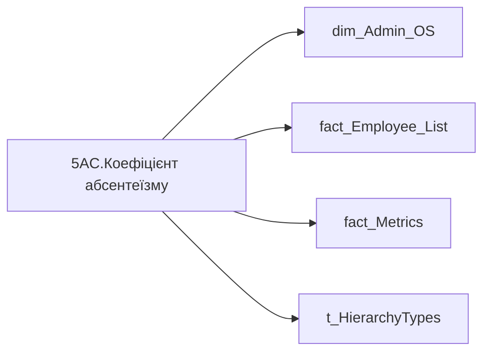

# 5AC.Коефіцієнт абсентеїзму

*тека `Group_Profile\Здоров'я та благополуччя` · формат `#,0.00%;-#,0.00%;#,0.00%`*

## Технічний опис

| Властивість | Значення |
|---|---|
| Тип | міра |
| Home table | _Measures |
| displayFolder | `Group_Profile\Здоров'я та благополуччя` |
| formatString | `#,0.00%;-#,0.00%;#,0.00%` |
| dataType | — |
| Прихована | ні |

### DAX

```dax
//************* ROLE FILTERS **************
VAR _roleIndex = SELECTEDVALUE ( 't_HierarchyTypes'[Index], 1 )   -- 0 = LT, 1 = Admin
VAR _filter_lt= TREATAS ( VALUES ( 'dim_Admin_LT_OS'[USER_ACCESS_ID] ),'dim_Admin_OS'[USER_ACCESS_ID] )

// //***** HEALTH AND WELLBEING FILTERS ******* 
// VAR _employee_list = VALUES('fact_Employee_List'[EMPLOYEE_ID])
// VAR _main_position_employees = 
//     CALCULATETABLE(
//         VALUES('fact_Employee_List'[USER_ACCESS_ID]),
//         REMOVEFILTERS('fact_Employee_List'), 
//         'fact_Employee_List'[STATUS_KEY] IN {"1","4"},
//         'fact_Employee_List'[EMPLOYEE_ID] IN _employee_list,
//         'fact_Employee_List'[IS_MAIN_POSITION] = 1
//     )
// VAR _filter0 = TREATAS(_main_position_employees, 'dim_Admin_OS'[USER_ACCESS_ID])

/* *********** ADMIN *********** */
VAR _admin = 
	CALCULATE(
		DIVIDE(
			SUM('fact_Metrics'[Sick_Leave_Day_Without_Pregnancy]),
			SUMX(
				'fact_Metrics',
				'fact_Metrics'[FTE_WEIGHTED_WORK_DAY_FOR_ABSENTEEISM] + 'fact_Metrics'[Sick_Leave_Day_Without_Pregnancy]
			)
		)
	)

/* *********** LT *********** */
VAR _admin_lt =
	CALCULATE(
		DIVIDE(
			SUM('fact_Metrics'[Sick_Leave_Day_Without_Pregnancy]),
			SUMX(
				'fact_Metrics',
				'fact_Metrics'[FTE_WEIGHTED_WORK_DAY_FOR_ABSENTEEISM] + 'fact_Metrics'[Sick_Leave_Day_Without_Pregnancy]
			)
		),
		REMOVEFILTERS('fact_Metrics'),
		_filter_lt
	)
VAR _res =
	SWITCH (
		_roleIndex,
		0, _admin_lt,    -- LT
		1, _admin,       -- Admin
		_admin
	)

RETURN COALESCE(_res, 0)
```

### Джерела даних

Вихідні таблиці: `DM.vw_R27_dim_Employee_Access_List`

Колонки: `EMPLOYEE_ID`, `FTE_WEIGHTED_WORK_DAY_FOR_ABSENTEEISM`, `IS_MAIN_POSITION`, `Index`, `STATUS_KEY`, `Sick_Leave_Day_Without_Pregnancy`, `USER_ACCESS_ID`

Power Query: `dim_Admin_OS`

### Залежності (таблиці й колонки)

Таблиці: `dim_Admin_OS`, `fact_Employee_List`, `fact_Metrics`, `t_HierarchyTypes`

Колонки: `dim_Admin_LT_OS[USER_ACCESS_ID]`, `dim_Admin_OS[USER_ACCESS_ID]`, `fact_Employee_List[EMPLOYEE_ID]`, `fact_Employee_List[IS_MAIN_POSITION]`, `fact_Employee_List[STATUS_KEY]`, `fact_Employee_List[USER_ACCESS_ID]`, `fact_Metrics[FTE_WEIGHTED_WORK_DAY_FOR_ABSENTEEISM]`, `fact_Metrics[Sick_Leave_Day_Without_Pregnancy]`, `t_HierarchyTypes[Index]`

### Схема



---

## Бізнес-суть

!!! note "Бізнес-визначення відсутнє"
    Поля міри не зіставлено з wiki «Таблицями джерел даних». Можна заповнити вручну в `manualNotes`.

## На сторінках звіту

[Group Profile](../report/group-profile.md)

## Пов'язані міри

**Використовується в:** [GP.Рівень абсентеїзму (%)](../measures/gp-riven-absenteizmu.md)

## Нотатки

_порожньо_
