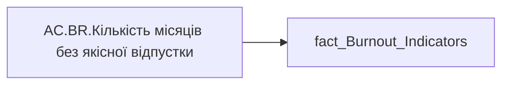

# AC.BR.Кількість місяців без якісної відпустки

| Властивість | Значення |
|---|---|
| Тип | міра |
| Home table | _Measures |
| displayFolder | `Analytical Cases\Burnout_Risk\Export` |
| formatString | `0` |
| dataType | — |
| Прихована | ні |

## DAX

```dax
SUM(fact_Burnout_Indicators[NO_QUALITY_VACATION_MONTHS])
```

## Джерела


Колонки: `NO_QUALITY_VACATION_MONTHS`

Power Query: `fact_Burnout_Indicators`

## Бізнес-суть

NO_QUALITY_VACATION_MONTHS → Кількість місяців без якісної відпустки

**Вимоги:** `Кейс-Утримання-працівників/Опис-джерел-для-сторінки-%22Кейс-звільнення-(вигорання)%22`

## Залежності

Таблиці: `fact_Burnout_Indicators`

Колонки: `fact_Burnout_Indicators[NO_QUALITY_VACATION_MONTHS]`

## Схема



## Нотатки

_порожньо_
