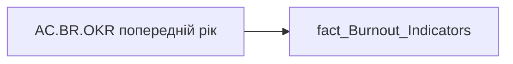

# AC.BR.OKR попередній рік

| Властивість | Значення |
|---|---|
| Тип | міра |
| Home table | _Measures |
| displayFolder | `Analytical Cases\Burnout_Risk\Export` |
| formatString | `0.00` |
| dataType | — |
| Прихована | ні |

## DAX

```dax
SELECTEDVALUE('fact_Burnout_Indicators'[OKR_PREV_YEAR_RATE])
```

## Джерела


Колонки: `OKR_PREV_YEAR_RATE`

Power Query: `fact_Burnout_Indicators`

## Бізнес-суть

OKR_PREV_YEAR_RATE → OKR попередній рік; OKR_PREV_YEAR_RATE → Значення коефіцієнта індивідуального бонусу за передостанній період; OKR_PREV_YEAR_RATE → OKR команди за передостанній рік

Для розрахунку метрики "Тренд OKR" Ці дані виводяться в деталізацію по тренду оцінки ОКР Тимчасово це буде коефіцієнт індивідуального бонусу, а не оцінка ОКР.  <br>Визначається по показнику керівника цієї команди.  <br>Якщо у керівника є ОКР, який було складено/оцінено по іншому кадровому підрозділу/організації, то такий ОКР  не відображається. Наприклад, керівник в 2023 році працював на іншому підприємстві чи підрозділі.

**Вимоги:** `Кейс-Втрати-Продуктивності-Працівників/Деталізація-метрик-в-кейсі-Продуктивність`, `Кейс-Утримання-працівників/Опис-джерел-для-сторінки-%22Кейс-звільнення-(вигорання)%22`, `Командний-профіль/Паспортна-частина-групового-профілю/Додати-інформацію-про-ОКР-команди-та-середню-оцінку-результативності-по-команді`

## Залежності

Таблиці: `fact_Burnout_Indicators`

Колонки: `fact_Burnout_Indicators[OKR_PREV_YEAR_RATE]`

## Схема



## Нотатки

_порожньо_
