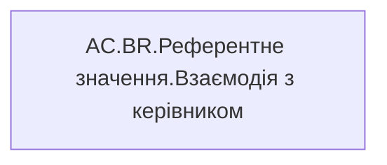

# AC.BR.Референтне значення.Взаємодія з керівником

*тека `Analytical Cases\Burnout_Risk\Export`*

## Технічний опис

| Властивість | Значення |
|---|---|
| Тип | міра |
| Home table | _Measures |
| displayFolder | `Analytical Cases\Burnout_Risk\Export` |
| formatString | — |
| dataType | — |
| Прихована | ні |

### DAX

```dax
IF(NOT(ISBLANK([AC.BR.Годин взаємодії з керівником])),"<= 30 хв")
```

### Джерела даних

—

### Залежності (таблиці й колонки)

—

### Схема



---

## Бізнес-суть

!!! note "Бізнес-визначення відсутнє"
    Поля міри не зіставлено з wiki «Таблицями джерел даних». Можна заповнити вручну в `manualNotes`.

## На сторінках звіту

[Утримання працівників](../report/utrymannia-pratsivnykiv.md)

## Пов'язані міри

**Використовує:** [AC.BR.Годин взаємодії з керівником](../measures/ac-br-hodyn-vzaiemodii-z-kerivnykom.md)

## Нотатки

_порожньо_
