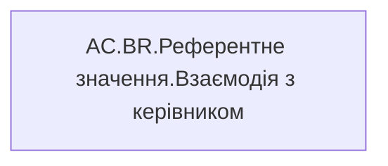

# AC.BR.Референтне значення.Взаємодія з керівником

| Властивість | Значення |
|---|---|
| Тип | міра |
| Home table | _Measures |
| displayFolder | `Analytical Cases\Burnout_Risk\Export` |
| formatString | — |
| dataType | — |
| Прихована | ні |

## DAX

```dax
IF(NOT(ISBLANK([AC.BR.Годин взаємодії з керівником])),"<= 30 хв")
```

## Джерела

—

## Бізнес-суть

!!! warning "Без бізнес-визначення"
    Поля міри не знайдено у wiki «Таблицях джерел даних». Заповніть `manualNotes`.

## Залежності

Міри: [AC.BR.Годин взаємодії з керівником](../measures/ac-br-hodyn-vzaiemodii-z-kerivnykom.md)


## Схема



## Нотатки

_порожньо_
