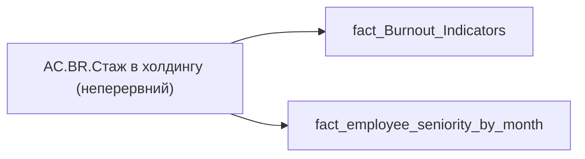

# AC.BR.Стаж в холдингу (неперервний)

| Властивість | Значення |
|---|---|
| Тип | міра |
| Home table | _Measures |
| displayFolder | `Analytical Cases\Burnout_Risk\Export` |
| formatString | — |
| dataType | — |
| Прихована | ні |

## DAX

```dax
VAR _user = VALUES('fact_Burnout_Indicators'[USER_ACCESS_ID])
VAR _seniority = 
	CALCULATE(
		SELECTEDVALUE(fact_employee_seniority_by_month[seniority_LAST_HOLDING_HIRE_DATE]),
		TREATAS(_user, 'fact_employee_seniority_by_month'[USER_ACCESS_ID])
	)
VAR _years = ROUNDDOWN(_seniority/12,0)
VAR _month = _seniority - _years *12
VAR _res = 
	IF(
		NOT ISBLANK( _seniority ),
		IF(
			NOT ISBLANK( _years ),
			_years & " р."
		) & " " &
		IF(
			NOT ISBLANK( _month ) && _month <> 0,
			_month & " міс."
		)
	)
RETURN _res
```

## Джерела

Вихідні таблиці: `DM.vw_R27_fact_employee_seniority_by_month_PDP`

Колонки: `USER_ACCESS_ID`, `seniority_LAST_HOLDING_HIRE_DATE`

Power Query: `fact_Burnout_Indicators`

## Бізнес-суть

seniority_LAST_HOLDING_HIRE_DATE → Стаж в холдингу останній; seniority_LAST_HOLDING_HIRE_DATE → Стаж в холдингу; seniority_LAST_HOLDING_HIRE_DATE → Стаж в холдингу (останній)

Значення поля в місяцях потрібно перевести в роки та місяці. Наприклад, якшо seniority_LAST_HOLDING_HIRE_DATE= 17, то в звіті треба відобразити 1 рік 5 місяців.

**Вимоги:** `Індивідуальний-профіль-працівника/Історія-по-посадам`, `Індивідуальний-профіль-працівника/Історія-по-посадам/Реліз-1.-Історія-по-посадам`, `Індивідуальний-профіль-працівника/Сторінка-Загальна-інформація-про-працівника`, `Командний-профіль/Сторінка-Моя-команда/ТЗ.-Деталізація-метрик-групового-профілю-звіту`

## Залежності

Таблиці: `fact_Burnout_Indicators`, `fact_employee_seniority_by_month`

Колонки: `fact_Burnout_Indicators[USER_ACCESS_ID]`, `fact_employee_seniority_by_month[USER_ACCESS_ID]`, `fact_employee_seniority_by_month[seniority_LAST_HOLDING_HIRE_DATE]`

## Схема



## Нотатки

_порожньо_
