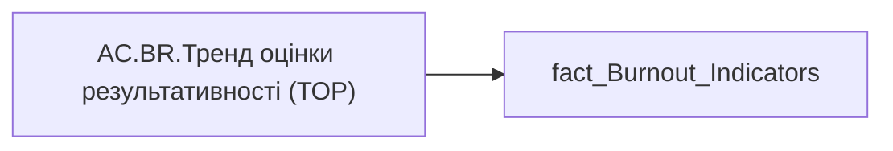

# AC.BR.Тренд оцінки результативності (ТОР)

*тека `Analytical Cases\Burnout_Risk\Export`*

## Технічний опис

| Властивість | Значення |
|---|---|
| Тип | міра |
| Home table | _Measures |
| displayFolder | `Analytical Cases\Burnout_Risk\Export` |
| formatString | — |
| dataType | — |
| Прихована | ні |

### DAX

```dax
SELECTEDVALUE('fact_Burnout_Indicators'[PERFORMANCE_RATE_TREND])
```

### Джерела даних


Колонки: `PERFORMANCE_RATE_TREND`

Power Query: `fact_Burnout_Indicators`

### Залежності (таблиці й колонки)

Таблиці: `fact_Burnout_Indicators`

Колонки: `fact_Burnout_Indicators[PERFORMANCE_RATE_TREND]`

### Схема



---

## Бізнес-суть

PERFORMANCE_RATE_TREND → Тренд Оцінки рез-ті (%); PERFORMANCE_RATE_TREND → Тренд оцінки результативності

**Вимоги:** `Кейс-Втрати-Продуктивності-Працівників`, `Кейс-Утримання-працівників/Опис-джерел-для-сторінки-%22Кейс-звільнення-(вигорання)%22`

## На сторінках звіту

[Утримання працівників](../report/utrymannia-pratsivnykiv.md)

## Пов'язані міри

_Прямих зв'язків з іншими мірами немає._

## Нотатки

_порожньо_
