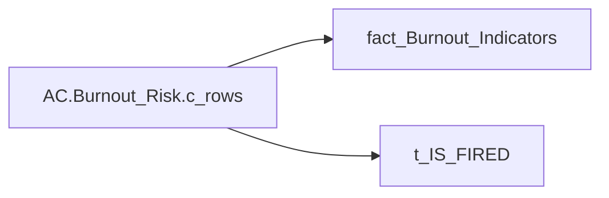

# AC.Burnout_Risk.c_rows

| Властивість | Значення |
|---|---|
| Тип | міра |
| Home table | _Measures |
| displayFolder | `Analytical Cases\Burnout_Risk\Main` |
| formatString | `0` |
| dataType | — |
| Прихована | ні |

## DAX

```dax
SWITCH(
	SELECTEDVALUE('t_IS_FIRED'[IS_FIRED]),
	0, 
	CALCULATE(
		COUNTROWS('fact_Burnout_Indicators'),
		'fact_Burnout_Indicators'[IS_FIRED] = FALSE()
	),
	1,
	CALCULATE(
		COUNTROWS('fact_Burnout_Indicators'),
		'fact_Burnout_Indicators'[IS_FIRED] = TRUE()
	)
)
```

## Джерела


Колонки: `IS_FIRED`

Power Query: `fact_Burnout_Indicators`

## Бізнес-суть

!!! warning "Без бізнес-визначення"
    Поля міри не знайдено у wiki «Таблицях джерел даних». Заповніть `manualNotes`.

## Залежності

Таблиці: `fact_Burnout_Indicators`, `t_IS_FIRED`

Колонки: `fact_Burnout_Indicators[IS_FIRED]`, `t_IS_FIRED[IS_FIRED]`

## Схема



## Нотатки

_порожньо_
