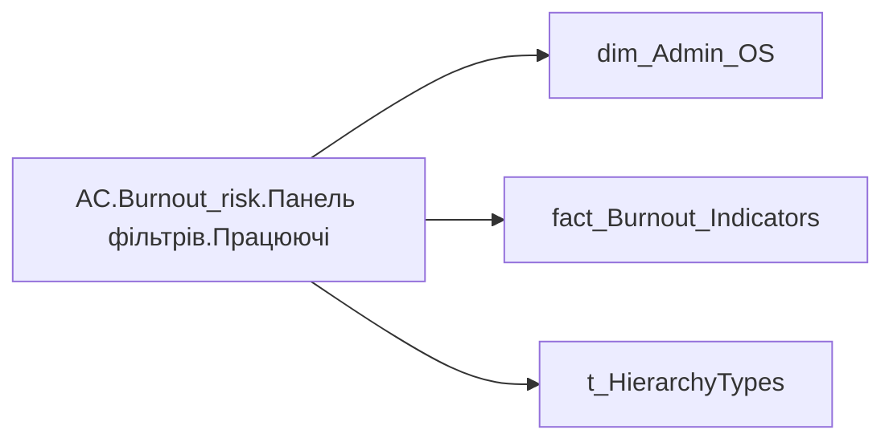

# AC.Burnout_risk.Панель фільтрів.Працюючі

*тека `Analytical Cases\Burnout_Risk\Main`*

## Бізнес-суть

!!! note "Бізнес-визначення відсутнє"
    Поля міри не зіставлено з wiki «Таблицями джерел даних». Можна заповнити вручну в `manualNotes`.

## На сторінках звіту

[Утримання працівників](../report/utrymannia-pratsivnykiv.md)

## Пов'язані міри

_Прямих зв'язків з іншими мірами немає._

---

## Технічний опис

| Властивість | Значення |
|---|---|
| Тип | міра |
| Home table | _Measures |
| displayFolder | `Analytical Cases\Burnout_Risk\Main` |
| formatString | — |
| dataType | — |
| Прихована | ні |

### DAX

```dax
VAR _Admin_lt = 
    CALCULATETABLE(
        VALUES(dim_Admin_LT_OS[USER_ACCESS_ID]),
        'dim_Admin_LT_OS'[USER_ROLE]  = "Адміністративний керівник"
    )

VAR _HRBP_lt = 
    CALCULATETABLE(
        VALUES(dim_Admin_LT_OS[USER_ACCESS_ID]),
        'dim_Admin_LT_OS'[USER_ROLE]  = "HRBP"
    )
VAR _Admin = 
	SWITCH(
		SELECTEDVALUE('t_HierarchyTypes'[HierarchyType]),
		"Hierarchy",
		CALCULATE(
			COUNTROWS(VALUES('fact_Burnout_Indicators'[USER_ACCESS_ID])),
            'dim_Admin_OS'[USER_ROLE]  = "Адміністративний керівник",
		    'fact_Burnout_Indicators'[IS_FIRED] = FALSE()
		),
		"Lead Team",
		CALCULATE(
			COUNTROWS(VALUES('fact_Burnout_Indicators'[USER_ACCESS_ID])),
			TREATAS(_Admin_lt, 'fact_Burnout_Indicators'[USER_ACCESS_ID]),
            'dim_Admin_OS'[USER_ROLE]  = "Адміністративний керівник",
		    'fact_Burnout_Indicators'[IS_FIRED] = FALSE()
		)
	)

VAR _HRBP = 
	SWITCH(
		SELECTEDVALUE('t_HierarchyTypes'[HierarchyType]),
		"Hierarchy",
		CALCULATE(
			COUNTROWS(VALUES('fact_Burnout_Indicators'[USER_ACCESS_ID])),
            'dim_Admin_OS'[USER_ROLE]  = "HRBP",
		    'fact_Burnout_Indicators'[IS_FIRED] = FALSE()
		),
		"Lead Team",
		CALCULATE(
			COUNTROWS(VALUES('fact_Burnout_Indicators'[USER_ACCESS_ID])),
			TREATAS(_HRBP_lt, 'fact_Burnout_Indicators'[USER_ACCESS_ID]),
            'dim_Admin_OS'[USER_ROLE]  = "HRBP",
		    'fact_Burnout_Indicators'[IS_FIRED] = FALSE()
		)
	)

VAR _v = 
 SWITCH(
    SELECTEDVALUE('dim_Admin_OS'[USER_ROLE]),
    "Адміністративний керівник", _Admin,
    "HRBP", _HRBP
 )

RETURN 
	"Панель фільтрів ("& 
		COALESCE(
			TRIM(
				FORMAT(
					_v, 
					"[uk-UA]# ##0"
				)
			),
			0
		) 
	& ")"
```

### Джерела даних

Вихідні таблиці: `DM.vw_R27_dim_Employee_Access_List`

Колонки: `HierarchyType`, `IS_FIRED`, `USER_ACCESS_ID`, `USER_ROLE`

Power Query: `dim_Admin_OS`

### Залежності (таблиці й колонки)

Таблиці: `dim_Admin_OS`, `fact_Burnout_Indicators`, `t_HierarchyTypes`

Колонки: `dim_Admin_LT_OS[USER_ROLE]`, `dim_Admin_OS[USER_ROLE]`, `fact_Burnout_Indicators[IS_FIRED]`, `fact_Burnout_Indicators[USER_ACCESS_ID]`, `t_HierarchyTypes[HierarchyType]`

### Схема



## Нотатки

_порожньо_
