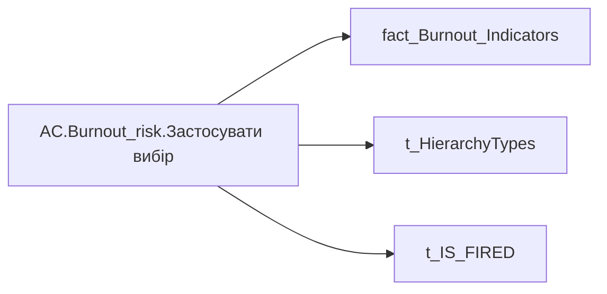

# AC.Burnout_risk.Застосувати вибір

| Властивість | Значення |
|---|---|
| Тип | міра |
| Home table | _Measures |
| displayFolder | `Analytical Cases\Burnout_Risk\Main` |
| formatString | — |
| dataType | — |
| Прихована | ні |

## DAX

```dax
VAR _v = 
SWITCH(
	SELECTEDVALUE('t_IS_FIRED'[IS_FIRED]),
	1,
	CALCULATE(
		COUNTROWS(
			VALUES('fact_Burnout_Indicators'[USER_ACCESS_ID])
		),
		'fact_Burnout_Indicators'[IS_FIRED] = TRUE()
	),
	0,
	SWITCH(
		SELECTEDVALUE('t_HierarchyTypes'[HierarchyType]),
		"Hierarchy",
		CALCULATE(
			COUNTROWS(VALUES('fact_Burnout_Indicators'[USER_ACCESS_ID])),
			'fact_Burnout_Indicators'[IS_FIRED] = FALSE()
		),
		"Lead Team",
		CALCULATE(
			COUNTROWS(VALUES('fact_Burnout_Indicators'[USER_ACCESS_ID])),
			'fact_Burnout_Indicators'[IS_FIRED] = FALSE(),
			TREATAS(VALUES(dim_Admin_LT_OS[USER_ACCESS_ID]), 'fact_Burnout_Indicators'[USER_ACCESS_ID])
		)
	)
)
RETURN 
	"Застосувати вибір ("& 
		COALESCE(
			TRIM(
				FORMAT(
					COALESCE(_v, 0),
					"[uk-UA]# ##0"
				)
			),
			0
		) 
	& ")"
```

## Джерела


Колонки: `HierarchyType`, `IS_FIRED`, `USER_ACCESS_ID`

Power Query: `fact_Burnout_Indicators`

## Бізнес-суть

!!! warning "Без бізнес-визначення"
    Поля міри не знайдено у wiki «Таблицях джерел даних». Заповніть `manualNotes`.

## Залежності

Таблиці: `fact_Burnout_Indicators`, `t_HierarchyTypes`, `t_IS_FIRED`

Колонки: `fact_Burnout_Indicators[IS_FIRED]`, `fact_Burnout_Indicators[USER_ACCESS_ID]`, `t_HierarchyTypes[HierarchyType]`, `t_IS_FIRED[IS_FIRED]`

## Схема



## Нотатки

_порожньо_
