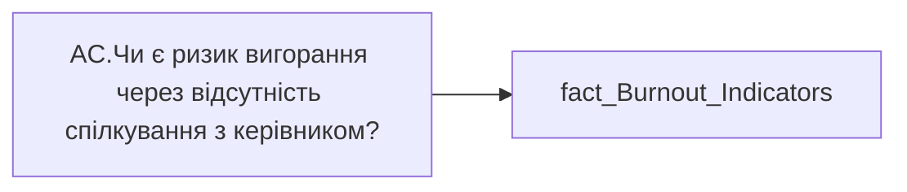

# AC.Чи є ризик вигорання через відсутність спілкування з керівником?

*тека `Analytical Cases\Burnout_Risk\Main`*

## Технічний опис

| Властивість | Значення |
|---|---|
| Тип | міра |
| Home table | _Measures |
| displayFolder | `Analytical Cases\Burnout_Risk\Main` |
| formatString | — |
| dataType | — |
| Прихована | ні |

### DAX

```dax
//НЕ видаляти пробіли для ✅
VAR _res = 
SWITCH(
	SELECTEDVALUE('fact_Burnout_Indicators'[IS_MEETING_WITH_MANAGER_ONE_TO_ONE_HOUR_RISK]),
	"Ризик", "❌",
	"Відсутній", " ✅ ",
	"━"
)
RETURN COALESCE( _res, "-" )
```

### Джерела даних


Колонки: `IS_MEETING_WITH_MANAGER_ONE_TO_ONE_HOUR_RISK`

Power Query: `fact_Burnout_Indicators`

### Залежності (таблиці й колонки)

Таблиці: `fact_Burnout_Indicators`

Колонки: `fact_Burnout_Indicators[IS_MEETING_WITH_MANAGER_ONE_TO_ONE_HOUR_RISK]`

### Схема



---

## Бізнес-суть

!!! note "Бізнес-визначення відсутнє"
    Поля міри не зіставлено з wiki «Таблицями джерел даних». Можна заповнити вручну в `manualNotes`.

## На сторінках звіту

_Не використовується на основних сторінках звіту._

## Пов'язані міри

**Використовується в:** [AC.Switch.Годин 1:1 в сер. за 3 міс.](../measures/ac-switch-hodyn-1-1-v-ser-za-3-mis.md), [AC.Switch.Годин 1:1 в сер. за 3 міс2](../measures/ac-switch-hodyn-1-1-v-ser-za-3-mis2.md)

## Нотатки

_порожньо_
