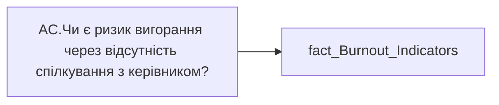

# AC.Чи є ризик вигорання через відсутність спілкування з керівником?

| Властивість | Значення |
|---|---|
| Тип | міра |
| Home table | _Measures |
| displayFolder | `Analytical Cases\Burnout_Risk\Main` |
| formatString | — |
| dataType | — |
| Прихована | ні |

## DAX

```dax
//НЕ видаляти пробіли для ✅
VAR _res = 
SWITCH(
	SELECTEDVALUE('fact_Burnout_Indicators'[IS_MEETING_WITH_MANAGER_ONE_TO_ONE_HOUR_RISK]),
	"Ризик", "❌",
	"Відсутній", " ✅ ",
	"━"
)
RETURN COALESCE( _res, "-" )
```

## Джерела


Колонки: `IS_MEETING_WITH_MANAGER_ONE_TO_ONE_HOUR_RISK`

Power Query: `fact_Burnout_Indicators`

## Бізнес-суть

!!! warning "Без бізнес-визначення"
    Поля міри не знайдено у wiki «Таблицях джерел даних». Заповніть `manualNotes`.

## Залежності

Таблиці: `fact_Burnout_Indicators`

Колонки: `fact_Burnout_Indicators[IS_MEETING_WITH_MANAGER_ONE_TO_ONE_HOUR_RISK]`

## Схема



## Нотатки

_порожньо_
