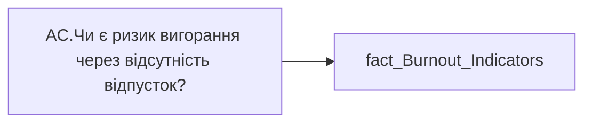

# AC.Чи є ризик вигорання через відсутність відпусток?

| Властивість | Значення |
|---|---|
| Тип | міра |
| Home table | _Measures |
| displayFolder | `Analytical Cases\Burnout_Risk\Main` |
| formatString | — |
| dataType | — |
| Прихована | ні |

## DAX

```dax
//НЕ видаляти пробіли для ✅
VAR _res = 
	SWITCH(
		SELECTEDVALUE('fact_Burnout_Indicators'[IS_VACATION_RISK]),
		"Відсутній", " ✅ ",
		"Ризик", "❌",
		"━"
	)
RETURN COALESCE( _res, "-" )
```

## Джерела


Колонки: `IS_VACATION_RISK`

Power Query: `fact_Burnout_Indicators`

## Бізнес-суть

IS_VACATION_RISK → Чи є ризик вигорання через відсутність відпусток?

**Вимоги:** `Кейс-Утримання-працівників/Опис-джерел-для-сторінки-%22Кейс-звільнення-(вигорання)%22`

## Залежності

Таблиці: `fact_Burnout_Indicators`

Колонки: `fact_Burnout_Indicators[IS_VACATION_RISK]`

## Схема



## Нотатки

_порожньо_
