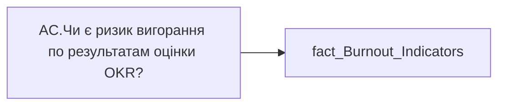

# AC.Чи є ризик вигорання по результатам оцінки OKR?

*тека `Analytical Cases\Burnout_Risk\Main`*

## Технічний опис

| Властивість | Значення |
|---|---|
| Тип | міра |
| Home table | _Measures |
| displayFolder | `Analytical Cases\Burnout_Risk\Main` |
| formatString | — |
| dataType | — |
| Прихована | ні |

### DAX

```dax
//НЕ видаляти пробіли для ✅
VAR _val = SELECTEDVALUE('fact_Burnout_Indicators'[IS_OKR_RISK])

VAR _vw = 110
VAR _vh = 16

/* палітра */
VAR _colRisk = "#E03232"  // насичений червоний
VAR _colOk   = "#33C072"
VAR _colOkBd = "#1F8E5A"
VAR _colNone = "#9AA0A6"

/* ✅ галочка — по центру */
VAR _okSvg =
"data:image/svg+xml;utf8," &
"<svg xmlns='http://www.w3.org/2000/svg' width='"&_vw&"' height='"&_vh&"' viewBox='0 0 110 16' preserveAspectRatio='xMidYMid meet'>" &
"<g transform='translate(48,2) scale(0.85)'>" &
	"<rect x='1.5' y='1.5' width='13' height='13' rx='2' fill='"&_colOk&"' stroke='"&_colOkBd&"' stroke-width='1.2'/>" &
	"<polyline points='4,8.5 7.1,11.2 12.8,4.8' fill='none' stroke='white' stroke-width='2' stroke-linecap='round' stroke-linejoin='round'/>" &
"</g>" &
"</svg>"

/* ❌ хрестик — по центру */
VAR _riskSvg =
"data:image/svg+xml;utf8," &
"<svg xmlns='http://www.w3.org/2000/svg' width='"&_vw&"' height='"&_vh&"' viewBox='0 0 110 16' preserveAspectRatio='xMidYMid meet'>" &
"<g transform='translate(48,2) scale(0.85)'>" &
	"<line x1='3.5' y1='3.5' x2='14.5' y2='14.5' stroke='"&_colRisk&"' stroke-width='2.6' stroke-linecap='round'/>" &
	"<line x1='14.5' y1='3.5' x2='3.5'  y2='14.5' stroke='"&_colRisk&"' stroke-width='2.6' stroke-linecap='round'/>" &
"</g>" &
"</svg>"

/* — коротке тире — по центру */
VAR _dashSvg =
"data:image/svg+xml;utf8," &
"<svg xmlns='http://www.w3.org/2000/svg' width='"&_vw&"' height='"&_vh&"' viewBox='0 0 110 16' preserveAspectRatio='xMidYMid meet'>" &
"<g transform='translate(48,1.5)'>" &
	"<line x1='2' y1='9' x2='13' y2='9' stroke='"&_colNone&"' stroke-width='1.2' stroke-linecap='round'/>" &
"</g>" &
"</svg>"

/* резервна риска — по центру */
VAR _noneSvg =
"data:image/svg+xml;utf8," &
"<svg xmlns='http://www.w3.org/2000/svg' width='"&_vw&"' height='"&_vh&"' viewBox='0 0 110 16' preserveAspectRatio='xMidYMid meet'>" &
"<g transform='translate(48,2) scale(0.85)'>" &
	"<line x1='2' y1='8' x2='18' y2='8' stroke='"&_colNone&"' stroke-width='1.4' stroke-linecap='round'/>" &
"</g>" &
"</svg>"

VAR _res =
	SWITCH(
		TRUE(),
		_val = "Ризик",     _riskSvg,
		_val = "Відсутній", _okSvg,
		ISBLANK(_val),      _dashSvg,
		_noneSvg
	)

RETURN _res
```

### Джерела даних


Колонки: `IS_OKR_RISK`

Power Query: `fact_Burnout_Indicators`

### Залежності (таблиці й колонки)

Таблиці: `fact_Burnout_Indicators`

Колонки: `fact_Burnout_Indicators[IS_OKR_RISK]`

### Схема



---

## Бізнес-суть

**Бізнес-назва:** Чи є ризик вигорання по результатам оцінки OKR?

### Опис із ТЗ

Якщо `OKR_Rate_Trend` = Спадання, то Ризик. Інакше - Відсутній.

**Вимоги (ТЗ):**

- [Допоміжні вітрини для звіту › Таблиця для розрахунку агрегованих метрик по звіту](https://dev.azure.com/MHPITDepProjects/People%20Digital%20Profile%20%28PDP%29/_wiki/wikis/PDP.wiki?pagePath=/%D0%A4%D1%83%D0%BD%D0%BA%D1%86%D1%96%D0%BE%D0%BD%D0%B0%D0%BB%D1%8C%D0%BD%D1%96%20%D0%B2%D0%B8%D0%BC%D0%BE%D0%B3%D0%B8/%D0%92%D0%B8%D0%BC%D0%BE%D0%B3%D0%B8%20%D0%B4%D0%BE%20%D0%B7%D0%B2%D1%96%D1%82%D1%83%20People%20Digital%20Profile/%D0%94%D0%BE%D0%BF%D0%BE%D0%BC%D1%96%D0%B6%D0%BD%D1%96%20%D0%B2%D1%96%D1%82%D1%80%D0%B8%D0%BD%D0%B8%20%D0%B4%D0%BB%D1%8F%20%D0%B7%D0%B2%D1%96%D1%82%D1%83/%D0%A2%D0%B0%D0%B1%D0%BB%D0%B8%D1%86%D1%8F%20%D0%B4%D0%BB%D1%8F%20%D1%80%D0%BE%D0%B7%D1%80%D0%B0%D1%85%D1%83%D0%BD%D0%BA%D1%83%20%D0%B0%D0%B3%D1%80%D0%B5%D0%B3%D0%BE%D0%B2%D0%B0%D0%BD%D0%B8%D1%85%20%D0%BC%D0%B5%D1%82%D1%80%D0%B8%D0%BA%20%D0%BF%D0%BE%20%D0%B7%D0%B2%D1%96%D1%82%D1%83)
- [Кейс Утримання працівників › Опис джерел для сторінки "Кейс звільнення (вигорання)"](https://dev.azure.com/MHPITDepProjects/People%20Digital%20Profile%20%28PDP%29/_wiki/wikis/PDP.wiki?pagePath=/%D0%A4%D1%83%D0%BD%D0%BA%D1%86%D1%96%D0%BE%D0%BD%D0%B0%D0%BB%D1%8C%D0%BD%D1%96%20%D0%B2%D0%B8%D0%BC%D0%BE%D0%B3%D0%B8/%D0%92%D0%B8%D0%BC%D0%BE%D0%B3%D0%B8%20%D0%B4%D0%BE%20%D0%B7%D0%B2%D1%96%D1%82%D1%83%20People%20Digital%20Profile/%D0%9A%D0%B5%D0%B9%D1%81%20%D0%A3%D1%82%D1%80%D0%B8%D0%BC%D0%B0%D0%BD%D0%BD%D1%8F%20%D0%BF%D1%80%D0%B0%D1%86%D1%96%D0%B2%D0%BD%D0%B8%D0%BA%D1%96%D0%B2/%D0%9E%D0%BF%D0%B8%D1%81%20%D0%B4%D0%B6%D0%B5%D1%80%D0%B5%D0%BB%20%D0%B4%D0%BB%D1%8F%20%D1%81%D1%82%D0%BE%D1%80%D1%96%D0%BD%D0%BA%D0%B8%20%22%D0%9A%D0%B5%D0%B9%D1%81%20%D0%B7%D0%B2%D1%96%D0%BB%D1%8C%D0%BD%D0%B5%D0%BD%D0%BD%D1%8F%20%28%D0%B2%D0%B8%D0%B3%D0%BE%D1%80%D0%B0%D0%BD%D0%BD%D1%8F%29%22)

## На сторінках звіту

_Не використовується на основних сторінках звіту._

## Пов'язані міри

**Використовується в:** [AC.Switch.Тренд оцінки OKR](../measures/ac-switch-trend-otsinky-okr.md)

## Нотатки

_порожньо_
