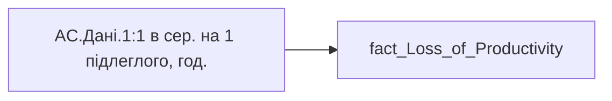

# AC.Дані.1:1 в сер. на 1 підлеглого, год.

*тека `Analytical Cases\Loss_Productivity\Main`*

## Технічний опис

| Властивість | Значення |
|---|---|
| Тип | міра |
| Home table | _Measures |
| displayFolder | `Analytical Cases\Loss_Productivity\Main` |
| formatString | — |
| dataType | — |
| Прихована | ні |

### DAX

```dax
VAR _res = SELECTEDVALUE('fact_Loss_of_Productivity'[MANAGER_COACHING_ONE_TO_ONE_HOUR])
RETURN COALESCE(_res, "—")
```

### Джерела даних

Вихідні таблиці: `DM.vw_R27_fact_Loss_of_Productivity`

Колонки: `MANAGER_COACHING_ONE_TO_ONE_HOUR`

Power Query: `fact_Loss_of_Productivity`

### Залежності (таблиці й колонки)

Таблиці: `fact_Loss_of_Productivity`

Колонки: `fact_Loss_of_Productivity[MANAGER_COACHING_ONE_TO_ONE_HOUR]`

### Схема



---

## Бізнес-суть

**Бізнес-назва:** 1:1 в сер. на 1 підлеглого, год.

### Опис із ТЗ

Розрахункове значення.   Це поле має бути доступне у візуалізаціях, побудованих на основі фактової таблиці `DM.vw_R27_dim_Employee_Metric_Health_and_Wellbeing`    Відбір по працівнику `person_key`, періоду `PERIOD`, документу прийому `DOC_JOB_APPLICATION_ID`.   Якщо дані по керівник  у вітрині відсутні, то показати надпис "Дані відсутні" (наприклад, якщо немає ліцензії та прцівник не користується teams or outlook

Розрахункове значення.   Це поле має бути доступне у візуалізаціях, побудованих на основі фактової таблиці `DM.vw_R27_dim_Employee_Metric_Health_and_Wellbeing`    Потрібно зсумувати значення поля `manager_coaching_one_to_one_hour` по кадровому підрозділу керівника за пріоритетним місцем роботи за період та поділити на кількість записів (кількість керівників) по підрозділу  за попереднй місяць.   Підрозділ кадровий визначається на основі фактової таблиці `dm.vw_R27_fact_Employee_List_PDP`, через відповідний зв’язок за ключем `division_key` = `unit_key`, поле `personnel_unit`

Розрахункове значення.   Це поле має бути доступне у візуалізаціях, побудованих на основі фактової таблиці DM.`vw_R27_calc_Viva_Direction_PDP`   Потрібно зсумувати значення поля `manager_coaching_one_to_one_hour` по напряму керівника за пріоритетним місцем роботи за період та поділити на кількість записів (кількість керівників) по напряму за попереднй місяць.   Напрям визначається на основі фактової таблиці `dm.vw_R27_fact_Employee_List_PDP`, через відповідний зв’язок за ключем `division_key` = `unit_key`, поле `direction`

Розрахункове значення.   Це поле має бути доступне у візуалізаціях, побудованих на основі фактової таблиці `DM.vw_R27_calc_Viva_Holding_PDP`    Потрібно зсумувати значення поля `manager_coaching_one_to_one_hour` по холдингу за період та поділити на кількість записів (кількість керівників) по підрозділу  за попереднй місяць.

Розрахункове значення.   Це поле має бути доступне у візуалізаціях, побудованих на основі фактової таблиці `DM.vw_R27_dim_Employee_Metric_Health_and_Wellbeing`    Відбір по працівнику `person_key`, періоду `PERIOD`, документу прийому `DOC_JOB_APPLICATION_ID`.   Розраховується як середнє значення за 3 попередніх місяці. Для цього значення поля `manager_coaching_one_to_one_hour` за 3 попередніх місяці по керівнику поділити три і на кількість прямих підлеглих (станом на поточний момент, бо історичних даних немає).   Якщо дані по керівник  у вітрині відсутні, то показати надпис "Дані відсутні" (наприклад, якщо немає ліцензії та прцівник не користується teams or outlook

??? note "Поля-джерела та пов'язані бізнес-метрики (11)"
    | Поле | Бізнес-метрики |
    |---|---|
    | `MANAGER_COACHING_ONE_TO_ONE_HOUR` | 1:1 в сер. на 1 підлеглого, год. · Годин керівника на взаємодію із підлеглими за період від поточної точки до попередньої точки · Годин керівника на взаємодію із безпосереднім підлеглим · Годин керівника на взаємодію із безпосередніми підлеглими по кадровому підрозділу · Годин керівника на взаємодію із безпосередніми підлеглими по напряму керівника · Годин керівника на взаємодію із безпосередніми підлеглими   по Холдингу · manager_coaching_one_to_one_hour_direction · manager_coaching_one_to_one_hour_holding · Годин керівника на взаємодію із безпосереднім підлеглим за 3 попередніх місяці · Кількість годин, які Керівник витратив на індивідуальні зустрічі з усіма своїми безпосередніми підлеглими за останні 3 місяці · Годин керівника на взаємодію із підлеглими |

**Вимоги (ТЗ):**

- [Індивідуальний профіль працівника › Історія по посадам](https://dev.azure.com/MHPITDepProjects/People%20Digital%20Profile%20%28PDP%29/_wiki/wikis/PDP.wiki?pagePath=/%D0%A4%D1%83%D0%BD%D0%BA%D1%86%D1%96%D0%BE%D0%BD%D0%B0%D0%BB%D1%8C%D0%BD%D1%96%20%D0%B2%D0%B8%D0%BC%D0%BE%D0%B3%D0%B8/%D0%92%D0%B8%D0%BC%D0%BE%D0%B3%D0%B8%20%D0%B4%D0%BE%20%D0%B7%D0%B2%D1%96%D1%82%D1%83%20People%20Digital%20Profile/%D0%86%D0%BD%D0%B4%D0%B8%D0%B2%D1%96%D0%B4%D1%83%D0%B0%D0%BB%D1%8C%D0%BD%D0%B8%D0%B9%20%D0%BF%D1%80%D0%BE%D1%84%D1%96%D0%BB%D1%8C%20%D0%BF%D1%80%D0%B0%D1%86%D1%96%D0%B2%D0%BD%D0%B8%D0%BA%D0%B0/%D0%86%D1%81%D1%82%D0%BE%D1%80%D1%96%D1%8F%20%D0%BF%D0%BE%20%D0%BF%D0%BE%D1%81%D0%B0%D0%B4%D0%B0%D0%BC)
- [Індивідуальний профіль працівника › Історія по посадам › Реліз 1. Історія по посадам](https://dev.azure.com/MHPITDepProjects/People%20Digital%20Profile%20%28PDP%29/_wiki/wikis/PDP.wiki?pagePath=/%D0%A4%D1%83%D0%BD%D0%BA%D1%86%D1%96%D0%BE%D0%BD%D0%B0%D0%BB%D1%8C%D0%BD%D1%96%20%D0%B2%D0%B8%D0%BC%D0%BE%D0%B3%D0%B8/%D0%92%D0%B8%D0%BC%D0%BE%D0%B3%D0%B8%20%D0%B4%D0%BE%20%D0%B7%D0%B2%D1%96%D1%82%D1%83%20People%20Digital%20Profile/%D0%86%D0%BD%D0%B4%D0%B8%D0%B2%D1%96%D0%B4%D1%83%D0%B0%D0%BB%D1%8C%D0%BD%D0%B8%D0%B9%20%D0%BF%D1%80%D0%BE%D1%84%D1%96%D0%BB%D1%8C%20%D0%BF%D1%80%D0%B0%D1%86%D1%96%D0%B2%D0%BD%D0%B8%D0%BA%D0%B0/%D0%86%D1%81%D1%82%D0%BE%D1%80%D1%96%D1%8F%20%D0%BF%D0%BE%20%D0%BF%D0%BE%D1%81%D0%B0%D0%B4%D0%B0%D0%BC/%D0%A0%D0%B5%D0%BB%D1%96%D0%B7%201.%20%D0%86%D1%81%D1%82%D0%BE%D1%80%D1%96%D1%8F%20%D0%BF%D0%BE%20%D0%BF%D0%BE%D1%81%D0%B0%D0%B4%D0%B0%D0%BC)
- [Індивідуальний профіль працівника › Сторінка Взаємодія Viva та залученість працівника](https://dev.azure.com/MHPITDepProjects/People%20Digital%20Profile%20%28PDP%29/_wiki/wikis/PDP.wiki?pagePath=/%D0%A4%D1%83%D0%BD%D0%BA%D1%86%D1%96%D0%BE%D0%BD%D0%B0%D0%BB%D1%8C%D0%BD%D1%96%20%D0%B2%D0%B8%D0%BC%D0%BE%D0%B3%D0%B8/%D0%92%D0%B8%D0%BC%D0%BE%D0%B3%D0%B8%20%D0%B4%D0%BE%20%D0%B7%D0%B2%D1%96%D1%82%D1%83%20People%20Digital%20Profile/%D0%86%D0%BD%D0%B4%D0%B8%D0%B2%D1%96%D0%B4%D1%83%D0%B0%D0%BB%D1%8C%D0%BD%D0%B8%D0%B9%20%D0%BF%D1%80%D0%BE%D1%84%D1%96%D0%BB%D1%8C%20%D0%BF%D1%80%D0%B0%D1%86%D1%96%D0%B2%D0%BD%D0%B8%D0%BA%D0%B0/%D0%A1%D1%82%D0%BE%D1%80%D1%96%D0%BD%D0%BA%D0%B0%20%D0%92%D0%B7%D0%B0%D1%94%D0%BC%D0%BE%D0%B4%D1%96%D1%8F%20Viva%20%D1%82%D0%B0%20%D0%B7%D0%B0%D0%BB%D1%83%D1%87%D0%B5%D0%BD%D1%96%D1%81%D1%82%D1%8C%20%D0%BF%D1%80%D0%B0%D1%86%D1%96%D0%B2%D0%BD%D0%B8%D0%BA%D0%B0)
- [Індивідуальний профіль працівника › Сторінка Взаємодія Viva та залученість працівника › Сторінка Ефективність працівника](https://dev.azure.com/MHPITDepProjects/People%20Digital%20Profile%20%28PDP%29/_wiki/wikis/PDP.wiki?pagePath=/%D0%A4%D1%83%D0%BD%D0%BA%D1%86%D1%96%D0%BE%D0%BD%D0%B0%D0%BB%D1%8C%D0%BD%D1%96%20%D0%B2%D0%B8%D0%BC%D0%BE%D0%B3%D0%B8/%D0%92%D0%B8%D0%BC%D0%BE%D0%B3%D0%B8%20%D0%B4%D0%BE%20%D0%B7%D0%B2%D1%96%D1%82%D1%83%20People%20Digital%20Profile/%D0%86%D0%BD%D0%B4%D0%B8%D0%B2%D1%96%D0%B4%D1%83%D0%B0%D0%BB%D1%8C%D0%BD%D0%B8%D0%B9%20%D0%BF%D1%80%D0%BE%D1%84%D1%96%D0%BB%D1%8C%20%D0%BF%D1%80%D0%B0%D1%86%D1%96%D0%B2%D0%BD%D0%B8%D0%BA%D0%B0/%D0%A1%D1%82%D0%BE%D1%80%D1%96%D0%BD%D0%BA%D0%B0%20%D0%92%D0%B7%D0%B0%D1%94%D0%BC%D0%BE%D0%B4%D1%96%D1%8F%20Viva%20%D1%82%D0%B0%20%D0%B7%D0%B0%D0%BB%D1%83%D1%87%D0%B5%D0%BD%D1%96%D1%81%D1%82%D1%8C%20%D0%BF%D1%80%D0%B0%D1%86%D1%96%D0%B2%D0%BD%D0%B8%D0%BA%D0%B0/%D0%A1%D1%82%D0%BE%D1%80%D1%96%D0%BD%D0%BA%D0%B0%20%D0%95%D1%84%D0%B5%D0%BA%D1%82%D0%B8%D0%B2%D0%BD%D1%96%D1%81%D1%82%D1%8C%20%D0%BF%D1%80%D0%B0%D1%86%D1%96%D0%B2%D0%BD%D0%B8%D0%BA%D0%B0)
- [Індивідуальний профіль працівника › Сторінка Взаємодія Viva та залученість працівника › Таблиця vw_R27_calc_Viva_Direction_PDP](https://dev.azure.com/MHPITDepProjects/People%20Digital%20Profile%20%28PDP%29/_wiki/wikis/PDP.wiki?pagePath=/%D0%A4%D1%83%D0%BD%D0%BA%D1%86%D1%96%D0%BE%D0%BD%D0%B0%D0%BB%D1%8C%D0%BD%D1%96%20%D0%B2%D0%B8%D0%BC%D0%BE%D0%B3%D0%B8/%D0%92%D0%B8%D0%BC%D0%BE%D0%B3%D0%B8%20%D0%B4%D0%BE%20%D0%B7%D0%B2%D1%96%D1%82%D1%83%20People%20Digital%20Profile/%D0%86%D0%BD%D0%B4%D0%B8%D0%B2%D1%96%D0%B4%D1%83%D0%B0%D0%BB%D1%8C%D0%BD%D0%B8%D0%B9%20%D0%BF%D1%80%D0%BE%D1%84%D1%96%D0%BB%D1%8C%20%D0%BF%D1%80%D0%B0%D1%86%D1%96%D0%B2%D0%BD%D0%B8%D0%BA%D0%B0/%D0%A1%D1%82%D0%BE%D1%80%D1%96%D0%BD%D0%BA%D0%B0%20%D0%92%D0%B7%D0%B0%D1%94%D0%BC%D0%BE%D0%B4%D1%96%D1%8F%20Viva%20%D1%82%D0%B0%20%D0%B7%D0%B0%D0%BB%D1%83%D1%87%D0%B5%D0%BD%D1%96%D1%81%D1%82%D1%8C%20%D0%BF%D1%80%D0%B0%D1%86%D1%96%D0%B2%D0%BD%D0%B8%D0%BA%D0%B0/%D0%A2%D0%B0%D0%B1%D0%BB%D0%B8%D1%86%D1%8F%20vw_R27_calc_Viva_Direction_PDP)
- [Індивідуальний профіль працівника › Сторінка Взаємодія Viva та залученість працівника › Таблиця vw_R27_calc_Viva_Holding_PDP](https://dev.azure.com/MHPITDepProjects/People%20Digital%20Profile%20%28PDP%29/_wiki/wikis/PDP.wiki?pagePath=/%D0%A4%D1%83%D0%BD%D0%BA%D1%86%D1%96%D0%BE%D0%BD%D0%B0%D0%BB%D1%8C%D0%BD%D1%96%20%D0%B2%D0%B8%D0%BC%D0%BE%D0%B3%D0%B8/%D0%92%D0%B8%D0%BC%D0%BE%D0%B3%D0%B8%20%D0%B4%D0%BE%20%D0%B7%D0%B2%D1%96%D1%82%D1%83%20People%20Digital%20Profile/%D0%86%D0%BD%D0%B4%D0%B8%D0%B2%D1%96%D0%B4%D1%83%D0%B0%D0%BB%D1%8C%D0%BD%D0%B8%D0%B9%20%D0%BF%D1%80%D0%BE%D1%84%D1%96%D0%BB%D1%8C%20%D0%BF%D1%80%D0%B0%D1%86%D1%96%D0%B2%D0%BD%D0%B8%D0%BA%D0%B0/%D0%A1%D1%82%D0%BE%D1%80%D1%96%D0%BD%D0%BA%D0%B0%20%D0%92%D0%B7%D0%B0%D1%94%D0%BC%D0%BE%D0%B4%D1%96%D1%8F%20Viva%20%D1%82%D0%B0%20%D0%B7%D0%B0%D0%BB%D1%83%D1%87%D0%B5%D0%BD%D1%96%D1%81%D1%82%D1%8C%20%D0%BF%D1%80%D0%B0%D1%86%D1%96%D0%B2%D0%BD%D0%B8%D0%BA%D0%B0/%D0%A2%D0%B0%D0%B1%D0%BB%D0%B8%D1%86%D1%8F%20vw_R27_calc_Viva_Holding_PDP)
- [Допоміжні вітрини для звіту › Таблиця для розрахунку агрегованих метрик по звіту](https://dev.azure.com/MHPITDepProjects/People%20Digital%20Profile%20%28PDP%29/_wiki/wikis/PDP.wiki?pagePath=/%D0%A4%D1%83%D0%BD%D0%BA%D1%86%D1%96%D0%BE%D0%BD%D0%B0%D0%BB%D1%8C%D0%BD%D1%96%20%D0%B2%D0%B8%D0%BC%D0%BE%D0%B3%D0%B8/%D0%92%D0%B8%D0%BC%D0%BE%D0%B3%D0%B8%20%D0%B4%D0%BE%20%D0%B7%D0%B2%D1%96%D1%82%D1%83%20People%20Digital%20Profile/%D0%94%D0%BE%D0%BF%D0%BE%D0%BC%D1%96%D0%B6%D0%BD%D1%96%20%D0%B2%D1%96%D1%82%D1%80%D0%B8%D0%BD%D0%B8%20%D0%B4%D0%BB%D1%8F%20%D0%B7%D0%B2%D1%96%D1%82%D1%83/%D0%A2%D0%B0%D0%B1%D0%BB%D0%B8%D1%86%D1%8F%20%D0%B4%D0%BB%D1%8F%20%D1%80%D0%BE%D0%B7%D1%80%D0%B0%D1%85%D1%83%D0%BD%D0%BA%D1%83%20%D0%B0%D0%B3%D1%80%D0%B5%D0%B3%D0%BE%D0%B2%D0%B0%D0%BD%D0%B8%D1%85%20%D0%BC%D0%B5%D1%82%D1%80%D0%B8%D0%BA%20%D0%BF%D0%BE%20%D0%B7%D0%B2%D1%96%D1%82%D1%83)
- [Допоміжні вітрини для звіту › Таблиця для розрахунку агрегованих метрик по звіту › Зміна алгоритму розрахунку метрик по Viva з урахуванням дати завантаження даних до DWH](https://dev.azure.com/MHPITDepProjects/People%20Digital%20Profile%20%28PDP%29/_wiki/wikis/PDP.wiki?pagePath=/%D0%A4%D1%83%D0%BD%D0%BA%D1%86%D1%96%D0%BE%D0%BD%D0%B0%D0%BB%D1%8C%D0%BD%D1%96%20%D0%B2%D0%B8%D0%BC%D0%BE%D0%B3%D0%B8/%D0%92%D0%B8%D0%BC%D0%BE%D0%B3%D0%B8%20%D0%B4%D0%BE%20%D0%B7%D0%B2%D1%96%D1%82%D1%83%20People%20Digital%20Profile/%D0%94%D0%BE%D0%BF%D0%BE%D0%BC%D1%96%D0%B6%D0%BD%D1%96%20%D0%B2%D1%96%D1%82%D1%80%D0%B8%D0%BD%D0%B8%20%D0%B4%D0%BB%D1%8F%20%D0%B7%D0%B2%D1%96%D1%82%D1%83/%D0%A2%D0%B0%D0%B1%D0%BB%D0%B8%D1%86%D1%8F%20%D0%B4%D0%BB%D1%8F%20%D1%80%D0%BE%D0%B7%D1%80%D0%B0%D1%85%D1%83%D0%BD%D0%BA%D1%83%20%D0%B0%D0%B3%D1%80%D0%B5%D0%B3%D0%BE%D0%B2%D0%B0%D0%BD%D0%B8%D1%85%20%D0%BC%D0%B5%D1%82%D1%80%D0%B8%D0%BA%20%D0%BF%D0%BE%20%D0%B7%D0%B2%D1%96%D1%82%D1%83/%D0%97%D0%BC%D1%96%D0%BD%D0%B0%20%D0%B0%D0%BB%D0%B3%D0%BE%D1%80%D0%B8%D1%82%D0%BC%D1%83%20%D1%80%D0%BE%D0%B7%D1%80%D0%B0%D1%85%D1%83%D0%BD%D0%BA%D1%83%20%D0%BC%D0%B5%D1%82%D1%80%D0%B8%D0%BA%20%D0%BF%D0%BE%20Viva%20%D0%B7%20%D1%83%D1%80%D0%B0%D1%85%D1%83%D0%B2%D0%B0%D0%BD%D0%BD%D1%8F%D0%BC%20%D0%B4%D0%B0%D1%82%D0%B8%20%D0%B7%D0%B0%D0%B2%D0%B0%D0%BD%D1%82%D0%B0%D0%B6%D0%B5%D0%BD%D0%BD%D1%8F%20%D0%B4%D0%B0%D0%BD%D0%B8%D1%85%20%D0%B4%D0%BE%20DWH)
- [Допоміжні вітрини для звіту › Таблиця для розрахунку агрегованих метрик по звіту › Змінити період розрахунку середніх значень по Віва](https://dev.azure.com/MHPITDepProjects/People%20Digital%20Profile%20%28PDP%29/_wiki/wikis/PDP.wiki?pagePath=/%D0%A4%D1%83%D0%BD%D0%BA%D1%86%D1%96%D0%BE%D0%BD%D0%B0%D0%BB%D1%8C%D0%BD%D1%96%20%D0%B2%D0%B8%D0%BC%D0%BE%D0%B3%D0%B8/%D0%92%D0%B8%D0%BC%D0%BE%D0%B3%D0%B8%20%D0%B4%D0%BE%20%D0%B7%D0%B2%D1%96%D1%82%D1%83%20People%20Digital%20Profile/%D0%94%D0%BE%D0%BF%D0%BE%D0%BC%D1%96%D0%B6%D0%BD%D1%96%20%D0%B2%D1%96%D1%82%D1%80%D0%B8%D0%BD%D0%B8%20%D0%B4%D0%BB%D1%8F%20%D0%B7%D0%B2%D1%96%D1%82%D1%83/%D0%A2%D0%B0%D0%B1%D0%BB%D0%B8%D1%86%D1%8F%20%D0%B4%D0%BB%D1%8F%20%D1%80%D0%BE%D0%B7%D1%80%D0%B0%D1%85%D1%83%D0%BD%D0%BA%D1%83%20%D0%B0%D0%B3%D1%80%D0%B5%D0%B3%D0%BE%D0%B2%D0%B0%D0%BD%D0%B8%D1%85%20%D0%BC%D0%B5%D1%82%D1%80%D0%B8%D0%BA%20%D0%BF%D0%BE%20%D0%B7%D0%B2%D1%96%D1%82%D1%83/%D0%97%D0%BC%D1%96%D0%BD%D0%B8%D1%82%D0%B8%20%D0%BF%D0%B5%D1%80%D1%96%D0%BE%D0%B4%20%D1%80%D0%BE%D0%B7%D1%80%D0%B0%D1%85%D1%83%D0%BD%D0%BA%D1%83%20%D1%81%D0%B5%D1%80%D0%B5%D0%B4%D0%BD%D1%96%D1%85%20%D0%B7%D0%BD%D0%B0%D1%87%D0%B5%D0%BD%D1%8C%20%D0%BF%D0%BE%20%D0%92%D1%96%D0%B2%D0%B0)
- [Кейс Втрати Продуктивності Працівників](https://dev.azure.com/MHPITDepProjects/People%20Digital%20Profile%20%28PDP%29/_wiki/wikis/PDP.wiki?pagePath=/%D0%A4%D1%83%D0%BD%D0%BA%D1%86%D1%96%D0%BE%D0%BD%D0%B0%D0%BB%D1%8C%D0%BD%D1%96%20%D0%B2%D0%B8%D0%BC%D0%BE%D0%B3%D0%B8/%D0%92%D0%B8%D0%BC%D0%BE%D0%B3%D0%B8%20%D0%B4%D0%BE%20%D0%B7%D0%B2%D1%96%D1%82%D1%83%20People%20Digital%20Profile/%D0%9A%D0%B5%D0%B9%D1%81%20%D0%92%D1%82%D1%80%D0%B0%D1%82%D0%B8%20%D0%9F%D1%80%D0%BE%D0%B4%D1%83%D0%BA%D1%82%D0%B8%D0%B2%D0%BD%D0%BE%D1%81%D1%82%D1%96%20%D0%9F%D1%80%D0%B0%D1%86%D1%96%D0%B2%D0%BD%D0%B8%D0%BA%D1%96%D0%B2)
- [Кейс Втрати Продуктивності Працівників › Деталізація метрик в кейсі Продуктивність](https://dev.azure.com/MHPITDepProjects/People%20Digital%20Profile%20%28PDP%29/_wiki/wikis/PDP.wiki?pagePath=/%D0%A4%D1%83%D0%BD%D0%BA%D1%86%D1%96%D0%BE%D0%BD%D0%B0%D0%BB%D1%8C%D0%BD%D1%96%20%D0%B2%D0%B8%D0%BC%D0%BE%D0%B3%D0%B8/%D0%92%D0%B8%D0%BC%D0%BE%D0%B3%D0%B8%20%D0%B4%D0%BE%20%D0%B7%D0%B2%D1%96%D1%82%D1%83%20People%20Digital%20Profile/%D0%9A%D0%B5%D0%B9%D1%81%20%D0%92%D1%82%D1%80%D0%B0%D1%82%D0%B8%20%D0%9F%D1%80%D0%BE%D0%B4%D1%83%D0%BA%D1%82%D0%B8%D0%B2%D0%BD%D0%BE%D1%81%D1%82%D1%96%20%D0%9F%D1%80%D0%B0%D1%86%D1%96%D0%B2%D0%BD%D0%B8%D0%BA%D1%96%D0%B2/%D0%94%D0%B5%D1%82%D0%B0%D0%BB%D1%96%D0%B7%D0%B0%D1%86%D1%96%D1%8F%20%D0%BC%D0%B5%D1%82%D1%80%D0%B8%D0%BA%20%D0%B2%20%D0%BA%D0%B5%D0%B9%D1%81%D1%96%20%D0%9F%D1%80%D0%BE%D0%B4%D1%83%D0%BA%D1%82%D0%B8%D0%B2%D0%BD%D1%96%D1%81%D1%82%D1%8C)
- [Командний профіль › Сторінка Взаємодія Viva та залученість команд](https://dev.azure.com/MHPITDepProjects/People%20Digital%20Profile%20%28PDP%29/_wiki/wikis/PDP.wiki?pagePath=/%D0%A4%D1%83%D0%BD%D0%BA%D1%86%D1%96%D0%BE%D0%BD%D0%B0%D0%BB%D1%8C%D0%BD%D1%96%20%D0%B2%D0%B8%D0%BC%D0%BE%D0%B3%D0%B8/%D0%92%D0%B8%D0%BC%D0%BE%D0%B3%D0%B8%20%D0%B4%D0%BE%20%D0%B7%D0%B2%D1%96%D1%82%D1%83%20People%20Digital%20Profile/%D0%9A%D0%BE%D0%BC%D0%B0%D0%BD%D0%B4%D0%BD%D0%B8%D0%B9%20%D0%BF%D1%80%D0%BE%D1%84%D1%96%D0%BB%D1%8C/%D0%A1%D1%82%D0%BE%D1%80%D1%96%D0%BD%D0%BA%D0%B0%20%D0%92%D0%B7%D0%B0%D1%94%D0%BC%D0%BE%D0%B4%D1%96%D1%8F%20Viva%20%D1%82%D0%B0%20%D0%B7%D0%B0%D0%BB%D1%83%D1%87%D0%B5%D0%BD%D1%96%D1%81%D1%82%D1%8C%20%D0%BA%D0%BE%D0%BC%D0%B0%D0%BD%D0%B4)
- [Командний профіль › Сторінка Ефективність](https://dev.azure.com/MHPITDepProjects/People%20Digital%20Profile%20%28PDP%29/_wiki/wikis/PDP.wiki?pagePath=/%D0%A4%D1%83%D0%BD%D0%BA%D1%86%D1%96%D0%BE%D0%BD%D0%B0%D0%BB%D1%8C%D0%BD%D1%96%20%D0%B2%D0%B8%D0%BC%D0%BE%D0%B3%D0%B8/%D0%92%D0%B8%D0%BC%D0%BE%D0%B3%D0%B8%20%D0%B4%D0%BE%20%D0%B7%D0%B2%D1%96%D1%82%D1%83%20People%20Digital%20Profile/%D0%9A%D0%BE%D0%BC%D0%B0%D0%BD%D0%B4%D0%BD%D0%B8%D0%B9%20%D0%BF%D1%80%D0%BE%D1%84%D1%96%D0%BB%D1%8C/%D0%A1%D1%82%D0%BE%D1%80%D1%96%D0%BD%D0%BA%D0%B0%20%D0%95%D1%84%D0%B5%D0%BA%D1%82%D0%B8%D0%B2%D0%BD%D1%96%D1%81%D1%82%D1%8C)

## На сторінках звіту

_Не використовується на основних сторінках звіту._

## Пов'язані міри

**Використовується в:** [AC.Switch.1:1 в сер. на 1 підлеглого, год.](../measures/ac-switch-1-1-v-ser-na-1-pidlehloho-hod.md)

## Нотатки

_порожньо_
