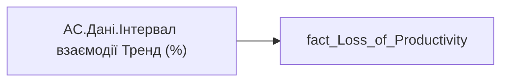

# AC.Дані.Інтервал взаємодії Тренд (%)

*тека `Analytical Cases\Loss_Productivity\Main`*

## Бізнес-суть

Collab_Span_Trend → Інтервал взаємодії Тренд (%)

**Вимоги:** `Кейс-Втрати-Продуктивності-Працівників`

## На сторінках звіту

_Не використовується на основних сторінках звіту._

## Пов'язані міри

**Використовується в:** [AC.Switch.Інтервал взаємодії Тренд (%)](../measures/ac-switch-interval-vzaiemodii-trend.md)

---

## Технічний опис

| Властивість | Значення |
|---|---|
| Тип | міра |
| Home table | _Measures |
| displayFolder | `Analytical Cases\Loss_Productivity\Main` |
| formatString | — |
| dataType | — |
| Прихована | ні |

### DAX

```dax
VAR _res = SELECTEDVALUE('fact_Loss_of_Productivity'[Collab_Span_Trend])
RETURN COALESCE(_res, "—")
```

### Джерела даних

Вихідні таблиці: `DM.vw_R27_fact_Loss_of_Productivity`

Колонки: `Collab_Span_Trend`

Power Query: `fact_Loss_of_Productivity`

### Залежності (таблиці й колонки)

Таблиці: `fact_Loss_of_Productivity`

Колонки: `fact_Loss_of_Productivity[Collab_Span_Trend]`

### Схема



## Нотатки

_порожньо_
