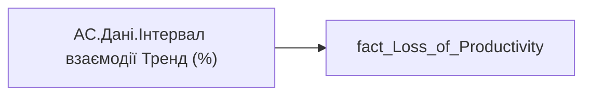

# AC.Дані.Інтервал взаємодії Тренд (%)

| Властивість | Значення |
|---|---|
| Тип | міра |
| Home table | _Measures |
| displayFolder | `Analytical Cases\Loss_Productivity\Main` |
| formatString | — |
| dataType | — |
| Прихована | ні |

## DAX

```dax
VAR _res = SELECTEDVALUE('fact_Loss_of_Productivity'[Collab_Span_Trend])
RETURN COALESCE(_res, "—")
```

## Джерела

Вихідні таблиці: `DM.vw_R27_fact_Loss_of_Productivity`

Колонки: `Collab_Span_Trend`

Power Query: `fact_Loss_of_Productivity`

## Бізнес-суть

Collab_Span_Trend → Інтервал взаємодії Тренд (%)

**Вимоги:** `Кейс-Втрати-Продуктивності-Працівників`

## Залежності

Таблиці: `fact_Loss_of_Productivity`

Колонки: `fact_Loss_of_Productivity[Collab_Span_Trend]`

## Схема



## Нотатки

_порожньо_
