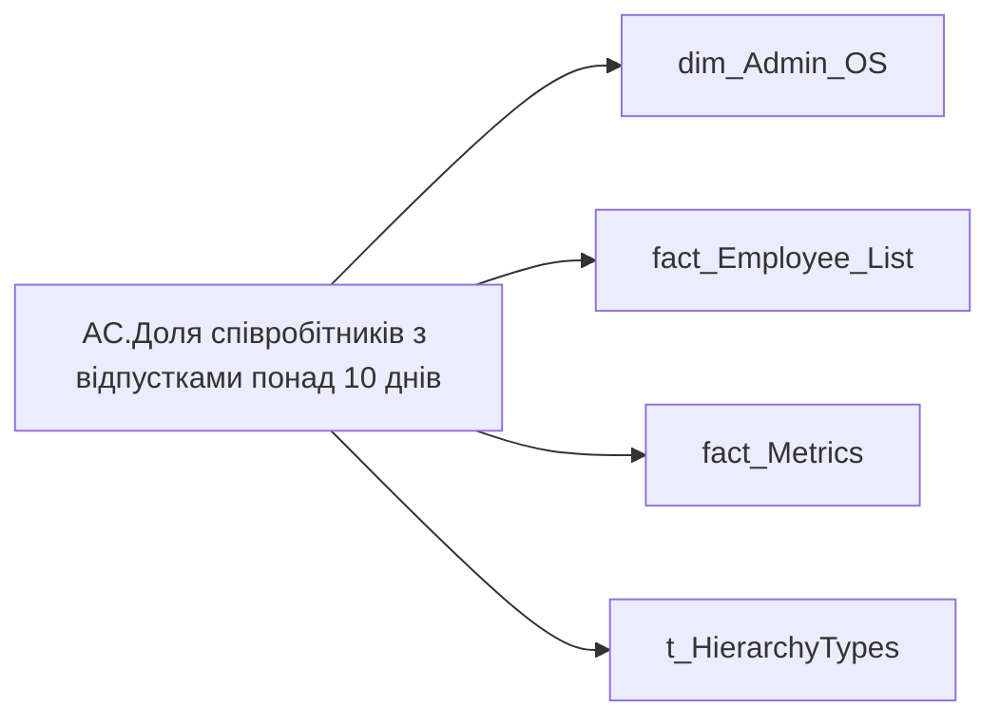

# AC.Доля співробітників з відпустками понад 10 днів

*тека `Group_Profile\Здоров'я та благополуччя`*

## Технічний опис

| Властивість | Значення |
|---|---|
| Тип | міра |
| Home table | _Measures |
| displayFolder | `Group_Profile\Здоров'я та благополуччя` |
| formatString | — |
| dataType | — |
| Прихована | ні |

### DAX

```dax
//************* ROLE FILTERS **************
VAR _roleIndex = SELECTEDVALUE ( 't_HierarchyTypes'[Index], 1 )   -- 0 = LT, 1 = Admin
VAR _filter_lt= TREATAS ( VALUES ( 'dim_Admin_LT_OS'[USER_ACCESS_ID] ),'dim_Admin_OS'[USER_ACCESS_ID] )

//***** HEALTH AND WELLBEING FILTERS ******* 
VAR _employee_list = VALUES('fact_Employee_List'[EMPLOYEE_ID])
VAR _main_position_employees = 
	CALCULATETABLE(
		VALUES('fact_Employee_List'[USER_ACCESS_ID]),
		REMOVEFILTERS('fact_Employee_List'), 
		'fact_Employee_List'[EMPLOYEE_ID] IN _employee_list,
		'fact_Employee_List'[IS_MAIN_POSITION] = 1
	)
VAR _filter0 = TREATAS(_main_position_employees, 'dim_Admin_OS'[USER_ACCESS_ID])

/* *********** ADMIN *********** */
VAR _admin =
	VAR _table0 = 
		CALCULATETABLE(
			ADDCOLUMNS(
				VALUES('dim_Admin_OS'[USER_ACCESS_ID]),
				"@Indicator",
				CALCULATE(
					SUM('fact_Metrics'[LONG_VACATION_TOTAL_DAY_BY_MAIN_POSITION])
				)
			),
			REMOVEFILTERS('fact_Metrics'),
			_filter0
		)
	VAR _ShareOfSomeIndicator = 
		VAR _Nominator = 
		COUNTROWS(
			FILTER(
				_table0, 
				NOT ISBLANK([@Indicator]) && [@Indicator] > 0
			)
		)
		VAR _Denominator = COUNTROWS(_table0)
		RETURN DIVIDE(_Nominator, _Denominator)
	RETURN _ShareOfSomeIndicator

/* *********** LT *********** */
VAR _admin_lt =
	VAR _table0 = 
		CALCULATETABLE(
			ADDCOLUMNS(
				VALUES('dim_Admin_OS'[USER_ACCESS_ID]),
				"@Indicator",
				CALCULATE(
					SUM('fact_Metrics'[LONG_VACATION_TOTAL_DAY_BY_MAIN_POSITION])
				)
			),
			REMOVEFILTERS('fact_Metrics'),
			_filter0,
			_filter_lt
		)
	VAR _ShareOfSomeIndicator = 
		VAR _Nominator = 
		COUNTROWS(
			FILTER(
				_table0, 
				NOT ISBLANK([@Indicator]) && [@Indicator] > 0
			)
		)
		VAR _Denominator = COUNTROWS(_table0)
		RETURN DIVIDE(_Nominator, _Denominator)
	RETURN _ShareOfSomeIndicator

VAR _res =
	SWITCH (
		_roleIndex,
		0, _admin_lt,    -- LT
		1, _admin,       -- Admin
		_admin
	)
RETURN COALESCE(_res, 0)
```

### Джерела даних

Вихідні таблиці: `DM.vw_R27_dim_Employee_Access_List`

Колонки: `EMPLOYEE_ID`, `IS_MAIN_POSITION`, `Index`, `LONG_VACATION_TOTAL_DAY_BY_MAIN_POSITION`, `USER_ACCESS_ID`

Power Query: `dim_Admin_OS`

### Залежності (таблиці й колонки)

Таблиці: `dim_Admin_OS`, `fact_Employee_List`, `fact_Metrics`, `t_HierarchyTypes`

Колонки: `dim_Admin_LT_OS[USER_ACCESS_ID]`, `dim_Admin_OS[USER_ACCESS_ID]`, `fact_Employee_List[EMPLOYEE_ID]`, `fact_Employee_List[IS_MAIN_POSITION]`, `fact_Employee_List[USER_ACCESS_ID]`, `fact_Metrics[LONG_VACATION_TOTAL_DAY_BY_MAIN_POSITION]`, `t_HierarchyTypes[Index]`

### Схема



---

## Бізнес-суть

### Опис із ТЗ

1 - Так   0 - Ні

??? note "Поля-джерела та пов'язані бізнес-метрики (2)"
    | Поле | Бізнес-метрики |
    |---|---|
    | `IS_MAIN_POSITION` | Пріоритетне місце роботи · is_main_position |

**Вимоги (ТЗ):**

- [Індивідуальний профіль працівника › Історія по посадам](https://dev.azure.com/MHPITDepProjects/People%20Digital%20Profile%20%28PDP%29/_wiki/wikis/PDP.wiki?pagePath=/%D0%A4%D1%83%D0%BD%D0%BA%D1%86%D1%96%D0%BE%D0%BD%D0%B0%D0%BB%D1%8C%D0%BD%D1%96%20%D0%B2%D0%B8%D0%BC%D0%BE%D0%B3%D0%B8/%D0%92%D0%B8%D0%BC%D0%BE%D0%B3%D0%B8%20%D0%B4%D0%BE%20%D0%B7%D0%B2%D1%96%D1%82%D1%83%20People%20Digital%20Profile/%D0%86%D0%BD%D0%B4%D0%B8%D0%B2%D1%96%D0%B4%D1%83%D0%B0%D0%BB%D1%8C%D0%BD%D0%B8%D0%B9%20%D0%BF%D1%80%D0%BE%D1%84%D1%96%D0%BB%D1%8C%20%D0%BF%D1%80%D0%B0%D1%86%D1%96%D0%B2%D0%BD%D0%B8%D0%BA%D0%B0/%D0%86%D1%81%D1%82%D0%BE%D1%80%D1%96%D1%8F%20%D0%BF%D0%BE%20%D0%BF%D0%BE%D1%81%D0%B0%D0%B4%D0%B0%D0%BC)
- [Індивідуальний профіль працівника › Історія по посадам › Реліз 1. Історія по посадам](https://dev.azure.com/MHPITDepProjects/People%20Digital%20Profile%20%28PDP%29/_wiki/wikis/PDP.wiki?pagePath=/%D0%A4%D1%83%D0%BD%D0%BA%D1%86%D1%96%D0%BE%D0%BD%D0%B0%D0%BB%D1%8C%D0%BD%D1%96%20%D0%B2%D0%B8%D0%BC%D0%BE%D0%B3%D0%B8/%D0%92%D0%B8%D0%BC%D0%BE%D0%B3%D0%B8%20%D0%B4%D0%BE%20%D0%B7%D0%B2%D1%96%D1%82%D1%83%20People%20Digital%20Profile/%D0%86%D0%BD%D0%B4%D0%B8%D0%B2%D1%96%D0%B4%D1%83%D0%B0%D0%BB%D1%8C%D0%BD%D0%B8%D0%B9%20%D0%BF%D1%80%D0%BE%D1%84%D1%96%D0%BB%D1%8C%20%D0%BF%D1%80%D0%B0%D1%86%D1%96%D0%B2%D0%BD%D0%B8%D0%BA%D0%B0/%D0%86%D1%81%D1%82%D0%BE%D1%80%D1%96%D1%8F%20%D0%BF%D0%BE%20%D0%BF%D0%BE%D1%81%D0%B0%D0%B4%D0%B0%D0%BC/%D0%A0%D0%B5%D0%BB%D1%96%D0%B7%201.%20%D0%86%D1%81%D1%82%D0%BE%D1%80%D1%96%D1%8F%20%D0%BF%D0%BE%20%D0%BF%D0%BE%D1%81%D0%B0%D0%B4%D0%B0%D0%BC)
- [Індивідуальний профіль працівника › Сторінка Взаємодія Viva та залученість працівника › Сторінка Ефективність працівника › Вітрина Відвідування офісів](https://dev.azure.com/MHPITDepProjects/People%20Digital%20Profile%20%28PDP%29/_wiki/wikis/PDP.wiki?pagePath=/%D0%A4%D1%83%D0%BD%D0%BA%D1%86%D1%96%D0%BE%D0%BD%D0%B0%D0%BB%D1%8C%D0%BD%D1%96%20%D0%B2%D0%B8%D0%BC%D0%BE%D0%B3%D0%B8/%D0%92%D0%B8%D0%BC%D0%BE%D0%B3%D0%B8%20%D0%B4%D0%BE%20%D0%B7%D0%B2%D1%96%D1%82%D1%83%20People%20Digital%20Profile/%D0%86%D0%BD%D0%B4%D0%B8%D0%B2%D1%96%D0%B4%D1%83%D0%B0%D0%BB%D1%8C%D0%BD%D0%B8%D0%B9%20%D0%BF%D1%80%D0%BE%D1%84%D1%96%D0%BB%D1%8C%20%D0%BF%D1%80%D0%B0%D1%86%D1%96%D0%B2%D0%BD%D0%B8%D0%BA%D0%B0/%D0%A1%D1%82%D0%BE%D1%80%D1%96%D0%BD%D0%BA%D0%B0%20%D0%92%D0%B7%D0%B0%D1%94%D0%BC%D0%BE%D0%B4%D1%96%D1%8F%20Viva%20%D1%82%D0%B0%20%D0%B7%D0%B0%D0%BB%D1%83%D1%87%D0%B5%D0%BD%D1%96%D1%81%D1%82%D1%8C%20%D0%BF%D1%80%D0%B0%D1%86%D1%96%D0%B2%D0%BD%D0%B8%D0%BA%D0%B0/%D0%A1%D1%82%D0%BE%D1%80%D1%96%D0%BD%D0%BA%D0%B0%20%D0%95%D1%84%D0%B5%D0%BA%D1%82%D0%B8%D0%B2%D0%BD%D1%96%D1%81%D1%82%D1%8C%20%D0%BF%D1%80%D0%B0%D1%86%D1%96%D0%B2%D0%BD%D0%B8%D0%BA%D0%B0/%D0%92%D1%96%D1%82%D1%80%D0%B8%D0%BD%D0%B0%20%D0%92%D1%96%D0%B4%D0%B2%D1%96%D0%B4%D1%83%D0%B2%D0%B0%D0%BD%D0%BD%D1%8F%20%D0%BE%D1%84%D1%96%D1%81%D1%96%D0%B2)
- [Індивідуальний профіль працівника › Сторінка Загальна інформація про працівника](https://dev.azure.com/MHPITDepProjects/People%20Digital%20Profile%20%28PDP%29/_wiki/wikis/PDP.wiki?pagePath=/%D0%A4%D1%83%D0%BD%D0%BA%D1%86%D1%96%D0%BE%D0%BD%D0%B0%D0%BB%D1%8C%D0%BD%D1%96%20%D0%B2%D0%B8%D0%BC%D0%BE%D0%B3%D0%B8/%D0%92%D0%B8%D0%BC%D0%BE%D0%B3%D0%B8%20%D0%B4%D0%BE%20%D0%B7%D0%B2%D1%96%D1%82%D1%83%20People%20Digital%20Profile/%D0%86%D0%BD%D0%B4%D0%B8%D0%B2%D1%96%D0%B4%D1%83%D0%B0%D0%BB%D1%8C%D0%BD%D0%B8%D0%B9%20%D0%BF%D1%80%D0%BE%D1%84%D1%96%D0%BB%D1%8C%20%D0%BF%D1%80%D0%B0%D1%86%D1%96%D0%B2%D0%BD%D0%B8%D0%BA%D0%B0/%D0%A1%D1%82%D0%BE%D1%80%D1%96%D0%BD%D0%BA%D0%B0%20%D0%97%D0%B0%D0%B3%D0%B0%D0%BB%D1%8C%D0%BD%D0%B0%20%D1%96%D0%BD%D1%84%D0%BE%D1%80%D0%BC%D0%B0%D1%86%D1%96%D1%8F%20%D0%BF%D1%80%D0%BE%20%D0%BF%D1%80%D0%B0%D1%86%D1%96%D0%B2%D0%BD%D0%B8%D0%BA%D0%B0)
- [Командний профіль › Сторінка Плинність та Exits › ТЗ на вітрину Exits](https://dev.azure.com/MHPITDepProjects/People%20Digital%20Profile%20%28PDP%29/_wiki/wikis/PDP.wiki?pagePath=/%D0%A4%D1%83%D0%BD%D0%BA%D1%86%D1%96%D0%BE%D0%BD%D0%B0%D0%BB%D1%8C%D0%BD%D1%96%20%D0%B2%D0%B8%D0%BC%D0%BE%D0%B3%D0%B8/%D0%92%D0%B8%D0%BC%D0%BE%D0%B3%D0%B8%20%D0%B4%D0%BE%20%D0%B7%D0%B2%D1%96%D1%82%D1%83%20People%20Digital%20Profile/%D0%9A%D0%BE%D0%BC%D0%B0%D0%BD%D0%B4%D0%BD%D0%B8%D0%B9%20%D0%BF%D1%80%D0%BE%D1%84%D1%96%D0%BB%D1%8C/%D0%A1%D1%82%D0%BE%D1%80%D1%96%D0%BD%D0%BA%D0%B0%20%D0%9F%D0%BB%D0%B8%D0%BD%D0%BD%D1%96%D1%81%D1%82%D1%8C%20%D1%82%D0%B0%20Exits/%D0%A2%D0%97%20%D0%BD%D0%B0%20%D0%B2%D1%96%D1%82%D1%80%D0%B8%D0%BD%D1%83%20Exits)

## На сторінках звіту

[Group Profile](../report/group-profile.md)

## Пов'язані міри

**Використовується в:** [GP.Рівень неякісних відпусток (%)](../measures/gp-riven-neiakisnykh-vidpustok.md)

## Нотатки

_порожньо_
