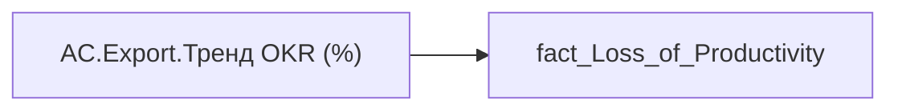

# AC.Export.Тренд OKR (%)

*тека `Analytical Cases\Loss_Productivity\Export`*

## Бізнес-суть

OKR_LAST_YEAR_RATE → Тренд OKR (%); OKR_LAST_YEAR_RATE → OKR останній рік; OKR_LAST_YEAR_RATE → Значення коефіцієнта індивідуального бонусу за останній період; OKR_LAST_YEAR_RATE → OKR команди за останній рік

Для розрахунку метрики "Тренд OKR" Ці дані виводяться в деталізацію по тренду оцінки ОКР Тимчасово це буде коефіцієнт індивідуального бонусу, а не оцінка ОКР.  <br>Визначається по показнику керівника цієї команди.  <br>Якщо у керівника є ОКР, який було складено/оцінено по іншому кадровому підрозділу/організації, то такий ОКР  не відображається. Наприклад, керівник в 2023 році працював на іншому підприємстві чи підрозділі.

**Вимоги:** `Кейс-Втрати-Продуктивності-Працівників`, `Кейс-Втрати-Продуктивності-Працівників/Деталізація-метрик-в-кейсі-Продуктивність`, `Кейс-Утримання-працівників/Опис-джерел-для-сторінки-%22Кейс-звільнення-(вигорання)%22`, `Командний-профіль/Паспортна-частина-групового-профілю/Додати-інформацію-про-ОКР-команди-та-середню-оцінку-результативності-по-команді`

## На сторінках звіту

[Продуктивність працівників](../report/produktyvnist-pratsivnykiv.md)

## Пов'язані міри

_Прямих зв'язків з іншими мірами немає._

---

## Технічний опис

| Властивість | Значення |
|---|---|
| Тип | міра |
| Home table | _Measures |
| displayFolder | `Analytical Cases\Loss_Productivity\Export` |
| formatString | — |
| dataType | — |
| Прихована | ні |

### DAX

```dax
SELECTEDVALUE('fact_Loss_of_Productivity'[OKR_LAST_YEAR_RATE])
```

### Джерела даних

Вихідні таблиці: `DM.vw_R27_fact_Loss_of_Productivity`

Колонки: `OKR_LAST_YEAR_RATE`

Power Query: `fact_Loss_of_Productivity`

### Залежності (таблиці й колонки)

Таблиці: `fact_Loss_of_Productivity`

Колонки: `fact_Loss_of_Productivity[OKR_LAST_YEAR_RATE]`

### Схема



## Нотатки

_порожньо_
