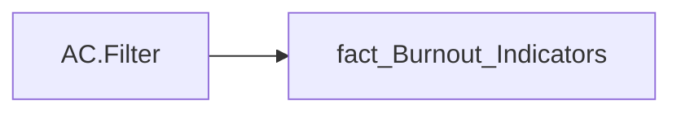

# AC.Filter

| Властивість | Значення |
|---|---|
| Тип | міра |
| Home table | _Measures |
| displayFolder | `Analytical Cases\Burnout_Risk\Main` |
| formatString | — |
| dataType | — |
| Прихована | ні |

## DAX

```dax
SELECTEDVALUE('fact_Burnout_Indicators'[IS_TOTAL_RISK])
```

## Джерела


Колонки: `IS_TOTAL_RISK`

Power Query: `fact_Burnout_Indicators`

## Бізнес-суть

IS_TOTAL_RISK → Ризик втрати працівника; IS_TOTAL_RISK → Ризик; IS_TOTAL_RISK → Ризик вигорання (%)

Це відсоток працівників, які знаходяться в статусі "Потребує уваги" = (кількість працівників в статусі "Потребує уваги"/загальну чисельність команди)*100%

**Вимоги:** `Індивідуальний-профіль-працівника/Паспортна-частина-індивідуального-профілю-співробітника`, `Індивідуальний-профіль-працівника/Паспортна-частина-індивідуального-профілю-співробітника/Сторінка-Картка-(паспорт)-працівника/Редизайн-паспортної-частини`, `Кейс-Утримання-працівників/Опис-джерел-для-сторінки-%22Кейс-звільнення-(вигорання)%22`, `Командний-профіль/Паспортна-частина-групового-профілю/Редизайн-паспортної-частини-групового-профілю`, `Командний-профіль/Сторінка-Моя-команда/ТЗ.-Деталізація-метрик-групового-профілю-звіту`

## Залежності

Таблиці: `fact_Burnout_Indicators`

Колонки: `fact_Burnout_Indicators[IS_TOTAL_RISK]`

## Схема



## Нотатки

_порожньо_
