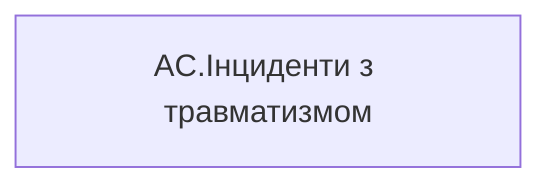

# AC.Інциденти з травматизмом

*тека `Group_Profile\Здоров'я та благополуччя`*

## Технічний опис

| Властивість | Значення |
|---|---|
| Тип | міра |
| Home table | _Measures |
| displayFolder | `Group_Profile\Здоров'я та благополуччя` |
| formatString | — |
| dataType | — |
| Прихована | ні |

### DAX

```dax
"В розробці"
```

### Джерела даних

—

### Залежності (таблиці й колонки)

—

### Схема



---

## Бізнес-суть

Інциденти з травматизмом

В звіті будуть dummy дані, поки не побудовані відповідні вітрини, які є джерелом даних

**Вимоги:** `Індивідуальний-профіль-працівника/Сторінка-Здоров'я-та-благополуччя-працівника`, `Командний-профіль/Сторінка-Здоров'я-та-благополуччя-команди`

## На сторінках звіту

[Group Profile](../report/group-profile.md)

## Пов'язані міри

_Прямих зв'язків з іншими мірами немає._

## Нотатки

_порожньо_
