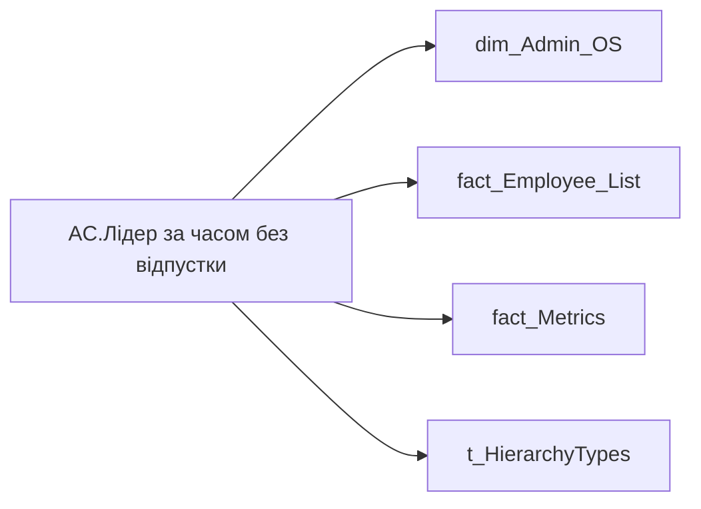

# AC.Лідер за часом без відпустки

*тека `Group_Profile\Здоров'я та благополуччя`*

## Технічний опис

| Властивість | Значення |
|---|---|
| Тип | міра |
| Home table | _Measures |
| displayFolder | `Group_Profile\Здоров'я та благополуччя` |
| formatString | — |
| dataType | — |
| Прихована | ні |

### DAX

```dax
//************* ROLE FILTERS **************
VAR _roleIndex = SELECTEDVALUE ( 't_HierarchyTypes'[Index], 1 )   -- 0 = LT, 1 = Admin
VAR _filter_lt= TREATAS ( VALUES ( 'dim_Admin_LT_OS'[USER_ACCESS_ID] ),'dim_Admin_OS'[USER_ACCESS_ID] )

//***** HEALTH AND WELLBEING FILTERS ******* 
VAR _employee_list = VALUES('fact_Employee_List'[EMPLOYEE_ID])
VAR _main_position_employees = 
	CALCULATETABLE(
		VALUES('fact_Employee_List'[USER_ACCESS_ID]),
		REMOVEFILTERS('fact_Employee_List'), 
		'fact_Employee_List'[EMPLOYEE_ID] IN _employee_list,
		'fact_Employee_List'[IS_MAIN_POSITION] = 1
	)
VAR _filter0 = TREATAS(_main_position_employees, 'dim_Admin_OS'[USER_ACCESS_ID])

/* *********** ADMIN *********** */
VAR _admin = 
	VAR _vac_reserve =
		CALCULATETABLE(
			ADDCOLUMNS(
				VALUES(dim_Admin_OS[USER_ACCESS_ID]),
				"@reserve",
				CALCULATE(
					SUM('fact_Metrics'[NO_VACATION_DURATION_BY_MAIN_POSITION])
				)
			)--,
			--REMOVEFILTERS(fact_Vacation_Reserve),
			--_filter0
		)
	VAR _top1 =
		TOPN(
			1,
			_vac_reserve,
			[@reserve],
			DESC
		)

	VAR _topUser = 
		LOOKUPVALUE(
			'dim_Admin_OS'[EMPLOYEE_NAME],
			'dim_Admin_OS'[USER_ACCESS_ID],
			MAXX(_top1, dim_Admin_OS[USER_ACCESS_ID])
		)
	VAR _topReserve = MAXX(_top1, [@reserve]) / 30
	RETURN FORMAT(_topReserve, "0") & " - " & _topUser
	
/* *********** LT *********** */
VAR _admin_lt =
	VAR _vac_reserve =
		CALCULATETABLE(
			ADDCOLUMNS(
				VALUES(dim_Admin_OS[USER_ACCESS_ID]),
				"@reserve",
				CALCULATE(
					SUM('fact_Metrics'[NO_VACATION_DURATION_BY_MAIN_POSITION])
				)
			),
			--REMOVEFILTERS(fact_Vacation_Reserve),
			--_filter0,
			_filter_lt
		)
	VAR _top1 =
		TOPN(
			1,
			_vac_reserve,
			[@reserve],
			DESC
		)

	VAR _topUser = 
		LOOKUPVALUE(
			'dim_Admin_OS'[EMPLOYEE_NAME],
			'dim_Admin_OS'[USER_ACCESS_ID],
			MAXX(_top1, dim_Admin_OS[USER_ACCESS_ID])
		)
	VAR _topReserve = MAXX(_top1, [@reserve]) / 30
	RETURN FORMAT(_topReserve, "0") & " - " & _topUser
VAR _res =
	SWITCH (
		_roleIndex,
		0, _admin_lt,    -- LT
		1, _admin,       -- Admin
		_admin
	)

RETURN _res
```

### Джерела даних

Вихідні таблиці: `DM.vw_R27_dim_Employee_Access_List`

Колонки: `EMPLOYEE_ID`, `EMPLOYEE_NAME`, `IS_MAIN_POSITION`, `Index`, `NO_VACATION_DURATION_BY_MAIN_POSITION`, `USER_ACCESS_ID`

Power Query: `dim_Admin_OS`

### Залежності (таблиці й колонки)

Таблиці: `dim_Admin_OS`, `fact_Employee_List`, `fact_Metrics`, `t_HierarchyTypes`

Колонки: `dim_Admin_LT_OS[USER_ACCESS_ID]`, `dim_Admin_OS[EMPLOYEE_NAME]`, `dim_Admin_OS[USER_ACCESS_ID]`, `fact_Employee_List[EMPLOYEE_ID]`, `fact_Employee_List[IS_MAIN_POSITION]`, `fact_Employee_List[USER_ACCESS_ID]`, `fact_Metrics[NO_VACATION_DURATION_BY_MAIN_POSITION]`, `t_HierarchyTypes[Index]`

### Схема



---

## Бізнес-суть

**Бізнес-назва:** Лідер за часом без відпустки

### Опис із ТЗ

Розрахункове поле.   Відібрати `EMPLOYEE_ID`, де `no_vacation_duration_months` має найбільше значення та вивести це значення та ПІБ працівника (`full_name`)   Якщо є кілька співробітників із однаковим значенням місяців без відпустки, то виводити кожного з них. Виводити максимально моюливу кількість записів списком. Якщо не вміщається, поставити в кінці ..., а по наведенню мишки показувати всіх.   Якщо значення в полі відсутнє, то показати текст "Дані відсутні" або знак "-".

Розрахункове поле.   Відібрати `EMPLOYEE_ID`, де `no_vacation_duration_months` має найбільше значення та вивести це значення та ПІБ працівника (`full_name`)   Якщо є кілька співробітників із однаковим значенням місяців без відпустки, то виводити кожного з них.   Якщо значення в полі відсутнє, то показати текст "Дані відсутні" або знак "-".

**Вимоги (ТЗ):**

- [Командний профіль › Сторінка Здоров'я та благополуччя команди](https://dev.azure.com/MHPITDepProjects/People%20Digital%20Profile%20%28PDP%29/_wiki/wikis/PDP.wiki?pagePath=/%D0%A4%D1%83%D0%BD%D0%BA%D1%86%D1%96%D0%BE%D0%BD%D0%B0%D0%BB%D1%8C%D0%BD%D1%96%20%D0%B2%D0%B8%D0%BC%D0%BE%D0%B3%D0%B8/%D0%92%D0%B8%D0%BC%D0%BE%D0%B3%D0%B8%20%D0%B4%D0%BE%20%D0%B7%D0%B2%D1%96%D1%82%D1%83%20People%20Digital%20Profile/%D0%9A%D0%BE%D0%BC%D0%B0%D0%BD%D0%B4%D0%BD%D0%B8%D0%B9%20%D0%BF%D1%80%D0%BE%D1%84%D1%96%D0%BB%D1%8C/%D0%A1%D1%82%D0%BE%D1%80%D1%96%D0%BD%D0%BA%D0%B0%20%D0%97%D0%B4%D0%BE%D1%80%D0%BE%D0%B2%27%D1%8F%20%D1%82%D0%B0%20%D0%B1%D0%BB%D0%B0%D0%B3%D0%BE%D0%BF%D0%BE%D0%BB%D1%83%D1%87%D1%87%D1%8F%20%D0%BA%D0%BE%D0%BC%D0%B0%D0%BD%D0%B4%D0%B8)

## На сторінках звіту

[Group Profile](../report/group-profile.md)

## Пов'язані міри

_Прямих зв'язків з іншими мірами немає._

## Нотатки

_порожньо_
