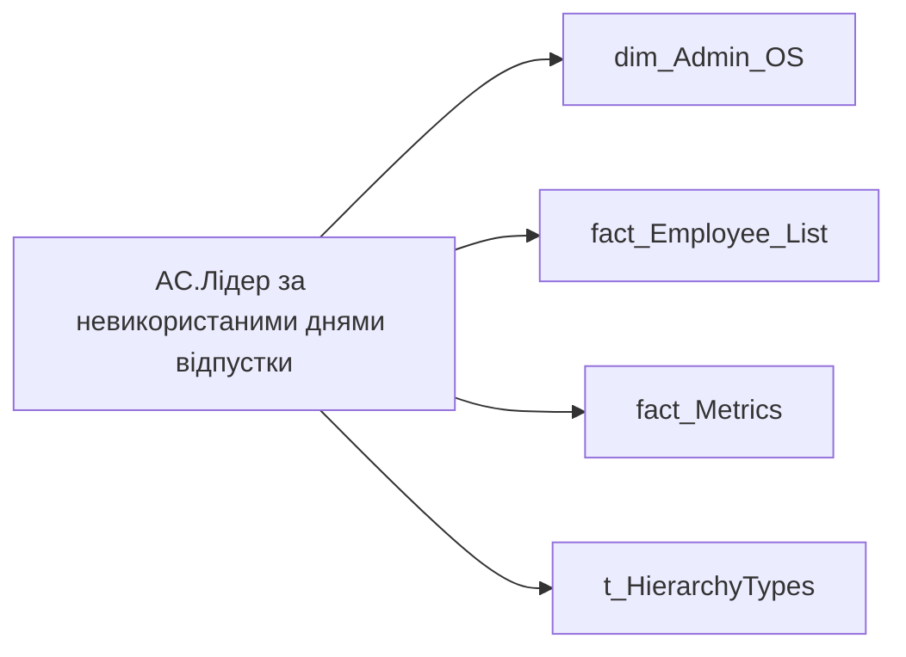

# AC.Лідер за невикористаними днями відпустки

*тека `Group_Profile\Здоров'я та благополуччя`*

## Технічний опис

| Властивість | Значення |
|---|---|
| Тип | міра |
| Home table | _Measures |
| displayFolder | `Group_Profile\Здоров'я та благополуччя` |
| formatString | — |
| dataType | — |
| Прихована | ні |

### DAX

```dax
//************* ROLE FILTERS **************
VAR _roleIndex = SELECTEDVALUE ( 't_HierarchyTypes'[Index], 1 )   -- 0 = LT, 1 = Admin
VAR _filter_lt= TREATAS ( VALUES ( 'dim_Admin_LT_OS'[USER_ACCESS_ID] ),'dim_Admin_OS'[USER_ACCESS_ID] )

//***** HEALTH AND WELLBEING FILTERS ******* 
VAR _employee_list = VALUES('fact_Employee_List'[EMPLOYEE_ID])
VAR _main_position_employees = 
	CALCULATETABLE(
		VALUES('fact_Employee_List'[USER_ACCESS_ID]),
		REMOVEFILTERS('fact_Employee_List'), 
		'fact_Employee_List'[EMPLOYEE_ID] IN _employee_list,
		'fact_Employee_List'[IS_MAIN_POSITION] = 1
	)
VAR _filter0 = TREATAS(_main_position_employees, 'dim_Admin_OS'[USER_ACCESS_ID])

/* *********** ADMIN *********** */
VAR _admin = 
	VAR _vac_reserve =
		CALCULATETABLE(
			ADDCOLUMNS(
				VALUES(dim_Admin_OS[USER_ACCESS_ID]),
				"@reserve",
				CALCULATE(
					SUM('fact_Metrics'[VACATION_RESERVE_BY_MAIN_POSITION])
				)
			)--,
			--REMOVEFILTERS(fact_Vacation_Reserve),
			--_filter0
		)
	VAR _top1 =
		TOPN(
			1,
			_vac_reserve,
			[@reserve],
			DESC
		)

	VAR _topUser = 
		LOOKUPVALUE(
			'dim_Admin_OS'[EMPLOYEE_NAME],
			'dim_Admin_OS'[USER_ACCESS_ID],
			MAXX(_top1, dim_Admin_OS[USER_ACCESS_ID])
		)
	VAR _topReserve = MAXX(_top1, [@reserve])
	RETURN FORMAT(_topReserve, "0") & " - " & _topUser
	
/* *********** LT *********** */
VAR _admin_lt =
	VAR _vac_reserve =
		CALCULATETABLE(
			ADDCOLUMNS(
				VALUES(dim_Admin_OS[USER_ACCESS_ID]),
				"@reserve",
				CALCULATE(
					SUM('fact_Metrics'[VACATION_RESERVE_BY_MAIN_POSITION])
				)
			),
			--REMOVEFILTERS(fact_Vacation_Reserve),
			--_filter0,
			_filter_lt
		)
	VAR _top1 =
		TOPN(
			1,
			_vac_reserve,
			[@reserve],
			DESC
		)

	VAR _topUser = 
		LOOKUPVALUE(
			'dim_Admin_OS'[EMPLOYEE_NAME],
			'dim_Admin_OS'[USER_ACCESS_ID],
			MAXX(_top1, dim_Admin_OS[USER_ACCESS_ID])
		)
	VAR _topReserve = MAXX(_top1, [@reserve])
	RETURN FORMAT(_topReserve, "0") & " - " & _topUser
VAR _res =
	SWITCH (
		_roleIndex,
		0, _admin_lt,    -- LT
		1, _admin,       -- Admin
		_admin
	)

RETURN _res
```

### Джерела даних

Вихідні таблиці: `DM.vw_R27_dim_Employee_Access_List`

Колонки: `EMPLOYEE_ID`, `EMPLOYEE_NAME`, `IS_MAIN_POSITION`, `Index`, `USER_ACCESS_ID`, `VACATION_RESERVE_BY_MAIN_POSITION`

Power Query: `dim_Admin_OS`

### Залежності (таблиці й колонки)

Таблиці: `dim_Admin_OS`, `fact_Employee_List`, `fact_Metrics`, `t_HierarchyTypes`

Колонки: `dim_Admin_LT_OS[USER_ACCESS_ID]`, `dim_Admin_OS[EMPLOYEE_NAME]`, `dim_Admin_OS[USER_ACCESS_ID]`, `fact_Employee_List[EMPLOYEE_ID]`, `fact_Employee_List[IS_MAIN_POSITION]`, `fact_Employee_List[USER_ACCESS_ID]`, `fact_Metrics[VACATION_RESERVE_BY_MAIN_POSITION]`, `t_HierarchyTypes[Index]`

### Схема



---

## Бізнес-суть

EMPLOYEE_NAME → ПІБ співробітника; IS_MAIN_POSITION → Пріоритетне місце роботи; IS_MAIN_POSITION → is_main_position; VACATION_RESERVE_BY_MAIN_POSITION → Залишок відпустки

1 - Так  <br>0 - Ні Це залишок днів відпусток, по яким формується резерв відпусток по підприємству /п)  <br>Це поле має бути доступне у візуалізаціях, побудованих на основі фактової таблиці [ DM.vw_R27_fact_Vacation_Reserve].  <br>Цифру округлювати до цілих в більшу сторону, якщо цифра після коми 5-9, і в меншу сторону, якщо цифра після коми 0-4.  <br>Не включати в MVP, але потрібно буде додати цей же показник, але в роках. Це відношення норми днів відпусток до залишку відпусток. Норма днів відпусток - відсутній в джерелах даних, потрібно досліджувати.

**Вимоги:** `Індивідуальний-профіль-працівника/Історія-по-посадам`, `Індивідуальний-профіль-працівника/Історія-по-посадам/Реліз-1.-Історія-по-посадам`, `Індивідуальний-профіль-працівника/Сторінка-Взаємодія-Viva-та-залученість-працівника/Сторінка-Ефективність-працівника/Вітрина-Відвідування-офісів`, `Індивідуальний-профіль-працівника/Сторінка-Загальна-інформація-про-працівника`, `Індивідуальний-профіль-працівника/Сторінка-Здоров'я-та-благополуччя-працівника`, `Командний-профіль/Сторінка-Моя-команда/ТЗ.-Деталізація-метрик-групового-профілю-звіту`, `Командний-профіль/Сторінка-Плинність-та-Exits/ТЗ-на-вітрину-Exits`

## На сторінках звіту

[Group Profile](../report/group-profile.md)

## Пов'язані міри

_Прямих зв'язків з іншими мірами немає._

## Нотатки

_порожньо_
