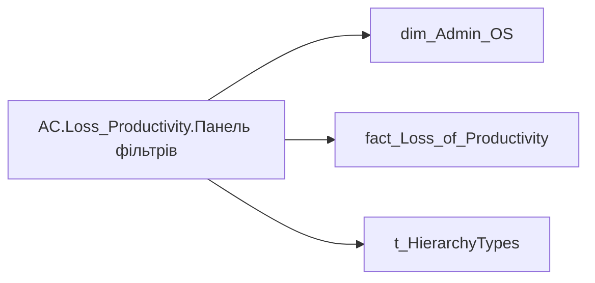

# AC.Loss_Productivity.Панель фільтрів

| Властивість | Значення |
|---|---|
| Тип | міра |
| Home table | _Measures |
| displayFolder | `Analytical Cases\Loss_Productivity\Formatting` |
| formatString | — |
| dataType | — |
| Прихована | ні |

## DAX

```dax
VAR _Admin_lt = 
    CALCULATETABLE(
        VALUES(dim_Admin_LT_OS[USER_ACCESS_ID]),
        'dim_Admin_LT_OS'[USER_ROLE]  = "Адміністративний керівник"
    )

VAR _HRBP_lt = 
    CALCULATETABLE(
        VALUES(dim_Admin_LT_OS[USER_ACCESS_ID]),
        'dim_Admin_LT_OS'[USER_ROLE]  = "HRBP"
    )
VAR _Admin = 
	SWITCH(
		SELECTEDVALUE('t_HierarchyTypes'[HierarchyType]),
		"Hierarchy",
		CALCULATE(
			COUNTROWS(VALUES('fact_Loss_of_Productivity'[USER_ACCESS_ID])),
            'dim_Admin_OS'[USER_ROLE]  = "Адміністративний керівник"
		),
		"Lead Team",
		CALCULATE(
			COUNTROWS(VALUES('fact_Loss_of_Productivity'[USER_ACCESS_ID])),
			TREATAS(_Admin_lt, 'fact_Loss_of_Productivity'[USER_ACCESS_ID]),
            'dim_Admin_OS'[USER_ROLE]  = "Адміністративний керівник"
		)
	)

VAR _HRBP = 
	SWITCH(
		SELECTEDVALUE('t_HierarchyTypes'[HierarchyType]),
		"Hierarchy",
		CALCULATE(
			COUNTROWS(VALUES('fact_Loss_of_Productivity'[USER_ACCESS_ID])),
            'dim_Admin_OS'[USER_ROLE]  = "HRBP"
		),
		"Lead Team",
		CALCULATE(
			COUNTROWS(VALUES('fact_Loss_of_Productivity'[USER_ACCESS_ID])),
			TREATAS(_HRBP_lt, 'fact_Loss_of_Productivity'[USER_ACCESS_ID]),
            'dim_Admin_OS'[USER_ROLE]  = "HRBP"
		)
	)

VAR _v = 
 SWITCH(
    SELECTEDVALUE('dim_Admin_OS'[USER_ROLE]),
    "Адміністративний керівник", _Admin,
    "HRBP", _HRBP
 )
 
RETURN 
	"Панель фільтрів ("& 
		COALESCE(
			TRIM(
				FORMAT(
					_v, 
					"[uk-UA]# ##0"
				)
			),
			0
		) 
	& ")"
```

## Джерела

Вихідні таблиці: `DM.vw_R27_dim_Employee_Access_List`, `DM.vw_R27_fact_Loss_of_Productivity`

Колонки: `HierarchyType`, `USER_ACCESS_ID`, `USER_ROLE`

Power Query: `dim_Admin_OS`

## Бізнес-суть

!!! warning "Без бізнес-визначення"
    Поля міри не знайдено у wiki «Таблицях джерел даних». Заповніть `manualNotes`.

## Залежності

Таблиці: `dim_Admin_OS`, `fact_Loss_of_Productivity`, `t_HierarchyTypes`

Колонки: `dim_Admin_LT_OS[USER_ROLE]`, `dim_Admin_OS[USER_ROLE]`, `fact_Loss_of_Productivity[USER_ACCESS_ID]`, `t_HierarchyTypes[HierarchyType]`

## Схема



## Нотатки

_порожньо_
