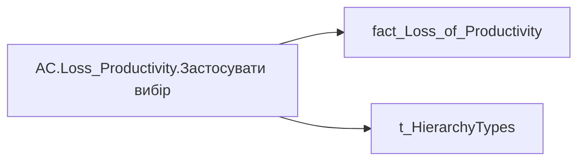

# AC.Loss_Productivity.Застосувати вибір

*тека `Analytical Cases\Loss_Productivity\Formatting`*

## Бізнес-суть

!!! note "Бізнес-визначення відсутнє"
    Поля міри не зіставлено з wiki «Таблицями джерел даних». Можна заповнити вручну в `manualNotes`.

## На сторінках звіту

[Продуктивність працівників](../report/produktyvnist-pratsivnykiv.md)

## Пов'язані міри

_Прямих зв'язків з іншими мірами немає._

---

## Технічний опис

| Властивість | Значення |
|---|---|
| Тип | міра |
| Home table | _Measures |
| displayFolder | `Analytical Cases\Loss_Productivity\Formatting` |
| formatString | — |
| dataType | — |
| Прихована | ні |

### DAX

```dax
VAR _v = 
	SWITCH(
		SELECTEDVALUE('t_HierarchyTypes'[HierarchyType]),
		"Hierarchy", CALCULATE(COUNTROWS(VALUES('fact_Loss_of_Productivity'[USER_ACCESS_ID]))),
		"Lead Team",
		CALCULATE(
			COUNTROWS(VALUES('fact_Loss_of_Productivity'[USER_ACCESS_ID])),
			TREATAS(VALUES(dim_Admin_LT_OS[USER_ACCESS_ID]), 'fact_Loss_of_Productivity'[USER_ACCESS_ID])
		)
	)
RETURN 
	"Застосувати вибір ("& 
		COALESCE(
			TRIM(
				FORMAT(
					COALESCE(_v, 0),
					"[uk-UA]# ##0"
				)
			),
			0
		) 
	& ")"
```

### Джерела даних

Вихідні таблиці: `DM.vw_R27_fact_Loss_of_Productivity`

Колонки: `HierarchyType`, `USER_ACCESS_ID`

Power Query: `fact_Loss_of_Productivity`

### Залежності (таблиці й колонки)

Таблиці: `fact_Loss_of_Productivity`, `t_HierarchyTypes`

Колонки: `fact_Loss_of_Productivity[USER_ACCESS_ID]`, `t_HierarchyTypes[HierarchyType]`

### Схема



## Нотатки

_порожньо_
