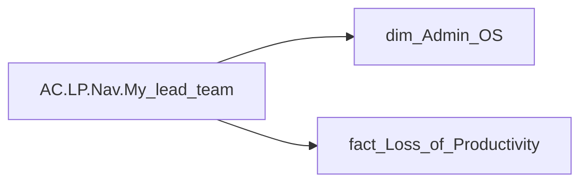

# AC.LP.Nav.My_lead_team

| Властивість | Значення |
|---|---|
| Тип | міра |
| Home table | _Measures |
| displayFolder | `Analytical Cases\Loss_Productivity\Formatting` |
| formatString | `0` |
| dataType | — |
| Прихована | ні |

## DAX

```dax
SWITCH(
	CALCULATE(
		SELECTEDVALUE('dim_Admin_OS'[path_length_rls]),
		TREATAS(VALUES('fact_Loss_of_Productivity'[USER_ACCESS_ID]), 'dim_Admin_OS'[USER_ACCESS_ID])
	)  <= 
    SWITCH(
        SELECTEDVALUE('dim_Admin_OS'[USER_ROLE]),
        "Адміністративний керівник", [User_Admin_Hierarchy_Level],
        "HRBP", [User_HRBP_Hierarchy_Level]
    ) + 2,
	TRUE(), 1,
	0
)
```

## Джерела

Вихідні таблиці: `DM.vw_R27_dim_Employee_Access_List`, `DM.vw_R27_fact_Loss_of_Productivity`

Колонки: `USER_ACCESS_ID`, `USER_ROLE`, `path_length_rls`

Power Query: `dim_Admin_OS`

## Бізнес-суть

!!! warning "Без бізнес-визначення"
    Поля міри не знайдено у wiki «Таблицях джерел даних». Заповніть `manualNotes`.

## Залежності

Міри: [User_Admin_Hierarchy_Level](../measures/user-admin-hierarchy-level.md), [User_HRBP_Hierarchy_Level](../measures/user-hrbp-hierarchy-level.md)

Таблиці: `dim_Admin_OS`, `fact_Loss_of_Productivity`

Колонки: `dim_Admin_OS[USER_ACCESS_ID]`, `dim_Admin_OS[USER_ROLE]`, `dim_Admin_OS[path_length_rls]`, `fact_Loss_of_Productivity[USER_ACCESS_ID]`

## Схема



## Нотатки

_порожньо_
