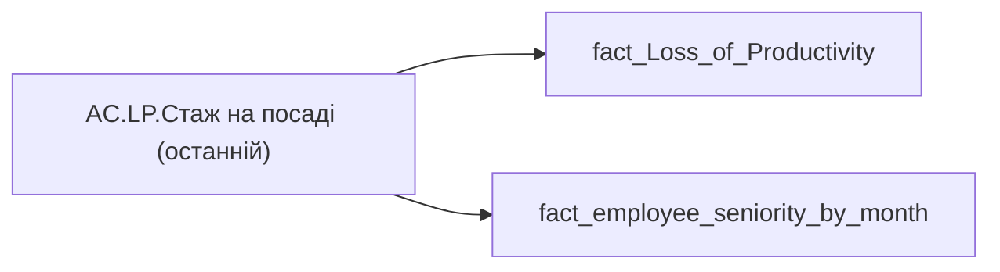

# AC.LP.Стаж на посаді (останній)

*тека `Analytical Cases\Loss_Productivity\Export`*

## Бізнес-суть

seniority_LAST_POSITION_HIRE_DATE → Стаж на посаді

Значення поля в місяцях потрібно перевести в роки та місяці. Наприклад, якшо seniority_LAST_POSITION_HIRE_DATE= 17, то в звіті треба відобразити 1 рік 5 місяців.

**Вимоги:** `Індивідуальний-профіль-працівника/Історія-по-посадам`, `Індивідуальний-профіль-працівника/Історія-по-посадам/Реліз-1.-Історія-по-посадам`, `Індивідуальний-профіль-працівника/Паспортна-частина-індивідуального-профілю-співробітника/Сторінка-Картка-(паспорт)-працівника`, `Індивідуальний-профіль-працівника/Сторінка-Загальна-інформація-про-працівника`, `Командний-профіль/Сторінка-Моя-команда/ТЗ.-Деталізація-метрик-групового-профілю-звіту`

## На сторінках звіту

[Продуктивність працівників](../report/produktyvnist-pratsivnykiv.md)

## Пов'язані міри

_Прямих зв'язків з іншими мірами немає._

---

## Технічний опис

| Властивість | Значення |
|---|---|
| Тип | міра |
| Home table | _Measures |
| displayFolder | `Analytical Cases\Loss_Productivity\Export` |
| formatString | — |
| dataType | — |
| Прихована | ні |

### DAX

```dax
VAR _user = VALUES('fact_Loss_of_Productivity'[USER_ACCESS_ID])
VAR _seniority = 
	CALCULATE(
		SELECTEDVALUE(fact_employee_seniority_by_month[seniority_LAST_POSITION_HIRE_DATE]),
		TREATAS(_user, 'fact_employee_seniority_by_month'[USER_ACCESS_ID])
	)
VAR _years = ROUNDDOWN(_seniority/12,0)
VAR _month = _seniority - _years *12
VAR _res = 
	IF(
		NOT ISBLANK( _seniority ),
		IF(
			NOT ISBLANK( _years ),
			_years & " р."
		) & " " &
		IF(
			NOT ISBLANK( _month ) && _month <> 0,
			_month & " міс."
		)
	)
RETURN _res
```

### Джерела даних

Вихідні таблиці: `DM.vw_R27_fact_Loss_of_Productivity`, `DM.vw_R27_fact_employee_seniority_by_month_PDP`

Колонки: `USER_ACCESS_ID`, `seniority_LAST_POSITION_HIRE_DATE`

Power Query: `fact_Loss_of_Productivity`

### Залежності (таблиці й колонки)

Таблиці: `fact_Loss_of_Productivity`, `fact_employee_seniority_by_month`

Колонки: `fact_Loss_of_Productivity[USER_ACCESS_ID]`, `fact_employee_seniority_by_month[USER_ACCESS_ID]`, `fact_employee_seniority_by_month[seniority_LAST_POSITION_HIRE_DATE]`

### Схема



## Нотатки

_порожньо_
