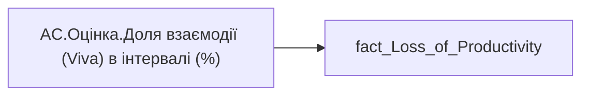

# AC.Оцінка.Доля взаємодії (Viva) в інтервалі (%)

| Властивість | Значення |
|---|---|
| Тип | міра |
| Home table | _Measures |
| displayFolder | `Analytical Cases\Loss_Productivity\Main` |
| formatString | — |
| dataType | — |
| Прихована | ні |

## DAX

```dax
//НЕ видаляти пробіли для ✅
VAR _res = 
	SWITCH(
		SELECTEDVALUE('fact_Loss_of_Productivity'[Collab_Hour_by_Span]),
		0, " ✅ ",
		0.5, " ⚠️ ",
		1, "❌",
		"━"
	)
RETURN COALESCE( _res, "-" )
```

## Джерела

Вихідні таблиці: `DM.vw_R27_fact_Loss_of_Productivity`

Колонки: `Collab_Hour_by_Span`

Power Query: `fact_Loss_of_Productivity`

## Бізнес-суть

Collab_Hour_by_Span → Доля взаємодії (Viva) в інтервалі (%)

**Вимоги:** `Кейс-Втрати-Продуктивності-Працівників`

## Залежності

Таблиці: `fact_Loss_of_Productivity`

Колонки: `fact_Loss_of_Productivity[Collab_Hour_by_Span]`

## Схема



## Нотатки

_порожньо_
