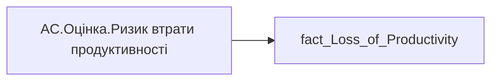

# AC.Оцінка.Ризик втрати продуктивності

*тека `Analytical Cases\Loss_Productivity\Main`*

## Технічний опис

| Властивість | Значення |
|---|---|
| Тип | міра |
| Home table | _Measures |
| displayFolder | `Analytical Cases\Loss_Productivity\Main` |
| formatString | — |
| dataType | — |
| Прихована | ні |

### DAX

```dax
VAR _val = SELECTEDVALUE('fact_Loss_of_Productivity'[Total_Risk_Productive_Name])
VAR _txt = COALESCE(_val, "Не визначено")

VAR _fill =
	SWITCH(
		_txt,
		"Ризик", "#FDE0D0",
		"Помірний ризик", "#D0E8F2",
		"Відсутній ризик", "#C9CFD6",
		"#C9CFD6"
	)
VAR _textColor =
	SWITCH(
		_txt,
		"Ризик", "#A63D00",
		"Помірний ризик", "#004D73",
		"Відсутній ризик", "#3B4552",
		"#3B4552"
	)
VAR _stroke =
	SWITCH(
		_txt,
		"Ризик", "#D55E00",
		"Помірний ризик", "#0072B2",
		"Відсутній ризик","#AEB6BF",
		"#AEB6BF"
	)

VAR _rectW = 110
VAR _rectH = 16
VAR _r = 8
VAR _font = 10
VAR _centerX = _rectW / 2

RETURN
"data:image/svg+xml;utf8," &
"<svg xmlns='http://www.w3.org/2000/svg' width='" & _rectW & "' height='" & _rectH & "'>
<rect x='0' y='0' rx='"&_r&"' ry='"&_r&"' width='"&_rectW&"' height='"&_rectH&"' fill='"&_fill&"' stroke='"&_stroke&"' stroke-width='0.8'/>
<text x='"&_centerX&"' y='"&(_rectH/2)&"' font-size='"&_font&"px' font-family='Segoe UI' font-weight='500' text-anchor='middle' dominant-baseline='central' fill='"&_textColor&"'>"&_txt&"</text>
</svg>"
```

### Джерела даних

Вихідні таблиці: `DM.vw_R27_fact_Loss_of_Productivity`

Колонки: `Total_Risk_Productive_Name`

Power Query: `fact_Loss_of_Productivity`

### Залежності (таблиці й колонки)

Таблиці: `fact_Loss_of_Productivity`

Колонки: `fact_Loss_of_Productivity[Total_Risk_Productive_Name]`

### Схема



---

## Бізнес-суть

**Бізнес-назва:** Ризик втрати продуктивності

**Вимоги (ТЗ):**

- [Індивідуальний профіль працівника › Паспортна частина індивідуального профілю співробітника](https://dev.azure.com/MHPITDepProjects/People%20Digital%20Profile%20%28PDP%29/_wiki/wikis/PDP.wiki?pagePath=/%D0%A4%D1%83%D0%BD%D0%BA%D1%86%D1%96%D0%BE%D0%BD%D0%B0%D0%BB%D1%8C%D0%BD%D1%96%20%D0%B2%D0%B8%D0%BC%D0%BE%D0%B3%D0%B8/%D0%92%D0%B8%D0%BC%D0%BE%D0%B3%D0%B8%20%D0%B4%D0%BE%20%D0%B7%D0%B2%D1%96%D1%82%D1%83%20People%20Digital%20Profile/%D0%86%D0%BD%D0%B4%D0%B8%D0%B2%D1%96%D0%B4%D1%83%D0%B0%D0%BB%D1%8C%D0%BD%D0%B8%D0%B9%20%D0%BF%D1%80%D0%BE%D1%84%D1%96%D0%BB%D1%8C%20%D0%BF%D1%80%D0%B0%D1%86%D1%96%D0%B2%D0%BD%D0%B8%D0%BA%D0%B0/%D0%9F%D0%B0%D1%81%D0%BF%D0%BE%D1%80%D1%82%D0%BD%D0%B0%20%D1%87%D0%B0%D1%81%D1%82%D0%B8%D0%BD%D0%B0%20%D1%96%D0%BD%D0%B4%D0%B8%D0%B2%D1%96%D0%B4%D1%83%D0%B0%D0%BB%D1%8C%D0%BD%D0%BE%D0%B3%D0%BE%20%D0%BF%D1%80%D0%BE%D1%84%D1%96%D0%BB%D1%8E%20%D1%81%D0%BF%D1%96%D0%B2%D1%80%D0%BE%D0%B1%D1%96%D1%82%D0%BD%D0%B8%D0%BA%D0%B0)
- [Індивідуальний профіль працівника › Паспортна частина індивідуального профілю співробітника › Сторінка Картка (паспорт) працівника › Редизайн паспортної частини](https://dev.azure.com/MHPITDepProjects/People%20Digital%20Profile%20%28PDP%29/_wiki/wikis/PDP.wiki?pagePath=/%D0%A4%D1%83%D0%BD%D0%BA%D1%86%D1%96%D0%BE%D0%BD%D0%B0%D0%BB%D1%8C%D0%BD%D1%96%20%D0%B2%D0%B8%D0%BC%D0%BE%D0%B3%D0%B8/%D0%92%D0%B8%D0%BC%D0%BE%D0%B3%D0%B8%20%D0%B4%D0%BE%20%D0%B7%D0%B2%D1%96%D1%82%D1%83%20People%20Digital%20Profile/%D0%86%D0%BD%D0%B4%D0%B8%D0%B2%D1%96%D0%B4%D1%83%D0%B0%D0%BB%D1%8C%D0%BD%D0%B8%D0%B9%20%D0%BF%D1%80%D0%BE%D1%84%D1%96%D0%BB%D1%8C%20%D0%BF%D1%80%D0%B0%D1%86%D1%96%D0%B2%D0%BD%D0%B8%D0%BA%D0%B0/%D0%9F%D0%B0%D1%81%D0%BF%D0%BE%D1%80%D1%82%D0%BD%D0%B0%20%D1%87%D0%B0%D1%81%D1%82%D0%B8%D0%BD%D0%B0%20%D1%96%D0%BD%D0%B4%D0%B8%D0%B2%D1%96%D0%B4%D1%83%D0%B0%D0%BB%D1%8C%D0%BD%D0%BE%D0%B3%D0%BE%20%D0%BF%D1%80%D0%BE%D1%84%D1%96%D0%BB%D1%8E%20%D1%81%D0%BF%D1%96%D0%B2%D1%80%D0%BE%D0%B1%D1%96%D1%82%D0%BD%D0%B8%D0%BA%D0%B0/%D0%A1%D1%82%D0%BE%D1%80%D1%96%D0%BD%D0%BA%D0%B0%20%D0%9A%D0%B0%D1%80%D1%82%D0%BA%D0%B0%20%28%D0%BF%D0%B0%D1%81%D0%BF%D0%BE%D1%80%D1%82%29%20%D0%BF%D1%80%D0%B0%D1%86%D1%96%D0%B2%D0%BD%D0%B8%D0%BA%D0%B0/%D0%A0%D0%B5%D0%B4%D0%B8%D0%B7%D0%B0%D0%B9%D0%BD%20%D0%BF%D0%B0%D1%81%D0%BF%D0%BE%D1%80%D1%82%D0%BD%D0%BE%D1%97%20%D1%87%D0%B0%D1%81%D1%82%D0%B8%D0%BD%D0%B8)
- [Кейс Втрати Продуктивності Працівників](https://dev.azure.com/MHPITDepProjects/People%20Digital%20Profile%20%28PDP%29/_wiki/wikis/PDP.wiki?pagePath=/%D0%A4%D1%83%D0%BD%D0%BA%D1%86%D1%96%D0%BE%D0%BD%D0%B0%D0%BB%D1%8C%D0%BD%D1%96%20%D0%B2%D0%B8%D0%BC%D0%BE%D0%B3%D0%B8/%D0%92%D0%B8%D0%BC%D0%BE%D0%B3%D0%B8%20%D0%B4%D0%BE%20%D0%B7%D0%B2%D1%96%D1%82%D1%83%20People%20Digital%20Profile/%D0%9A%D0%B5%D0%B9%D1%81%20%D0%92%D1%82%D1%80%D0%B0%D1%82%D0%B8%20%D0%9F%D1%80%D0%BE%D0%B4%D1%83%D0%BA%D1%82%D0%B8%D0%B2%D0%BD%D0%BE%D1%81%D1%82%D1%96%20%D0%9F%D1%80%D0%B0%D1%86%D1%96%D0%B2%D0%BD%D0%B8%D0%BA%D1%96%D0%B2)
- [Командний профіль › Сторінка Моя команда › ТЗ. Деталізація метрик групового профілю звіту](https://dev.azure.com/MHPITDepProjects/People%20Digital%20Profile%20%28PDP%29/_wiki/wikis/PDP.wiki?pagePath=/%D0%A4%D1%83%D0%BD%D0%BA%D1%86%D1%96%D0%BE%D0%BD%D0%B0%D0%BB%D1%8C%D0%BD%D1%96%20%D0%B2%D0%B8%D0%BC%D0%BE%D0%B3%D0%B8/%D0%92%D0%B8%D0%BC%D0%BE%D0%B3%D0%B8%20%D0%B4%D0%BE%20%D0%B7%D0%B2%D1%96%D1%82%D1%83%20People%20Digital%20Profile/%D0%9A%D0%BE%D0%BC%D0%B0%D0%BD%D0%B4%D0%BD%D0%B8%D0%B9%20%D0%BF%D1%80%D0%BE%D1%84%D1%96%D0%BB%D1%8C/%D0%A1%D1%82%D0%BE%D1%80%D1%96%D0%BD%D0%BA%D0%B0%20%D0%9C%D0%BE%D1%8F%20%D0%BA%D0%BE%D0%BC%D0%B0%D0%BD%D0%B4%D0%B0/%D0%A2%D0%97.%20%D0%94%D0%B5%D1%82%D0%B0%D0%BB%D1%96%D0%B7%D0%B0%D1%86%D1%96%D1%8F%20%D0%BC%D0%B5%D1%82%D1%80%D0%B8%D0%BA%20%D0%B3%D1%80%D1%83%D0%BF%D0%BE%D0%B2%D0%BE%D0%B3%D0%BE%20%D0%BF%D1%80%D0%BE%D1%84%D1%96%D0%BB%D1%8E%20%D0%B7%D0%B2%D1%96%D1%82%D1%83)

## На сторінках звіту

_Не використовується на основних сторінках звіту._

## Пов'язані міри

**Використовується в:** [AC.Switch.Ризик втрати продуктивності](../measures/ac-switch-ryzyk-vtraty-produktyvnosti.md)

## Нотатки

_порожньо_
