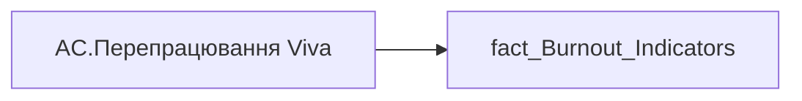

# AC.Перепрацювання Viva

*тека `Analytical Cases\Burnout_Risk\Main`*

## Технічний опис

| Властивість | Значення |
|---|---|
| Тип | міра |
| Home table | _Measures |
| displayFolder | `Analytical Cases\Burnout_Risk\Main` |
| formatString | — |
| dataType | — |
| Прихована | ні |

### DAX

```dax
VAR _res = SUM(fact_Burnout_Indicators[VIVA_OVERWORKING])
RETURN _res
```

### Джерела даних


Колонки: `VIVA_OVERWORKING`

Power Query: `fact_Burnout_Indicators`

### Залежності (таблиці й колонки)

Таблиці: `fact_Burnout_Indicators`

Колонки: `fact_Burnout_Indicators[VIVA_OVERWORKING]`

### Схема



---

## Бізнес-суть

**Бізнес-назва:** Перепрацювання Viva

### Опис із ТЗ

`Viva_Overworking` = `TOTAL_AFTER_HOURS`/   `workdays_without_sickleaves_and_vacations`. **18.05.2026** Якщо поле `TOTAL_AFTER_HOURS` > 0 і поле `workdays_without_sickleaves_and_vacations` = 0, то замість `workdays_without_sickleaves_and_vacations` брати значення поля `Viva_days_6month`.

??? note "Поля-джерела та пов'язані бізнес-метрики (3)"
    | Поле | Бізнес-метрики |
    |---|---|
    | `VIVA_OVERWORKING` | Перепрацювання (Viva) · Чи є ризик вигорання через перепрацювання? · Перепрацювання Viva |

**Вимоги (ТЗ):**

- [Допоміжні вітрини для звіту › Таблиця для розрахунку агрегованих метрик по звіту](https://dev.azure.com/MHPITDepProjects/People%20Digital%20Profile%20%28PDP%29/_wiki/wikis/PDP.wiki?pagePath=/%D0%A4%D1%83%D0%BD%D0%BA%D1%86%D1%96%D0%BE%D0%BD%D0%B0%D0%BB%D1%8C%D0%BD%D1%96%20%D0%B2%D0%B8%D0%BC%D0%BE%D0%B3%D0%B8/%D0%92%D0%B8%D0%BC%D0%BE%D0%B3%D0%B8%20%D0%B4%D0%BE%20%D0%B7%D0%B2%D1%96%D1%82%D1%83%20People%20Digital%20Profile/%D0%94%D0%BE%D0%BF%D0%BE%D0%BC%D1%96%D0%B6%D0%BD%D1%96%20%D0%B2%D1%96%D1%82%D1%80%D0%B8%D0%BD%D0%B8%20%D0%B4%D0%BB%D1%8F%20%D0%B7%D0%B2%D1%96%D1%82%D1%83/%D0%A2%D0%B0%D0%B1%D0%BB%D0%B8%D1%86%D1%8F%20%D0%B4%D0%BB%D1%8F%20%D1%80%D0%BE%D0%B7%D1%80%D0%B0%D1%85%D1%83%D0%BD%D0%BA%D1%83%20%D0%B0%D0%B3%D1%80%D0%B5%D0%B3%D0%BE%D0%B2%D0%B0%D0%BD%D0%B8%D1%85%20%D0%BC%D0%B5%D1%82%D1%80%D0%B8%D0%BA%20%D0%BF%D0%BE%20%D0%B7%D0%B2%D1%96%D1%82%D1%83)
- [Кейс Втрати Продуктивності Працівників](https://dev.azure.com/MHPITDepProjects/People%20Digital%20Profile%20%28PDP%29/_wiki/wikis/PDP.wiki?pagePath=/%D0%A4%D1%83%D0%BD%D0%BA%D1%86%D1%96%D0%BE%D0%BD%D0%B0%D0%BB%D1%8C%D0%BD%D1%96%20%D0%B2%D0%B8%D0%BC%D0%BE%D0%B3%D0%B8/%D0%92%D0%B8%D0%BC%D0%BE%D0%B3%D0%B8%20%D0%B4%D0%BE%20%D0%B7%D0%B2%D1%96%D1%82%D1%83%20People%20Digital%20Profile/%D0%9A%D0%B5%D0%B9%D1%81%20%D0%92%D1%82%D1%80%D0%B0%D1%82%D0%B8%20%D0%9F%D1%80%D0%BE%D0%B4%D1%83%D0%BA%D1%82%D0%B8%D0%B2%D0%BD%D0%BE%D1%81%D1%82%D1%96%20%D0%9F%D1%80%D0%B0%D1%86%D1%96%D0%B2%D0%BD%D0%B8%D0%BA%D1%96%D0%B2)
- [Кейс Утримання працівників › Опис джерел для сторінки %22Кейс звільнення (вигорання)%22](https://dev.azure.com/MHPITDepProjects/People%20Digital%20Profile%20%28PDP%29/_wiki/wikis/PDP.wiki?pagePath=/%D0%A4%D1%83%D0%BD%D0%BA%D1%86%D1%96%D0%BE%D0%BD%D0%B0%D0%BB%D1%8C%D0%BD%D1%96%20%D0%B2%D0%B8%D0%BC%D0%BE%D0%B3%D0%B8/%D0%92%D0%B8%D0%BC%D0%BE%D0%B3%D0%B8%20%D0%B4%D0%BE%20%D0%B7%D0%B2%D1%96%D1%82%D1%83%20People%20Digital%20Profile/%D0%9A%D0%B5%D0%B9%D1%81%20%D0%A3%D1%82%D1%80%D0%B8%D0%BC%D0%B0%D0%BD%D0%BD%D1%8F%20%D0%BF%D1%80%D0%B0%D1%86%D1%96%D0%B2%D0%BD%D0%B8%D0%BA%D1%96%D0%B2/%D0%9E%D0%BF%D0%B8%D1%81%20%D0%B4%D0%B6%D0%B5%D1%80%D0%B5%D0%BB%20%D0%B4%D0%BB%D1%8F%20%D1%81%D1%82%D0%BE%D1%80%D1%96%D0%BD%D0%BA%D0%B8%20%2522%D0%9A%D0%B5%D0%B9%D1%81%20%D0%B7%D0%B2%D1%96%D0%BB%D1%8C%D0%BD%D0%B5%D0%BD%D0%BD%D1%8F%20%28%D0%B2%D0%B8%D0%B3%D0%BE%D1%80%D0%B0%D0%BD%D0%BD%D1%8F%29%2522)

## На сторінках звіту

_Не використовується на основних сторінках звіту._

## Пов'язані міри

**Використовується в:** [AC.Switch.Перепрацювання Viva](../measures/ac-switch-perepratsiuvannia-viva.md)

## Нотатки

_порожньо_
