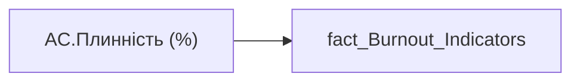

# AC.Плинність (%)

*тека `Analytical Cases\Burnout_Risk\Main` · формат `#,0.00`*

## Технічний опис

| Властивість | Значення |
|---|---|
| Тип | міра |
| Home table | _Measures |
| displayFolder | `Analytical Cases\Burnout_Risk\Main` |
| formatString | `#,0.00` |
| dataType | — |
| Прихована | ні |

### DAX

```dax
VAR _res = SUM(fact_Burnout_Indicators[TURNOVER])
RETURN  _res/100
```

### Джерела даних


Колонки: `TURNOVER`

Power Query: `fact_Burnout_Indicators`

### Залежності (таблиці й колонки)

Таблиці: `fact_Burnout_Indicators`

Колонки: `fact_Burnout_Indicators[TURNOVER]`

### Схема



---

## Бізнес-суть

**Бізнес-назва:** Плинність (%)

### Опис із ТЗ

Плинність по кадровому підрозділу

Щоб порахувати плинність по структурі, яка містить в собі кілька кадрових підрозділів, потрібно показник `Fired_Unit_Cnt` по кожному підрозділу (не людині) зсумувати та поділити на суму `Employee_Unit_Average` по кожному підрозділу (не людині). Щоб визначити `Fired_Unit_Cnt`  та  `Employee_Unit_Average` по підрозділу, треба взяти їх значення по одному із працівників цього підрозділу, бо плинність по людині рахується по її підрозділу

**Вимоги (ТЗ):**

- [Кейс Утримання працівників › Опис джерел для сторінки "Кейс звільнення (вигорання)"](https://dev.azure.com/MHPITDepProjects/People%20Digital%20Profile%20%28PDP%29/_wiki/wikis/PDP.wiki?pagePath=/%D0%A4%D1%83%D0%BD%D0%BA%D1%86%D1%96%D0%BE%D0%BD%D0%B0%D0%BB%D1%8C%D0%BD%D1%96%20%D0%B2%D0%B8%D0%BC%D0%BE%D0%B3%D0%B8/%D0%92%D0%B8%D0%BC%D0%BE%D0%B3%D0%B8%20%D0%B4%D0%BE%20%D0%B7%D0%B2%D1%96%D1%82%D1%83%20People%20Digital%20Profile/%D0%9A%D0%B5%D0%B9%D1%81%20%D0%A3%D1%82%D1%80%D0%B8%D0%BC%D0%B0%D0%BD%D0%BD%D1%8F%20%D0%BF%D1%80%D0%B0%D1%86%D1%96%D0%B2%D0%BD%D0%B8%D0%BA%D1%96%D0%B2/%D0%9E%D0%BF%D0%B8%D1%81%20%D0%B4%D0%B6%D0%B5%D1%80%D0%B5%D0%BB%20%D0%B4%D0%BB%D1%8F%20%D1%81%D1%82%D0%BE%D1%80%D1%96%D0%BD%D0%BA%D0%B8%20%22%D0%9A%D0%B5%D0%B9%D1%81%20%D0%B7%D0%B2%D1%96%D0%BB%D1%8C%D0%BD%D0%B5%D0%BD%D0%BD%D1%8F%20%28%D0%B2%D0%B8%D0%B3%D0%BE%D1%80%D0%B0%D0%BD%D0%BD%D1%8F%29%22)
- [Командний профіль › Паспортна частина групового профілю › Сторінка Картка команди](https://dev.azure.com/MHPITDepProjects/People%20Digital%20Profile%20%28PDP%29/_wiki/wikis/PDP.wiki?pagePath=/%D0%A4%D1%83%D0%BD%D0%BA%D1%86%D1%96%D0%BE%D0%BD%D0%B0%D0%BB%D1%8C%D0%BD%D1%96%20%D0%B2%D0%B8%D0%BC%D0%BE%D0%B3%D0%B8/%D0%92%D0%B8%D0%BC%D0%BE%D0%B3%D0%B8%20%D0%B4%D0%BE%20%D0%B7%D0%B2%D1%96%D1%82%D1%83%20People%20Digital%20Profile/%D0%9A%D0%BE%D0%BC%D0%B0%D0%BD%D0%B4%D0%BD%D0%B8%D0%B9%20%D0%BF%D1%80%D0%BE%D1%84%D1%96%D0%BB%D1%8C/%D0%9F%D0%B0%D1%81%D0%BF%D0%BE%D1%80%D1%82%D0%BD%D0%B0%20%D1%87%D0%B0%D1%81%D1%82%D0%B8%D0%BD%D0%B0%20%D0%B3%D1%80%D1%83%D0%BF%D0%BE%D0%B2%D0%BE%D0%B3%D0%BE%20%D0%BF%D1%80%D0%BE%D1%84%D1%96%D0%BB%D1%8E/%D0%A1%D1%82%D0%BE%D1%80%D1%96%D0%BD%D0%BA%D0%B0%20%D0%9A%D0%B0%D1%80%D1%82%D0%BA%D0%B0%20%D0%BA%D0%BE%D0%BC%D0%B0%D0%BD%D0%B4%D0%B8)

## На сторінках звіту

_Не використовується на основних сторінках звіту._

## Пов'язані міри

**Використовується в:** [AC.Switch.Плинність (%)](../measures/ac-switch-plynnist.md)

## Нотатки

_порожньо_
