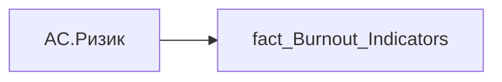

# AC.Ризик

| Властивість | Значення |
|---|---|
| Тип | міра |
| Home table | _Measures |
| displayFolder | `Analytical Cases\Burnout_Risk\Main` |
| formatString | — |
| dataType | — |
| Прихована | ні |

## DAX

```dax
VAR _val = SELECTEDVALUE('fact_Burnout_Indicators'[IS_TOTAL_RISK])
VAR _txt = COALESCE(_val, "Не визначено")

VAR _fill =
	SWITCH(
		_txt,
		"Потребує уваги", "#FDE0D0",
		"Показники в нормі", "#D0E8F2",
		"#C9CFD6"
	)
VAR _textColor =
	SWITCH(
		_txt,
		"Потребує уваги", "#A63D00",
		"Показники в нормі", "#004D73",
		"#3B4552"
	)
VAR _stroke =
	SWITCH(
		_txt,
		"Потребує уваги", "#D55E00",
		"Показники в нормі", "#0072B2",
		"#AEB6BF"
	)

VAR _rectW = 110
VAR _rectH = 16
VAR _r = 8
VAR _font = 10
VAR _centerX = _rectW / 2

RETURN
"data:image/svg+xml;utf8," &
"<svg xmlns='http://www.w3.org/2000/svg' width='" & _rectW & "' height='" & _rectH & "'>
<rect x='0' y='0' rx='"&_r&"' ry='"&_r&"' width='"&_rectW&"' height='"&_rectH&"' fill='"&_fill&"' stroke='"&_stroke&"' stroke-width='0.8'/>
<text x='"&_centerX&"' y='"&(_rectH/2)&"' font-size='"&_font&"px' font-family='Segoe UI' font-weight='500' text-anchor='middle' dominant-baseline='central' fill='"&_textColor&"'>"&_txt&"</text>
</svg>"
```

## Джерела


Колонки: `IS_TOTAL_RISK`

Power Query: `fact_Burnout_Indicators`

## Бізнес-суть

IS_TOTAL_RISK → Ризик втрати працівника; IS_TOTAL_RISK → Ризик; IS_TOTAL_RISK → Ризик вигорання (%)

Це відсоток працівників, які знаходяться в статусі "Потребує уваги" = (кількість працівників в статусі "Потребує уваги"/загальну чисельність команди)*100%

**Вимоги:** `Індивідуальний-профіль-працівника/Паспортна-частина-індивідуального-профілю-співробітника`, `Індивідуальний-профіль-працівника/Паспортна-частина-індивідуального-профілю-співробітника/Сторінка-Картка-(паспорт)-працівника/Редизайн-паспортної-частини`, `Кейс-Утримання-працівників/Опис-джерел-для-сторінки-%22Кейс-звільнення-(вигорання)%22`, `Командний-профіль/Паспортна-частина-групового-профілю/Редизайн-паспортної-частини-групового-профілю`, `Командний-профіль/Сторінка-Моя-команда/ТЗ.-Деталізація-метрик-групового-профілю-звіту`

## Залежності

Таблиці: `fact_Burnout_Indicators`

Колонки: `fact_Burnout_Indicators[IS_TOTAL_RISK]`

## Схема



## Нотатки

_порожньо_
