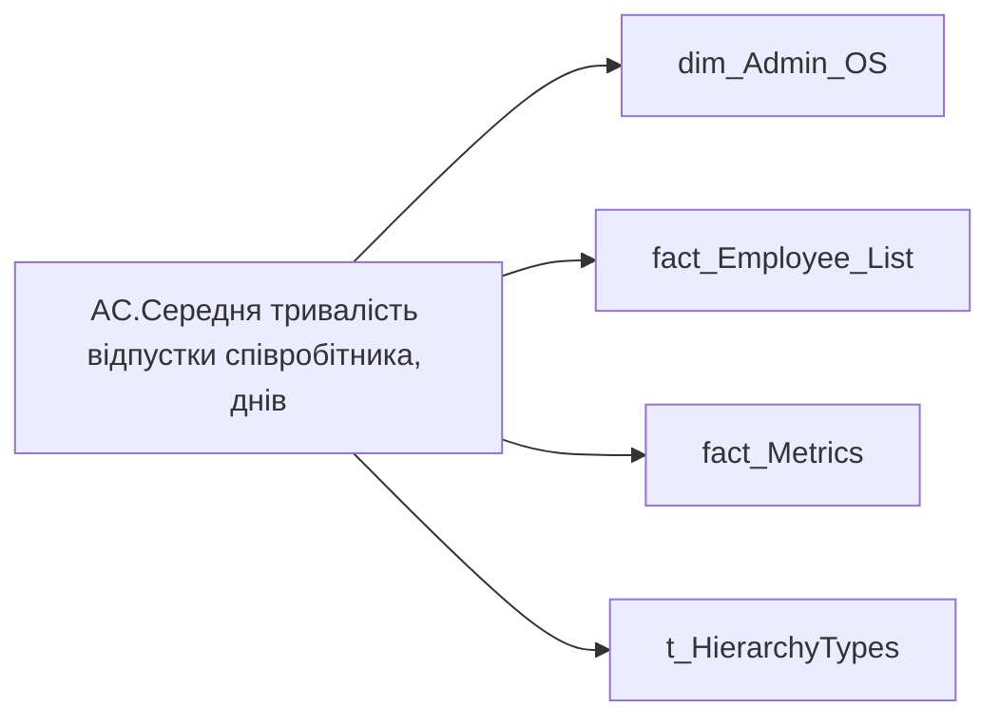

# AC.Середня тривалість відпустки співробітника, днів

*тека `Group_Profile\Здоров'я та благополуччя`*

## Бізнес-суть

IS_MAIN_POSITION → Пріоритетне місце роботи; IS_MAIN_POSITION → is_main_position; Vacation_Day → % днів відпустки  в робочі дні (за останні 12 місяців); Vacation_Day → Дні відпустки; Vacation_Day → Середня тривалість відпустки; Vacation_Day → Середня кількість днів використаної відпустки співробітником 12 міс.; Vacation_Day → Середня тривалість відпустки співробітника, днів; Vacation_Day → % днів відпустки  в робочі дні; Vacation_Day → % днів відпустки в робочі дні; Vacation_Number → Кількість відпусток

1 - Так  <br>0 - Ні Показує відсоток днів відпуски, які припадають на робочі дні за останні 12 місяців, включно із поточним.  <br>Розраховується як (Vacation_Day-Weekend_Day)/Vacation_Day  <br>Якщо значення в полі відсутнє, то показати текст "Дані відсутні". Розрахункове поле.  <br>Кількість днів відпусток всіх видів, використаних за останні 12 місяців (включно із поточним місяцем) в сумі. Розрахункове поле.  <br>Потрібно кількість днів відпустки за останні 12 місяців поділити на кількість таких відпусток та округлити до десятих = Vacation_Day/Vacation_Number  <br>Якщо значення в полі відсутнє

**Вимоги:** `Індивідуальний-профіль-працівника/Історія-по-посадам`, `Індивідуальний-профіль-працівника/Історія-по-посадам/Реліз-1.-Історія-по-посадам`, `Індивідуальний-профіль-працівника/Сторінка-Взаємодія-Viva-та-залученість-працівника/Сторінка-Ефективність-працівника/Вітрина-Відвідування-офісів`, `Індивідуальний-профіль-працівника/Сторінка-Загальна-інформація-про-працівника`, `Індивідуальний-профіль-працівника/Сторінка-Здоров'я-та-благополуччя-працівника`, `Командний-профіль/Сторінка-Здоров'я-та-благополуччя-команди`, `Командний-профіль/Сторінка-Моя-команда/ТЗ.-Деталізація-метрик-групового-профілю-звіту`, `Командний-профіль/Сторінка-Плинність-та-Exits/ТЗ-на-вітрину-Exits`

## На сторінках звіту

[Group Profile](../report/group-profile.md)

## Пов'язані міри

_Прямих зв'язків з іншими мірами немає._

---

## Технічний опис

| Властивість | Значення |
|---|---|
| Тип | міра |
| Home table | _Measures |
| displayFolder | `Group_Profile\Здоров'я та благополуччя` |
| formatString | — |
| dataType | — |
| Прихована | ні |

### DAX

```dax
//************* ROLE FILTERS **************
VAR _roleIndex = SELECTEDVALUE ( 't_HierarchyTypes'[Index], 1 )   -- 0 = LT, 1 = Admin
VAR _filter_lt= TREATAS ( VALUES ( 'dim_Admin_LT_OS'[USER_ACCESS_ID] ),'dim_Admin_OS'[USER_ACCESS_ID] )

//***** HEALTH AND WELLBEING FILTERS ******* 
VAR _employee_list = VALUES('fact_Employee_List'[EMPLOYEE_ID])
VAR _main_position_employees = 
	CALCULATETABLE(
		VALUES('fact_Employee_List'[USER_ACCESS_ID]),
		REMOVEFILTERS('fact_Employee_List'), 
		'fact_Employee_List'[EMPLOYEE_ID] IN _employee_list,
		'fact_Employee_List'[IS_MAIN_POSITION] = 1
	)
VAR _filter0 = TREATAS(_main_position_employees, 'dim_Admin_OS'[USER_ACCESS_ID])

/* *********** ADMIN *********** */
VAR _admin = 
	CALCULATE(
		AVERAGEX( 
			VALUES( dim_Admin_OS[USER_ACCESS_ID] ), 
			CALCULATE( 
				DIVIDE(
					SUM('fact_Metrics'[Vacation_Day]),
					SUM('fact_Metrics'[Vacation_Number])
				)
			)
		),
		REMOVEFILTERS('fact_Vacation_Reserve'),
		_filter0
	)
/* *********** LT *********** */
VAR _admin_lt =
	CALCULATE(
		AVERAGEX( 
			VALUES( dim_Admin_OS[USER_ACCESS_ID] ), 
			CALCULATE( 
				DIVIDE(
					SUM('fact_Metrics'[Vacation_Day]),
					SUM('fact_Metrics'[Vacation_Number])
				)
			)
		),
		REMOVEFILTERS('fact_Metrics'),
		_filter0,
		_filter_lt
	)
VAR _res =
	SWITCH (
		_roleIndex,
		0, _admin_lt,    -- LT
		1, _admin,       -- Admin
		_admin
	)

RETURN _res
```

### Джерела даних

Вихідні таблиці: `DM.vw_R27_dim_Employee_Access_List`

Колонки: `EMPLOYEE_ID`, `IS_MAIN_POSITION`, `Index`, `USER_ACCESS_ID`, `Vacation_Day`, `Vacation_Number`

Power Query: `dim_Admin_OS`

### Залежності (таблиці й колонки)

Таблиці: `dim_Admin_OS`, `fact_Employee_List`, `fact_Metrics`, `t_HierarchyTypes`

Колонки: `dim_Admin_LT_OS[USER_ACCESS_ID]`, `dim_Admin_OS[USER_ACCESS_ID]`, `fact_Employee_List[EMPLOYEE_ID]`, `fact_Employee_List[IS_MAIN_POSITION]`, `fact_Employee_List[USER_ACCESS_ID]`, `fact_Metrics[Vacation_Day]`, `fact_Metrics[Vacation_Number]`, `t_HierarchyTypes[Index]`

### Схема



## Нотатки

_порожньо_
