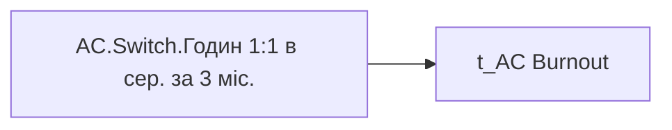

# AC.Switch.Годин 1:1 в сер. за 3 міс.

*тека `Analytical Cases\Burnout_Risk\Main`*

## Технічний опис

| Властивість | Значення |
|---|---|
| Тип | міра |
| Home table | _Measures |
| displayFolder | `Analytical Cases\Burnout_Risk\Main` |
| formatString | — |
| dataType | — |
| Прихована | ні |

### DAX

```dax
VAR _indicator = SELECTEDVALUE('t_AC Burnout'[Burnout_Indicator])
RETURN
SWITCH(
	_indicator,
	"Оцінка", [AC.Чи є ризик вигорання через відсутність спілкування з керівником?],
	"Дані", 
		VAR _value = [AC.Взаємодія з керівником]
		RETURN COALESCE(_value, 0)
)
```

### Джерела даних


Колонки: `Burnout_Indicator`

### Залежності (таблиці й колонки)

Таблиці: `t_AC Burnout`

Колонки: `t_AC Burnout[Burnout_Indicator]`

### Схема



---

## Бізнес-суть

!!! note "Бізнес-визначення відсутнє"
    Поля міри не зіставлено з wiki «Таблицями джерел даних». Можна заповнити вручну в `manualNotes`.

## На сторінках звіту

- [Утримання працівників](../report/utrymannia-pratsivnykiv.md) — Таблиці › Працюючі

## Пов'язані міри

**Використовує:** [AC.Взаємодія з керівником](../measures/ac-vzaiemodiia-z-kerivnykom.md), [AC.Чи є ризик вигорання через відсутність спілкування з керівником?](../measures/ac-chy-ie-ryzyk-vyhorannia-cherez-vidsutnist-spilkuvannia-z-kerivnykom.md)

## Нотатки

_порожньо_
