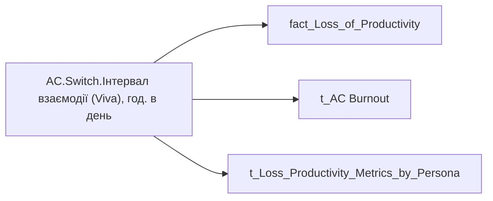

# AC.Switch.Інтервал взаємодії (Viva), год. в день

*тека `Analytical Cases\Loss_Productivity\Main`*

!!! abstract "Джерела даних"
    `DM.vw_R27_fact_Loss_of_Productivity`, `DWH.t_SPO_HR_Person_Matrix_with_Coefficient`

## Бізнес-суть

!!! note "Бізнес-визначення відсутнє"
    Поля міри не зіставлено з wiki «Таблицями джерел даних». Можна заповнити вручну в `manualNotes`.

## На сторінках звіту

[Продуктивність працівників](../report/produktyvnist-pratsivnykiv.md)

## Пов'язані міри

**Використовує:** [AC.Дані.Інтервал взаємодії (Viva), год. в день](../measures/ac-dani-interval-vzaiemodii-viva-hod-v-den.md), [AC.Оцінка.Інтервал взаємодії (Viva), год. в день](../measures/ac-otsinka-interval-vzaiemodii-viva-hod-v-den.md)

---

## Технічний опис

| Властивість | Значення |
|---|---|
| Тип | міра |
| Home table | _Measures |
| displayFolder | `Analytical Cases\Loss_Productivity\Main` |
| formatString | — |
| dataType | — |
| Прихована | ні |

### DAX

```dax
VAR _subperson = SELECTEDVALUE('fact_Loss_of_Productivity'[Person_Name])
VAR _metric_relevance = 
    CALCULATE(
        MIN('t_Loss_Productivity_Metrics_by_Persona'[Value]),
        't_Loss_Productivity_Metrics_by_Persona'[SubPerson] = _subperson,
        't_Loss_Productivity_Metrics_by_Persona'[Metric_Name] = "Collab_Hour_by_Span"
    )
VAR _result = 
    SWITCH(
        SELECTEDVALUE('t_AC Burnout'[Burnout_Indicator]),
        "Оцінка", [AC.Оцінка.Інтервал взаємодії (Viva), год. в день],
        "Дані", [AC.Дані.Інтервал взаємодії (Viva), год. в день]
    )
RETURN IF(_metric_relevance = "NA", "NA", _result)
```

### Джерела даних

Вихідні таблиці: `DM.vw_R27_fact_Loss_of_Productivity`, `DWH.t_SPO_HR_Person_Matrix_with_Coefficient`

Колонки: `Burnout_Indicator`, `Metric_Name`, `Person_Name`, `SubPerson`, `Value`

Power Query: `fact_Loss_of_Productivity`

### Залежності (таблиці й колонки)

Таблиці: `fact_Loss_of_Productivity`, `t_AC Burnout`, `t_Loss_Productivity_Metrics_by_Persona`

Колонки: `fact_Loss_of_Productivity[Person_Name]`, `t_AC Burnout[Burnout_Indicator]`, `t_Loss_Productivity_Metrics_by_Persona[Metric_Name]`, `t_Loss_Productivity_Metrics_by_Persona[SubPerson]`, `t_Loss_Productivity_Metrics_by_Persona[Value]`

### Схема



## Нотатки

_порожньо_
