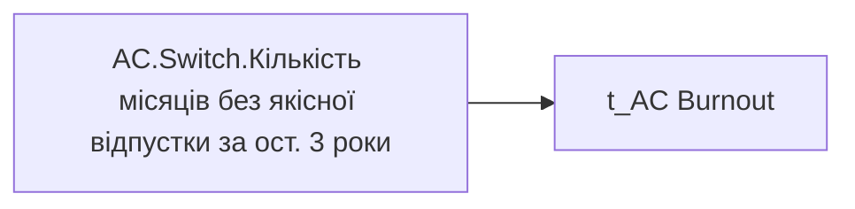

# AC.Switch.Кількість місяців без якісної відпустки за ост. 3 роки

*тека `Analytical Cases\Burnout_Risk\Main`*

## Технічний опис

| Властивість | Значення |
|---|---|
| Тип | міра |
| Home table | _Measures |
| displayFolder | `Analytical Cases\Burnout_Risk\Main` |
| formatString | — |
| dataType | — |
| Прихована | ні |

### DAX

```dax
SWITCH(
	SELECTEDVALUE('t_AC Burnout'[Burnout_Indicator]),
	"Оцінка", [AC.Чи є ризик вигорання через відсутність відпусток?],
	"Дані", COALESCE([AC.Кількість місяців без якісної відпустки], 0)
)
```

### Джерела даних


Колонки: `Burnout_Indicator`

### Залежності (таблиці й колонки)

Таблиці: `t_AC Burnout`

Колонки: `t_AC Burnout[Burnout_Indicator]`

### Схема



---

## Бізнес-суть

!!! note "Бізнес-визначення відсутнє"
    Поля міри не зіставлено з wiki «Таблицями джерел даних». Можна заповнити вручну в `manualNotes`.

## На сторінках звіту

- [Утримання працівників](../report/utrymannia-pratsivnykiv.md) — Таблиці › Звільнені, Таблиці › Працюючі

## Пов'язані міри

**Використовує:** [AC.Кількість місяців без якісної відпустки](../measures/ac-kilkist-misiatsiv-bez-iakisnoi-vidpustky.md), [AC.Чи є ризик вигорання через відсутність відпусток?](../measures/ac-chy-ie-ryzyk-vyhorannia-cherez-vidsutnist-vidpustok.md)

## Нотатки

_порожньо_
