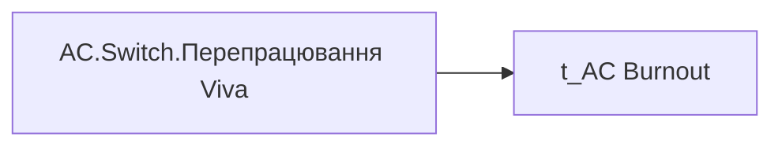

# AC.Switch.Перепрацювання Viva

*тека `Analytical Cases\Burnout_Risk\Main`*

## Технічний опис

| Властивість | Значення |
|---|---|
| Тип | міра |
| Home table | _Measures |
| displayFolder | `Analytical Cases\Burnout_Risk\Main` |
| formatString | — |
| dataType | — |
| Прихована | ні |

### DAX

```dax
SWITCH(
	SELECTEDVALUE('t_AC Burnout'[Burnout_Indicator]),
	"Оцінка", [AC.Чи є ризик вигорання через перепрацювання?],
	"Дані", COALESCE([AC.Перепрацювання Viva],0)
)
```

### Джерела даних


Колонки: `Burnout_Indicator`

### Залежності (таблиці й колонки)

Таблиці: `t_AC Burnout`

Колонки: `t_AC Burnout[Burnout_Indicator]`

### Схема



---

## Бізнес-суть

Перепрацювання Viva

Viva_Overworking = TOTAL_AFTER_HOURS/  <br>workdays_without_sickleaves_and_vacations.<br>**18.05.2026** Якщо поле TOTAL_AFTER_HOURS > 0 і поле workdays_without_sickleaves_and_vacations = 0, то замість workdays_without_sickleaves_and_vacations брати значення поля Viva_days_6month.

**Вимоги:** `Допоміжні-вітрини-для-звіту/Таблиця-для-розрахунку-агрегованих-метрик-по-звіту`, `Кейс-Утримання-працівників/Опис-джерел-для-сторінки-%22Кейс-звільнення-(вигорання)%22`

## На сторінках звіту

[Утримання працівників](../report/utrymannia-pratsivnykiv.md)

## Пов'язані міри

**Використовує:** [AC.Перепрацювання Viva](../measures/ac-perepratsiuvannia-viva.md), [AC.Чи є ризик вигорання через перепрацювання?](../measures/ac-chy-ie-ryzyk-vyhorannia-cherez-perepratsiuvannia.md)

## Нотатки

_порожньо_
