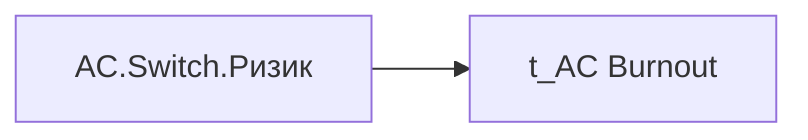

# AC.Switch.Ризик

*тека `Analytical Cases\Burnout_Risk\Main`*

## Технічний опис

| Властивість | Значення |
|---|---|
| Тип | міра |
| Home table | _Measures |
| displayFolder | `Analytical Cases\Burnout_Risk\Main` |
| formatString | — |
| dataType | — |
| Прихована | ні |

### DAX

```dax
SWITCH(
	SELECTEDVALUE('t_AC Burnout'[Burnout_Indicator]),
	"Оцінка", [AC.Чи є ризик?],
	"Дані", [AC.Ризик]
)
```

### Джерела даних


Колонки: `Burnout_Indicator`

### Залежності (таблиці й колонки)

Таблиці: `t_AC Burnout`

Колонки: `t_AC Burnout[Burnout_Indicator]`

### Схема



---

## Бізнес-суть

Ризик

**Вимоги:** `Кейс-Утримання-працівників/Опис-джерел-для-сторінки-%22Кейс-звільнення-(вигорання)%22`

## На сторінках звіту

[Утримання працівників](../report/utrymannia-pratsivnykiv.md)

## Пов'язані міри

**Використовує:** [AC.Ризик](../measures/ac-ryzyk.md), [AC.Чи є ризик?](../measures/ac-chy-ie-ryzyk.md)

## Нотатки

_порожньо_
