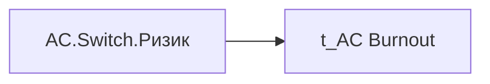

# AC.Switch.Ризик

*тека `Analytical Cases\Burnout_Risk\Main`*

## Технічний опис

| Властивість | Значення |
|---|---|
| Тип | міра |
| Home table | _Measures |
| displayFolder | `Analytical Cases\Burnout_Risk\Main` |
| formatString | — |
| dataType | — |
| Прихована | ні |

### DAX

```dax
SWITCH(
	SELECTEDVALUE('t_AC Burnout'[Burnout_Indicator]),
	"Оцінка", [AC.Чи є ризик?],
	"Дані", [AC.Ризик]
)
```

### Джерела даних


Колонки: `Burnout_Indicator`

### Залежності (таблиці й колонки)

Таблиці: `t_AC Burnout`

Колонки: `t_AC Burnout[Burnout_Indicator]`

### Схема



---

## Бізнес-суть

**Бізнес-назва:** Ризик

**Вимоги (ТЗ):**

- [Кейс Утримання працівників › Опис джерел для сторінки "Кейс звільнення (вигорання)"](https://dev.azure.com/MHPITDepProjects/People%20Digital%20Profile%20%28PDP%29/_wiki/wikis/PDP.wiki?pagePath=/%D0%A4%D1%83%D0%BD%D0%BA%D1%86%D1%96%D0%BE%D0%BD%D0%B0%D0%BB%D1%8C%D0%BD%D1%96%20%D0%B2%D0%B8%D0%BC%D0%BE%D0%B3%D0%B8/%D0%92%D0%B8%D0%BC%D0%BE%D0%B3%D0%B8%20%D0%B4%D0%BE%20%D0%B7%D0%B2%D1%96%D1%82%D1%83%20People%20Digital%20Profile/%D0%9A%D0%B5%D0%B9%D1%81%20%D0%A3%D1%82%D1%80%D0%B8%D0%BC%D0%B0%D0%BD%D0%BD%D1%8F%20%D0%BF%D1%80%D0%B0%D1%86%D1%96%D0%B2%D0%BD%D0%B8%D0%BA%D1%96%D0%B2/%D0%9E%D0%BF%D0%B8%D1%81%20%D0%B4%D0%B6%D0%B5%D1%80%D0%B5%D0%BB%20%D0%B4%D0%BB%D1%8F%20%D1%81%D1%82%D0%BE%D1%80%D1%96%D0%BD%D0%BA%D0%B8%20%22%D0%9A%D0%B5%D0%B9%D1%81%20%D0%B7%D0%B2%D1%96%D0%BB%D1%8C%D0%BD%D0%B5%D0%BD%D0%BD%D1%8F%20%28%D0%B2%D0%B8%D0%B3%D0%BE%D1%80%D0%B0%D0%BD%D0%BD%D1%8F%29%22)

## На сторінках звіту

- [Утримання працівників](../report/utrymannia-pratsivnykiv.md) — Таблиці › Звільнені, Таблиці › Працюючі

## Пов'язані міри

**Використовує:** [AC.Ризик](../measures/ac-ryzyk.md), [AC.Чи є ризик?](../measures/ac-chy-ie-ryzyk.md)

## Нотатки

_порожньо_
