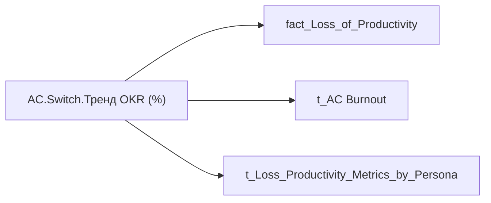

# AC.Switch.Тренд OKR (%)

*тека `Analytical Cases\Loss_Productivity\Main`*

## Технічний опис

| Властивість | Значення |
|---|---|
| Тип | міра |
| Home table | _Measures |
| displayFolder | `Analytical Cases\Loss_Productivity\Main` |
| formatString | — |
| dataType | — |
| Прихована | ні |

### DAX

```dax
VAR _subperson = SELECTEDVALUE('fact_Loss_of_Productivity'[Person_Name])
VAR _metric_relevance = 
    CALCULATE(
        MIN('t_Loss_Productivity_Metrics_by_Persona'[Value]),
        't_Loss_Productivity_Metrics_by_Persona'[SubPerson] = _subperson,
        't_Loss_Productivity_Metrics_by_Persona'[Metric_Name] = "OKR_Pct"
    )
VAR _result = 
    SWITCH(
        SELECTEDVALUE('t_AC Burnout'[Burnout_Indicator]),
        "Оцінка", [AC.Оцінка.Тренд OKR (%)],
        "Дані", [AC.Дані.Тренд OKR (%)]
    )
RETURN IF(_metric_relevance = "NA", "NA", _result)
```

### Джерела даних

Вихідні таблиці: `DM.vw_R27_fact_Loss_of_Productivity`, `DWH.t_SPO_HR_Person_Matrix_with_Coefficient`

Колонки: `Burnout_Indicator`, `Metric_Name`, `Person_Name`, `SubPerson`, `Value`

Power Query: `fact_Loss_of_Productivity`

### Залежності (таблиці й колонки)

Таблиці: `fact_Loss_of_Productivity`, `t_AC Burnout`, `t_Loss_Productivity_Metrics_by_Persona`

Колонки: `fact_Loss_of_Productivity[Person_Name]`, `t_AC Burnout[Burnout_Indicator]`, `t_Loss_Productivity_Metrics_by_Persona[Metric_Name]`, `t_Loss_Productivity_Metrics_by_Persona[SubPerson]`, `t_Loss_Productivity_Metrics_by_Persona[Value]`

### Схема



---

## Бізнес-суть

**Бізнес-назва:** Тренд OKR (%)

**Вимоги (ТЗ):**

- [Кейс Втрати Продуктивності Працівників](https://dev.azure.com/MHPITDepProjects/People%20Digital%20Profile%20%28PDP%29/_wiki/wikis/PDP.wiki?pagePath=/%D0%A4%D1%83%D0%BD%D0%BA%D1%86%D1%96%D0%BE%D0%BD%D0%B0%D0%BB%D1%8C%D0%BD%D1%96%20%D0%B2%D0%B8%D0%BC%D0%BE%D0%B3%D0%B8/%D0%92%D0%B8%D0%BC%D0%BE%D0%B3%D0%B8%20%D0%B4%D0%BE%20%D0%B7%D0%B2%D1%96%D1%82%D1%83%20People%20Digital%20Profile/%D0%9A%D0%B5%D0%B9%D1%81%20%D0%92%D1%82%D1%80%D0%B0%D1%82%D0%B8%20%D0%9F%D1%80%D0%BE%D0%B4%D1%83%D0%BA%D1%82%D0%B8%D0%B2%D0%BD%D0%BE%D1%81%D1%82%D1%96%20%D0%9F%D1%80%D0%B0%D1%86%D1%96%D0%B2%D0%BD%D0%B8%D0%BA%D1%96%D0%B2)

## На сторінках звіту

- [Продуктивність працівників](../report/produktyvnist-pratsivnykiv.md)

## Пов'язані міри

**Використовує:** [AC.Дані.Тренд OKR (%)](../measures/ac-dani-trend-okr.md), [AC.Оцінка.Тренд OKR (%)](../measures/ac-otsinka-trend-okr.md)

## Нотатки

_порожньо_
