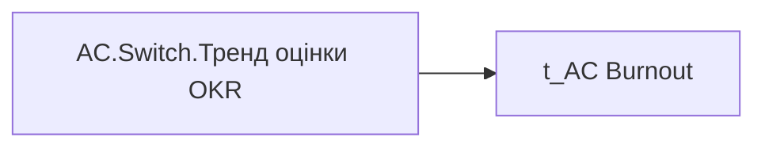

# AC.Switch.Тренд оцінки OKR

*тека `Analytical Cases\Burnout_Risk\Main`*

## Технічний опис

| Властивість | Значення |
|---|---|
| Тип | міра |
| Home table | _Measures |
| displayFolder | `Analytical Cases\Burnout_Risk\Main` |
| formatString | — |
| dataType | — |
| Прихована | ні |

### DAX

```dax
SWITCH(
	SELECTEDVALUE('t_AC Burnout'[Burnout_Indicator]),
	"Оцінка", [AC.Чи є ризик вигорання по результатам оцінки OKR?],
	"Дані", [AC.Тренд оцінки OKR]
)
```

### Джерела даних


Колонки: `Burnout_Indicator`

### Залежності (таблиці й колонки)

Таблиці: `t_AC Burnout`

Колонки: `t_AC Burnout[Burnout_Indicator]`

### Схема



---

## Бізнес-суть

**Бізнес-назва:** Тренд оцінки OKR

### Опис із ТЗ

Тренд оцінки ОКР визначається порівнянням коефіцієнту індивідуального бонусу за останні два періоди.   Якщо `Ind_Bonus_Rate` за останній рік `OKR_Last_Year_Rate` дорівнює `Ind_Bonus_Rate` за попередній рік `OKR_Prev_Year_Rate`, то Стабільний   Якщо `Ind_Bonus_Rate` за останній рік `OKR_Last_Year_Rate`  більше ніж `Ind_Bonus_Rate` за попередній рік `OKR_Prev_Year_Rate`, то Зростання   Якщо `Ind_Bonus_Rate` за останній рік `OKR_Last_Year_Rate` менше ніж `Ind_Bonus_Rate` за попередній рік `OKR_Prev_Year_Rate`, то Спадання. Якщо у працівника `Ind_Bonus_Rate` присутній тільки за один період (рік), то ставити прочерк, наче дані відсутні.

Тренд оцінки ОКР визначається порівнянням колірного значення ОКР за останні два періоди.   Якщо `OKR_Last_Year_Score`=`OKR_Prev_Year_Score` то **Стабільний**. Якщо `OKR_Last_Year_Score` вищий за `OKR_Prev_Year_Score`  то **Зростання**. Якщо `OKR_Last_Year_Score` нижчий за `OKR_Prev_Year_Score`, то **Спадання**. **АЛЕ якщо зміна від Супер зеленого (6) до Зеленого (5), це враховується як Стабільний**  Якщо у працівника є значення тільки одного із полів (тобто оцінка виконання ОКР була тільки за один період), то ставити прочерк, наче дані відсутні.

**Вимоги (ТЗ):**

- [Допоміжні вітрини для звіту › Таблиця для розрахунку агрегованих метрик по звіту](https://dev.azure.com/MHPITDepProjects/People%20Digital%20Profile%20%28PDP%29/_wiki/wikis/PDP.wiki?pagePath=/%D0%A4%D1%83%D0%BD%D0%BA%D1%86%D1%96%D0%BE%D0%BD%D0%B0%D0%BB%D1%8C%D0%BD%D1%96%20%D0%B2%D0%B8%D0%BC%D0%BE%D0%B3%D0%B8/%D0%92%D0%B8%D0%BC%D0%BE%D0%B3%D0%B8%20%D0%B4%D0%BE%20%D0%B7%D0%B2%D1%96%D1%82%D1%83%20People%20Digital%20Profile/%D0%94%D0%BE%D0%BF%D0%BE%D0%BC%D1%96%D0%B6%D0%BD%D1%96%20%D0%B2%D1%96%D1%82%D1%80%D0%B8%D0%BD%D0%B8%20%D0%B4%D0%BB%D1%8F%20%D0%B7%D0%B2%D1%96%D1%82%D1%83/%D0%A2%D0%B0%D0%B1%D0%BB%D0%B8%D1%86%D1%8F%20%D0%B4%D0%BB%D1%8F%20%D1%80%D0%BE%D0%B7%D1%80%D0%B0%D1%85%D1%83%D0%BD%D0%BA%D1%83%20%D0%B0%D0%B3%D1%80%D0%B5%D0%B3%D0%BE%D0%B2%D0%B0%D0%BD%D0%B8%D1%85%20%D0%BC%D0%B5%D1%82%D1%80%D0%B8%D0%BA%20%D0%BF%D0%BE%20%D0%B7%D0%B2%D1%96%D1%82%D1%83)
- [Допоміжні вітрини для звіту › Таблиця для розрахунку агрегованих метрик по звіту › Змінити логіку визначення окремих полів у вітрині](https://dev.azure.com/MHPITDepProjects/People%20Digital%20Profile%20%28PDP%29/_wiki/wikis/PDP.wiki?pagePath=/%D0%A4%D1%83%D0%BD%D0%BA%D1%86%D1%96%D0%BE%D0%BD%D0%B0%D0%BB%D1%8C%D0%BD%D1%96%20%D0%B2%D0%B8%D0%BC%D0%BE%D0%B3%D0%B8/%D0%92%D0%B8%D0%BC%D0%BE%D0%B3%D0%B8%20%D0%B4%D0%BE%20%D0%B7%D0%B2%D1%96%D1%82%D1%83%20People%20Digital%20Profile/%D0%94%D0%BE%D0%BF%D0%BE%D0%BC%D1%96%D0%B6%D0%BD%D1%96%20%D0%B2%D1%96%D1%82%D1%80%D0%B8%D0%BD%D0%B8%20%D0%B4%D0%BB%D1%8F%20%D0%B7%D0%B2%D1%96%D1%82%D1%83/%D0%A2%D0%B0%D0%B1%D0%BB%D0%B8%D1%86%D1%8F%20%D0%B4%D0%BB%D1%8F%20%D1%80%D0%BE%D0%B7%D1%80%D0%B0%D1%85%D1%83%D0%BD%D0%BA%D1%83%20%D0%B0%D0%B3%D1%80%D0%B5%D0%B3%D0%BE%D0%B2%D0%B0%D0%BD%D0%B8%D1%85%20%D0%BC%D0%B5%D1%82%D1%80%D0%B8%D0%BA%20%D0%BF%D0%BE%20%D0%B7%D0%B2%D1%96%D1%82%D1%83/%D0%97%D0%BC%D1%96%D0%BD%D0%B8%D1%82%D0%B8%20%D0%BB%D0%BE%D0%B3%D1%96%D0%BA%D1%83%20%D0%B2%D0%B8%D0%B7%D0%BD%D0%B0%D1%87%D0%B5%D0%BD%D0%BD%D1%8F%20%D0%BE%D0%BA%D1%80%D0%B5%D0%BC%D0%B8%D1%85%20%D0%BF%D0%BE%D0%BB%D1%96%D0%B2%20%D1%83%20%D0%B2%D1%96%D1%82%D1%80%D0%B8%D0%BD%D1%96)
- [Кейс Утримання працівників › Опис джерел для сторінки "Кейс звільнення (вигорання)"](https://dev.azure.com/MHPITDepProjects/People%20Digital%20Profile%20%28PDP%29/_wiki/wikis/PDP.wiki?pagePath=/%D0%A4%D1%83%D0%BD%D0%BA%D1%86%D1%96%D0%BE%D0%BD%D0%B0%D0%BB%D1%8C%D0%BD%D1%96%20%D0%B2%D0%B8%D0%BC%D0%BE%D0%B3%D0%B8/%D0%92%D0%B8%D0%BC%D0%BE%D0%B3%D0%B8%20%D0%B4%D0%BE%20%D0%B7%D0%B2%D1%96%D1%82%D1%83%20People%20Digital%20Profile/%D0%9A%D0%B5%D0%B9%D1%81%20%D0%A3%D1%82%D1%80%D0%B8%D0%BC%D0%B0%D0%BD%D0%BD%D1%8F%20%D0%BF%D1%80%D0%B0%D1%86%D1%96%D0%B2%D0%BD%D0%B8%D0%BA%D1%96%D0%B2/%D0%9E%D0%BF%D0%B8%D1%81%20%D0%B4%D0%B6%D0%B5%D1%80%D0%B5%D0%BB%20%D0%B4%D0%BB%D1%8F%20%D1%81%D1%82%D0%BE%D1%80%D1%96%D0%BD%D0%BA%D0%B8%20%22%D0%9A%D0%B5%D0%B9%D1%81%20%D0%B7%D0%B2%D1%96%D0%BB%D1%8C%D0%BD%D0%B5%D0%BD%D0%BD%D1%8F%20%28%D0%B2%D0%B8%D0%B3%D0%BE%D1%80%D0%B0%D0%BD%D0%BD%D1%8F%29%22)

## На сторінках звіту

- [Утримання працівників](../report/utrymannia-pratsivnykiv.md) — Таблиці › Звільнені, Таблиці › Працюючі

## Пов'язані міри

**Використовує:** [AC.Тренд оцінки OKR](../measures/ac-trend-otsinky-okr.md), [AC.Чи є ризик вигорання по результатам оцінки OKR?](../measures/ac-chy-ie-ryzyk-vyhorannia-po-rezultatam-otsinky-okr.md)

## Нотатки

_порожньо_
