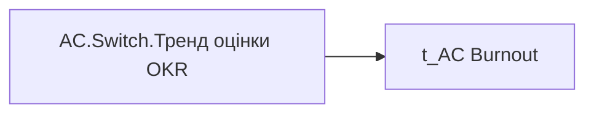

# AC.Switch.Тренд оцінки OKR

*тека `Analytical Cases\Burnout_Risk\Main`*

## Бізнес-суть

Тренд оцінки OKR

Тренд оцінки ОКР визначається порівнянням коефіцієнту індивідуального бонусу за останні два періоди.  <br>Якщо Ind_Bonus_Rate за останній рік [OKR_Last_Year_Rate] дорівнює Ind_Bonus_Rate за попередній рік [OKR_Prev_Year_Rate], то Стабільний  <br>Якщо Ind_Bonus_Rate за останній рік [OKR_Last_Year_Rate]  більше ніж Ind_Bonus_Rate за попередній рік [OKR_Prev_Year_Rate], то Зростання  <br>Якщо Ind_Bonus_Rate за останній рік [OKR_Last_Year_Rate] менше ніж Ind_Bonus_Rate за попередній рік [OKR_Prev_Year_Rate], то Спадання. Якщо у працівника Ind_Bonus_Rate присутній тільки за один період (рік), то ст

**Вимоги:** `Допоміжні-вітрини-для-звіту/Таблиця-для-розрахунку-агрегованих-метрик-по-звіту`, `Кейс-Утримання-працівників/Опис-джерел-для-сторінки-%22Кейс-звільнення-(вигорання)%22`

## На сторінках звіту

[Утримання працівників](../report/utrymannia-pratsivnykiv.md)

## Пов'язані міри

**Використовує:** [AC.Тренд оцінки OKR](../measures/ac-trend-otsinky-okr.md), [AC.Чи є ризик вигорання по результатам оцінки OKR?](../measures/ac-chy-ie-ryzyk-vyhorannia-po-rezultatam-otsinky-okr.md)

---

## Технічний опис

| Властивість | Значення |
|---|---|
| Тип | міра |
| Home table | _Measures |
| displayFolder | `Analytical Cases\Burnout_Risk\Main` |
| formatString | — |
| dataType | — |
| Прихована | ні |

### DAX

```dax
SWITCH(
	SELECTEDVALUE('t_AC Burnout'[Burnout_Indicator]),
	"Оцінка", [AC.Чи є ризик вигорання по результатам оцінки OKR?],
	"Дані", [AC.Тренд оцінки OKR]
)
```

### Джерела даних


Колонки: `Burnout_Indicator`

### Залежності (таблиці й колонки)

Таблиці: `t_AC Burnout`

Колонки: `t_AC Burnout[Burnout_Indicator]`

### Схема



## Нотатки

_порожньо_
