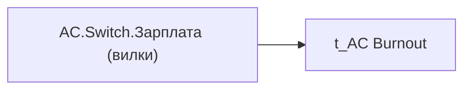

# AC.Switch.Зарплата (вилки)

*тека `Analytical Cases\Burnout_Risk\Main`*

## Технічний опис

| Властивість | Значення |
|---|---|
| Тип | міра |
| Home table | _Measures |
| displayFolder | `Analytical Cases\Burnout_Risk\Main` |
| formatString | — |
| dataType | — |
| Прихована | ні |

### DAX

```dax
SWITCH(
	SELECTEDVALUE('t_AC Burnout'[Burnout_Indicator]),
	"Оцінка", [AC.Чи є ризик вигорання через рівень оплати праці?],
	"Дані", [AC.Зарплата (вилки)]
)
```

### Джерела даних


Колонки: `Burnout_Indicator`

### Залежності (таблиці й колонки)

Таблиці: `t_AC Burnout`

Колонки: `t_AC Burnout[Burnout_Indicator]`

### Схема



---

## Бізнес-суть

**Бізнес-назва:** Зарплата (вилки)

### Опис із ТЗ

Потрібно визначити в якому діапазоні знаходиться значення `min_tariff_rate` за формулою **Нова формула.** Положення окладу (%) = ((Оклад - Середина вилки) / Середина вилки) × 100, Положення `min_tariff_rate` = ((`min_tariff_rate`- `avg_tariff_rate`) / `avg_tariff_rate`) × 100  Спочатку треба порівняти оклад із мінімальним значенням, а потім застосувати формулу. **Нижче мінімума** - якщо `min_tariff_rate` <`min_salary_range` **Мінімум-середина**: Позиція –5,1% і нижче. **Середина**: Позиція між -5,0% та +5,0% (навіть якщо рівно середина).  **Середина-максимум**: Позиція + 5,1% і вище.  Якщо по посаді не встановлено вилки (відсутні дані про оклад або середину вилки (`min_tariff_rate`,  `avg_tariff_rate`)), то виводити "Дані відсутні" Для звільнених - оклад на дату звільнення.    **Стара формула.** Положення `min_tariff_rate` = ((`min_tariff_rate`- `min_salary_range`) / (`max_salary_range` - `min_salary_range`)) × 100   Нижче мінімума: Позиція <0   Мінімум-середина: Позиція 0–49%.   Середина: Позиція 50%.   Середина-максимум: Позиція 51–99%.   Максимум: Позиція 100%. Якщо мінімум вилки = максимуму вилки, то потрібно брати сам оклад (`min_tariff_rate`) і порівнювати із `min_salary_range`, наприклад. Якщо `min_tariff_rate`>=`min_salary_range`, то **Максимум**. Якщо `min_tariff_rate`<=`min_salary_range`, то **Нижче мінімума**.

**Вимоги (ТЗ):**

- [Допоміжні вітрини для звіту › Таблиця для розрахунку агрегованих метрик по звіту](https://dev.azure.com/MHPITDepProjects/People%20Digital%20Profile%20%28PDP%29/_wiki/wikis/PDP.wiki?pagePath=/%D0%A4%D1%83%D0%BD%D0%BA%D1%86%D1%96%D0%BE%D0%BD%D0%B0%D0%BB%D1%8C%D0%BD%D1%96%20%D0%B2%D0%B8%D0%BC%D0%BE%D0%B3%D0%B8/%D0%92%D0%B8%D0%BC%D0%BE%D0%B3%D0%B8%20%D0%B4%D0%BE%20%D0%B7%D0%B2%D1%96%D1%82%D1%83%20People%20Digital%20Profile/%D0%94%D0%BE%D0%BF%D0%BE%D0%BC%D1%96%D0%B6%D0%BD%D1%96%20%D0%B2%D1%96%D1%82%D1%80%D0%B8%D0%BD%D0%B8%20%D0%B4%D0%BB%D1%8F%20%D0%B7%D0%B2%D1%96%D1%82%D1%83/%D0%A2%D0%B0%D0%B1%D0%BB%D0%B8%D1%86%D1%8F%20%D0%B4%D0%BB%D1%8F%20%D1%80%D0%BE%D0%B7%D1%80%D0%B0%D1%85%D1%83%D0%BD%D0%BA%D1%83%20%D0%B0%D0%B3%D1%80%D0%B5%D0%B3%D0%BE%D0%B2%D0%B0%D0%BD%D0%B8%D1%85%20%D0%BC%D0%B5%D1%82%D1%80%D0%B8%D0%BA%20%D0%BF%D0%BE%20%D0%B7%D0%B2%D1%96%D1%82%D1%83)
- [Кейс Утримання працівників › Опис джерел для сторінки "Кейс звільнення (вигорання)"](https://dev.azure.com/MHPITDepProjects/People%20Digital%20Profile%20%28PDP%29/_wiki/wikis/PDP.wiki?pagePath=/%D0%A4%D1%83%D0%BD%D0%BA%D1%86%D1%96%D0%BE%D0%BD%D0%B0%D0%BB%D1%8C%D0%BD%D1%96%20%D0%B2%D0%B8%D0%BC%D0%BE%D0%B3%D0%B8/%D0%92%D0%B8%D0%BC%D0%BE%D0%B3%D0%B8%20%D0%B4%D0%BE%20%D0%B7%D0%B2%D1%96%D1%82%D1%83%20People%20Digital%20Profile/%D0%9A%D0%B5%D0%B9%D1%81%20%D0%A3%D1%82%D1%80%D0%B8%D0%BC%D0%B0%D0%BD%D0%BD%D1%8F%20%D0%BF%D1%80%D0%B0%D1%86%D1%96%D0%B2%D0%BD%D0%B8%D0%BA%D1%96%D0%B2/%D0%9E%D0%BF%D0%B8%D1%81%20%D0%B4%D0%B6%D0%B5%D1%80%D0%B5%D0%BB%20%D0%B4%D0%BB%D1%8F%20%D1%81%D1%82%D0%BE%D1%80%D1%96%D0%BD%D0%BA%D0%B8%20%22%D0%9A%D0%B5%D0%B9%D1%81%20%D0%B7%D0%B2%D1%96%D0%BB%D1%8C%D0%BD%D0%B5%D0%BD%D0%BD%D1%8F%20%28%D0%B2%D0%B8%D0%B3%D0%BE%D1%80%D0%B0%D0%BD%D0%BD%D1%8F%29%22)

## На сторінках звіту

- [Утримання працівників](../report/utrymannia-pratsivnykiv.md) — Таблиці › Звільнені, Таблиці › Працюючі

## Пов'язані міри

**Використовує:** [AC.Зарплата (вилки)](../measures/ac-zarplata-vylky.md), [AC.Чи є ризик вигорання через рівень оплати праці?](../measures/ac-chy-ie-ryzyk-vyhorannia-cherez-riven-oplaty-pratsi.md)

## Нотатки

_порожньо_
