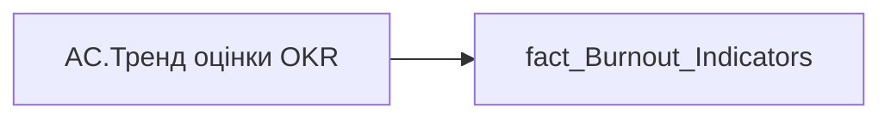

# AC.Тренд оцінки OKR

*тека `Analytical Cases\Burnout_Risk\Main`*

## Технічний опис

| Властивість | Значення |
|---|---|
| Тип | міра |
| Home table | _Measures |
| displayFolder | `Analytical Cases\Burnout_Risk\Main` |
| formatString | — |
| dataType | — |
| Прихована | ні |

### DAX

```dax
VAR _v= SELECTEDVALUE('fact_Burnout_Indicators'[OKR_RATE_TREND])

/* розміри під матрицю */
VAR _vw = 110
VAR _vh = 16
VAR _sw = 1.8   // товщина лінії

/* кольори */
VAR _colUp   = "#14AE5C"
VAR _colDown = "#E84C3D"
VAR _colFlat = "#9AA0A6"
VAR _textColor = "#333333"
VAR _font       = 13  // збільшений розмір шрифту
VAR _fontFamily = "Segoe UI"

/* ярлик */
VAR _label =
	SWITCH(
		TRUE(),
		_v = "Зростання",  "Зростання",
		_v = "Спадання",   "Спадання",
		_v = "Стабільний", "Стабільний",
		BLANK(), "—"
	)

/* СТРІЛКА ВГОРУ - паралельні 1 і 3 лінії */
VAR _up =
"data:image/svg+xml;utf8," &
"<svg xmlns='http://www.w3.org/2000/svg' width='"&_vw&"' height='"&_vh&"' viewBox='0 0 110 16'>" &
"<defs>" &
	"<marker id='arrowUp' markerWidth='4' markerHeight='4' refX='2' refY='2' orient='auto'>" &
	"<path d='M0,4 L4,2 L0,0' fill='none' stroke='"&_colUp&"' stroke-width='1'/>" &
	"</marker>" &
"</defs>" &
"<g transform='translate(5,8)'>" &
	"<path d='M0,1 L6,-2 L10,1 L16,-2' fill='none' stroke='"&_colUp&"' stroke-width='"&_sw&"' stroke-linecap='round' stroke-linejoin='round' marker-end='url(#arrowUp)'/>" &
"</g>" &
"<text x='28' y='12' font-size='"&_font&"' font-family='"&_fontFamily&"' fill='"&_textColor&"' font-weight='400'>"&_label&"</text>" &
"</svg>"

/* СТРІЛКА ВНИЗ - паралельні 1 і 3 лінії */
VAR _down =
"data:image/svg+xml;utf8," &
"<svg xmlns='http://www.w3.org/2000/svg' width='"&_vw&"' height='"&_vh&"' viewBox='0 0 110 16'>" &
"<defs>" &
	"<marker id='arrowDown' markerWidth='4' markerHeight='4' refX='2' refY='2' orient='auto'>" &
	"<path d='M0,0 L4,2 L0,4' fill='none' stroke='"&_colDown&"' stroke-width='1'/>" &
	"</marker>" &
"</defs>" &
"<g transform='translate(5,8)'>" &
	"<path d='M0,-1 L6,2 L10,-1 L16,2' fill='none' stroke='"&_colDown&"' stroke-width='"&_sw&"' stroke-linecap='round' stroke-linejoin='round' marker-end='url(#arrowDown)'/>" &
"</g>" &
"<text x='28' y='12' font-size='"&_font&"' font-family='"&_fontFamily&"' fill='"&_textColor&"' font-weight='400'>"&_label&"</text>" &
"</svg>"

/* СТРІЛКА ГОРИЗОНТАЛЬНА - збільшена */
VAR _flat =
"data:image/svg+xml;utf8," &
"<svg xmlns='http://www.w3.org/2000/svg' width='"&_vw&"' height='"&_vh&"' viewBox='0 0 110 16'>" &
"<defs>" &
	"<marker id='arrowFlat' markerWidth='4' markerHeight='4' refX='3.5' refY='2' orient='auto'>" &
	"<path d='M0,0 L4,2 L0,4 L1,2 Z' fill='"&_colFlat&"'/>" &
	"</marker>" &
"</defs>" &
"<g transform='translate(5,8)'>" &
	"<line x1='0' y1='0' x2='16' y2='0' stroke='"&_colFlat&"' stroke-width='"&_sw&"' stroke-linecap='round' marker-end='url(#arrowFlat)'/>" &
"</g>" &
"<text x='28' y='12' font-size='"&_font&"' font-family='"&_fontFamily&"' fill='"&_textColor&"' font-weight='400'>"&_label&"</text>" &
"</svg>"

/* ПРОЧЕРК для пустих значень */
VAR _empty =
"data:image/svg+xml;utf8," &
"<svg xmlns='http://www.w3.org/2000/svg' width='"&_vw&"' height='"&_vh&"' viewBox='0 0 110 16'>" &
"<g transform='translate(35,8)'>" &
	"<line x1='0' y1='0' x2='13' y2='0' stroke='"&_colFlat&"' stroke-width='"&_sw&"' stroke-linecap='round'/>" &
"</g>" &
"</svg>"

VAR _res =
	SWITCH(
		TRUE(),
		_v = "Зростання",  _up,
		_v = "Спадання",   _down,
		_v = "Стабільний", _flat,
		_empty
	)

RETURN _res
```

### Джерела даних


Колонки: `OKR_RATE_TREND`

Power Query: `fact_Burnout_Indicators`

### Залежності (таблиці й колонки)

Таблиці: `fact_Burnout_Indicators`

Колонки: `fact_Burnout_Indicators[OKR_RATE_TREND]`

### Схема



---

## Бізнес-суть

**Бізнес-назва:** Тренд оцінки OKR

### Опис із ТЗ

Тренд оцінки ОКР визначається порівнянням коефіцієнту індивідуального бонусу за останні два періоди.   Якщо `Ind_Bonus_Rate` за останній рік `OKR_Last_Year_Rate` дорівнює `Ind_Bonus_Rate` за попередній рік `OKR_Prev_Year_Rate`, то Стабільний   Якщо `Ind_Bonus_Rate` за останній рік `OKR_Last_Year_Rate`  більше ніж `Ind_Bonus_Rate` за попередній рік `OKR_Prev_Year_Rate`, то Зростання   Якщо `Ind_Bonus_Rate` за останній рік `OKR_Last_Year_Rate` менше ніж `Ind_Bonus_Rate` за попередній рік `OKR_Prev_Year_Rate`, то Спадання. Якщо у працівника `Ind_Bonus_Rate` присутній тільки за один період (рік), то ставити прочерк, наче дані відсутні.

Тренд оцінки ОКР визначається порівнянням колірного значення ОКР за останні два періоди.   Якщо `OKR_Last_Year_Score`=`OKR_Prev_Year_Score` то **Стабільний**. Якщо `OKR_Last_Year_Score` вищий за `OKR_Prev_Year_Score`  то **Зростання**. Якщо `OKR_Last_Year_Score` нижчий за `OKR_Prev_Year_Score`, то **Спадання**. Якщо у працівника є значення тільки одного із полів (тобто оцінка виконання ОКР була тільки за один період), то ставити прочерк, наче дані відсутні.

**Вимоги (ТЗ):**

- [Допоміжні вітрини для звіту › Таблиця для розрахунку агрегованих метрик по звіту](https://dev.azure.com/MHPITDepProjects/People%20Digital%20Profile%20%28PDP%29/_wiki/wikis/PDP.wiki?pagePath=/%D0%A4%D1%83%D0%BD%D0%BA%D1%86%D1%96%D0%BE%D0%BD%D0%B0%D0%BB%D1%8C%D0%BD%D1%96%20%D0%B2%D0%B8%D0%BC%D0%BE%D0%B3%D0%B8/%D0%92%D0%B8%D0%BC%D0%BE%D0%B3%D0%B8%20%D0%B4%D0%BE%20%D0%B7%D0%B2%D1%96%D1%82%D1%83%20People%20Digital%20Profile/%D0%94%D0%BE%D0%BF%D0%BE%D0%BC%D1%96%D0%B6%D0%BD%D1%96%20%D0%B2%D1%96%D1%82%D1%80%D0%B8%D0%BD%D0%B8%20%D0%B4%D0%BB%D1%8F%20%D0%B7%D0%B2%D1%96%D1%82%D1%83/%D0%A2%D0%B0%D0%B1%D0%BB%D0%B8%D1%86%D1%8F%20%D0%B4%D0%BB%D1%8F%20%D1%80%D0%BE%D0%B7%D1%80%D0%B0%D1%85%D1%83%D0%BD%D0%BA%D1%83%20%D0%B0%D0%B3%D1%80%D0%B5%D0%B3%D0%BE%D0%B2%D0%B0%D0%BD%D0%B8%D1%85%20%D0%BC%D0%B5%D1%82%D1%80%D0%B8%D0%BA%20%D0%BF%D0%BE%20%D0%B7%D0%B2%D1%96%D1%82%D1%83)
- [Допоміжні вітрини для звіту › Таблиця для розрахунку агрегованих метрик по звіту › Змінити логіку визначення окремих полів у вітрині](https://dev.azure.com/MHPITDepProjects/People%20Digital%20Profile%20%28PDP%29/_wiki/wikis/PDP.wiki?pagePath=/%D0%A4%D1%83%D0%BD%D0%BA%D1%86%D1%96%D0%BE%D0%BD%D0%B0%D0%BB%D1%8C%D0%BD%D1%96%20%D0%B2%D0%B8%D0%BC%D0%BE%D0%B3%D0%B8/%D0%92%D0%B8%D0%BC%D0%BE%D0%B3%D0%B8%20%D0%B4%D0%BE%20%D0%B7%D0%B2%D1%96%D1%82%D1%83%20People%20Digital%20Profile/%D0%94%D0%BE%D0%BF%D0%BE%D0%BC%D1%96%D0%B6%D0%BD%D1%96%20%D0%B2%D1%96%D1%82%D1%80%D0%B8%D0%BD%D0%B8%20%D0%B4%D0%BB%D1%8F%20%D0%B7%D0%B2%D1%96%D1%82%D1%83/%D0%A2%D0%B0%D0%B1%D0%BB%D0%B8%D1%86%D1%8F%20%D0%B4%D0%BB%D1%8F%20%D1%80%D0%BE%D0%B7%D1%80%D0%B0%D1%85%D1%83%D0%BD%D0%BA%D1%83%20%D0%B0%D0%B3%D1%80%D0%B5%D0%B3%D0%BE%D0%B2%D0%B0%D0%BD%D0%B8%D1%85%20%D0%BC%D0%B5%D1%82%D1%80%D0%B8%D0%BA%20%D0%BF%D0%BE%20%D0%B7%D0%B2%D1%96%D1%82%D1%83/%D0%97%D0%BC%D1%96%D0%BD%D0%B8%D1%82%D0%B8%20%D0%BB%D0%BE%D0%B3%D1%96%D0%BA%D1%83%20%D0%B2%D0%B8%D0%B7%D0%BD%D0%B0%D1%87%D0%B5%D0%BD%D0%BD%D1%8F%20%D0%BE%D0%BA%D1%80%D0%B5%D0%BC%D0%B8%D1%85%20%D0%BF%D0%BE%D0%BB%D1%96%D0%B2%20%D1%83%20%D0%B2%D1%96%D1%82%D1%80%D0%B8%D0%BD%D1%96)
- [Кейс Утримання працівників › Опис джерел для сторінки "Кейс звільнення (вигорання)"](https://dev.azure.com/MHPITDepProjects/People%20Digital%20Profile%20%28PDP%29/_wiki/wikis/PDP.wiki?pagePath=/%D0%A4%D1%83%D0%BD%D0%BA%D1%86%D1%96%D0%BE%D0%BD%D0%B0%D0%BB%D1%8C%D0%BD%D1%96%20%D0%B2%D0%B8%D0%BC%D0%BE%D0%B3%D0%B8/%D0%92%D0%B8%D0%BC%D0%BE%D0%B3%D0%B8%20%D0%B4%D0%BE%20%D0%B7%D0%B2%D1%96%D1%82%D1%83%20People%20Digital%20Profile/%D0%9A%D0%B5%D0%B9%D1%81%20%D0%A3%D1%82%D1%80%D0%B8%D0%BC%D0%B0%D0%BD%D0%BD%D1%8F%20%D0%BF%D1%80%D0%B0%D1%86%D1%96%D0%B2%D0%BD%D0%B8%D0%BA%D1%96%D0%B2/%D0%9E%D0%BF%D0%B8%D1%81%20%D0%B4%D0%B6%D0%B5%D1%80%D0%B5%D0%BB%20%D0%B4%D0%BB%D1%8F%20%D1%81%D1%82%D0%BE%D1%80%D1%96%D0%BD%D0%BA%D0%B8%20%22%D0%9A%D0%B5%D0%B9%D1%81%20%D0%B7%D0%B2%D1%96%D0%BB%D1%8C%D0%BD%D0%B5%D0%BD%D0%BD%D1%8F%20%28%D0%B2%D0%B8%D0%B3%D0%BE%D1%80%D0%B0%D0%BD%D0%BD%D1%8F%29%22)

## На сторінках звіту

_Не використовується на основних сторінках звіту._

## Пов'язані міри

**Використовується в:** [AC.Switch.Тренд оцінки OKR](../measures/ac-switch-trend-otsinky-okr.md)

## Нотатки

_порожньо_
