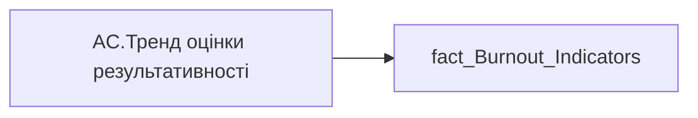

# AC.Тренд оцінки результативності

| Властивість | Значення |
|---|---|
| Тип | міра |
| Home table | _Measures |
| displayFolder | `Analytical Cases\Burnout_Risk\Main` |
| formatString | — |
| dataType | — |
| Прихована | ні |

## DAX

```dax
VAR _v = SELECTEDVALUE('fact_Burnout_Indicators'[PERFORMANCE_RATE_TREND])

/* розміри під матрицю */
VAR _vw = 110
VAR _vh = 16
VAR _sw = 1.8   // товщина лінії

/* кольори */
VAR _colUp   = "#14AE5C"
VAR _colDown = "#E84C3D"
VAR _colFlat = "#9AA0A6"
VAR _textColor = "#333333"
VAR _font       = 13  // збільшений розмір шрифту
VAR _fontFamily = "Segoe UI"

/* ярлик */
VAR _label =
	SWITCH(
		TRUE(),
		_v = "Зростання",  "Зростання",
		_v = "Спадання",   "Спадання",
		_v = "Стабільний", "Стабільний",
		BLANK(), "-"
	)

/* СТРІЛКА ВГОРУ - паралельні 1 і 3 лінії */
VAR _up =
"data:image/svg+xml;utf8," &
"<svg xmlns='http://www.w3.org/2000/svg' width='"&_vw&"' height='"&_vh&"' viewBox='0 0 110 16'>" &
"<defs>" &
	"<marker id='arrowUp' markerWidth='4' markerHeight='4' refX='2' refY='2' orient='auto'>" &
	"<path d='M0,4 L4,2 L0,0' fill='none' stroke='"&_colUp&"' stroke-width='1'/>" &
	"</marker>" &
"</defs>" &
"<g transform='translate(5,8)'>" &
	"<path d='M0,1 L6,-2 L10,1 L16,-2' fill='none' stroke='"&_colUp&"' stroke-width='"&_sw&"' stroke-linecap='round' stroke-linejoin='round' marker-end='url(#arrowUp)'/>" &
"</g>" &
"<text x='28' y='12' font-size='"&_font&"' font-family='"&_fontFamily&"' fill='"&_textColor&"' font-weight='400'>"&_label&"</text>" &
"</svg>"

/* СТРІЛКА ВНИЗ - паралельні 1 і 3 лінії */
VAR _down =
"data:image/svg+xml;utf8," &
"<svg xmlns='http://www.w3.org/2000/svg' width='"&_vw&"' height='"&_vh&"' viewBox='0 0 110 16'>" &
"<defs>" &
	"<marker id='arrowDown' markerWidth='4' markerHeight='4' refX='2' refY='2' orient='auto'>" &
	"<path d='M0,0 L4,2 L0,4' fill='none' stroke='"&_colDown&"' stroke-width='1'/>" &
	"</marker>" &
"</defs>" &
"<g transform='translate(5,8)'>" &
	"<path d='M0,-1 L6,2 L10,-1 L16,2' fill='none' stroke='"&_colDown&"' stroke-width='"&_sw&"' stroke-linecap='round' stroke-linejoin='round' marker-end='url(#arrowDown)'/>" &
"</g>" &
"<text x='28' y='12' font-size='"&_font&"' font-family='"&_fontFamily&"' fill='"&_textColor&"' font-weight='400'>"&_label&"</text>" &
"</svg>"

/* СТРІЛКА ГОРИЗОНТАЛЬНА - збільшена */
VAR _flat =
"data:image/svg+xml;utf8," &
"<svg xmlns='http://www.w3.org/2000/svg' width='"&_vw&"' height='"&_vh&"' viewBox='0 0 110 16'>" &
"<defs>" &
	"<marker id='arrowFlat' markerWidth='4' markerHeight='4' refX='3.5' refY='2' orient='auto'>" &
	"<path d='M0,0 L4,2 L0,4 L1,2 Z' fill='"&_colFlat&"'/>" &
	"</marker>" &
"</defs>" &
"<g transform='translate(5,8)'>" &
	"<line x1='0' y1='0' x2='16' y2='0' stroke='"&_colFlat&"' stroke-width='"&_sw&"' stroke-linecap='round' marker-end='url(#arrowFlat)'/>" &
"</g>" &
"<text x='28' y='12' font-size='"&_font&"' font-family='"&_fontFamily&"' fill='"&_textColor&"' font-weight='400'>"&_label&"</text>" &
"</svg>"

/* ПРОЧЕРК для пустих значень */
VAR _empty =
"data:image/svg+xml;utf8," &
"<svg xmlns='http://www.w3.org/2000/svg' width='"&_vw&"' height='"&_vh&"' viewBox='0 0 110 16'>" &
"<g transform='translate(35,8)'>" &
	"<line x1='0' y1='0' x2='13' y2='0' stroke='"&_colFlat&"' stroke-width='"&_sw&"' stroke-linecap='round'/>" &
"</g>" &
"</svg>"

VAR _res =
	SWITCH(
		TRUE(),
		_v = "Зростання",  _up,
		_v = "Спадання",   _down,
		_v = "Стабільний", _flat,
		_empty
	)

RETURN _res
```

## Джерела


Колонки: `PERFORMANCE_RATE_TREND`

Power Query: `fact_Burnout_Indicators`

## Бізнес-суть

PERFORMANCE_RATE_TREND → Тренд Оцінки рез-ті (%); PERFORMANCE_RATE_TREND → Тренд оцінки результативності

**Вимоги:** `Кейс-Втрати-Продуктивності-Працівників`, `Кейс-Утримання-працівників/Опис-джерел-для-сторінки-%22Кейс-звільнення-(вигорання)%22`

## Залежності

Таблиці: `fact_Burnout_Indicators`

Колонки: `fact_Burnout_Indicators[PERFORMANCE_RATE_TREND]`

## Схема



## Нотатки

_порожньо_
