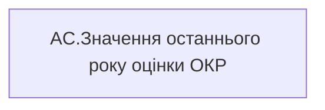

# AC.Значення останнього року оцінки ОКР

*тека `Analytical Cases\Burnout_Risk\Main`*

## Бізнес-суть

Значення останнього року оцінки ОКР

Значення останнього року оцінки ОКР визначати в залежності від того, які дані доступні на поточний момент. Наприклад, протягом 2025 року в оцінку брати коефіцієнт індивідуального бонусу працівника за 2023-2024 роки, бо за 2025 рік оцінки ще немає. Тому останній рік буде 2024. На початку 2026 року, коли з'являться результати оцінки ОКР за 2025 рік, потрібно буде змістити період і брати 2025 рік.  <br>  <br>Для того, що визначити період (рік), за який виставлено індивідуальний бонус, потрібно:  <br>1. Із таблиці dwh.t_sf_okr_objective_monitor потрібно визначити Form_template_ID по ключу Form_Emp

**Вимоги:** `Допоміжні-вітрини-для-звіту/Таблиця-для-розрахунку-агрегованих-метрик-по-звіту`, `Кейс-Утримання-працівників/Опис-джерел-для-сторінки-%22Кейс-звільнення-(вигорання)%22`, `Командний-профіль/Паспортна-частина-групового-профілю/Додати-інформацію-про-ОКР-команди-та-середню-оцінку-результативності-по-команді`

## На сторінках звіту

_Не використовується на основних сторінках звіту._

## Пов'язані міри

_Прямих зв'язків з іншими мірами немає._

---

## Технічний опис

| Властивість | Значення |
|---|---|
| Тип | міра |
| Home table | _Measures |
| displayFolder | `Analytical Cases\Burnout_Risk\Main` |
| formatString | — |
| dataType | — |
| Прихована | ні |

### DAX

```dax
"-"
```

### Джерела даних

—

### Залежності (таблиці й колонки)

—

### Схема



## Нотатки

_порожньо_
