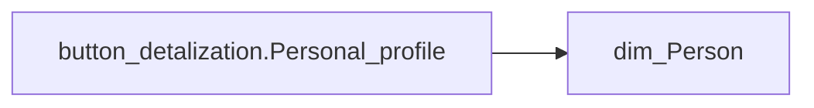

# button_detalization.Personal_profile

*тека `Navigation\Personal`*

## Технічний опис

| Властивість | Значення |
|---|---|
| Тип | міра |
| Home table | _Measures |
| displayFolder | `Navigation\Personal` |
| formatString | — |
| dataType | — |
| Прихована | ні |

### DAX

```dax
IF(
	ISBLANK(COUNTROWS('fact_Employee_List')),
	"ПОПЕРЕДЖЕННЯ! Застосовано некоректні відбори. Будь ласка, скиньте фільтр в рядку пошуку",
	IF(
		HASONEVALUE('dim_Person'[FULL_NAME]),
		"Перейти до персонального профілю "&SELECTEDVALUE('dim_Person'[FULL_NAME]),
		"Для переходу в персональний профіль, оберіть працівника зі списку"
	)
)
```

### Джерела даних

Вихідні таблиці: `DM.vw_R27_dim_Person_PDP`

Колонки: `FULL_NAME`

Power Query: `dim_Person`

### Залежності (таблиці й колонки)

Таблиці: `dim_Person`

Колонки: `dim_Person[FULL_NAME]`

### Схема



---

## Бізнес-суть

!!! note "Бізнес-визначення відсутнє"
    Поля міри не зіставлено з wiki «Таблицями джерел даних». Можна заповнити вручну в `manualNotes`.

## На сторінках звіту

_Не використовується на основних сторінках звіту._

## Пов'язані міри

_Прямих зв'язків з іншими мірами немає._

## Нотатки

_порожньо_
