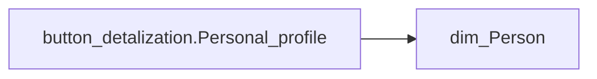

# button_detalization.Personal_profile

*тека `Navigation\Personal`*

## Бізнес-суть

FULL_NAME → ПІБ співробітника; FULL_NAME → Прізвище, ім'я, по-батькові; FULL_NAME → Функціональний керівник; FULL_NAME → HRBP; FULL_NAME → FinBP; FULL_NAME → employee_name; FULL_NAME → ПІБ звільненого працівника

person_key=employee_id Поле зберігається в довіднику [dm.vw_R27_dim_person ]  <br>Це поле має бути доступне у візуалізаціях, побудованих на основі фактової таблиці [dm.vw_R27_fact_Employee_List], через відповідний зв’язок за ключем [person_key].  <br>Поле завжди має значення, пусте поле не допускається  <br>Якщо ПІБ не вміщається в одну строку, перенести на іншу Поле зберігається в довіднику [dm.vw_R27_dim_person ]  <br>Це поле має бути доступне у візуалізаціях, побудованих на основі фактової таблиці [dm.vw_R27_fact_Employee_List], через відповідний зв’язок за ключем [person_key].  <br>Поле за

**Вимоги:** `Індивідуальний-профіль-працівника/Історія-по-посадам`, `Індивідуальний-профіль-працівника/Історія-по-посадам/Реліз-1.-Історія-по-посадам`, `Індивідуальний-профіль-працівника/Паспортна-частина-індивідуального-профілю-співробітника`, `Індивідуальний-профіль-працівника/Паспортна-частина-індивідуального-профілю-співробітника/Сторінка-Картка-(паспорт)-працівника`, `Індивідуальний-профіль-працівника/Сторінка-Індивідуальний-профіль-працівника`, `Індивідуальний-профіль-працівника/Сторінка-Взаємодія-Viva-та-залученість-працівника/Сторінка-Ефективність-працівника/Вітрина-Відвідування-офісів`, `Індивідуальний-профіль-працівника/Сторінка-Загальна-інформація-про-працівника`, `Допоміжні-вітрини-для-звіту/Таблиця-для-розрахунку-агрегованих-метрик-по-звіту`, `Командний-профіль/Паспортна-частина-групового-профілю/Редизайн-паспортної-частини-групового-профілю`, `Командний-профіль/Сторінка-Загальна-інформація-про-команду`, `Командний-профіль/Сторінка-Плинність-та-Exits/ТЗ-на-вітрину-Exits`

## На сторінках звіту

_Не використовується на основних сторінках звіту._

## Пов'язані міри

_Прямих зв'язків з іншими мірами немає._

---

## Технічний опис

| Властивість | Значення |
|---|---|
| Тип | міра |
| Home table | _Measures |
| displayFolder | `Navigation\Personal` |
| formatString | — |
| dataType | — |
| Прихована | ні |

### DAX

```dax
IF(
	ISBLANK(COUNTROWS('fact_Employee_List')),
	"ПОПЕРЕДЖЕННЯ! Застосовано некоректні відбори. Будь ласка, скиньте фільтр в рядку пошуку",
	IF(
		HASONEVALUE('dim_Person'[FULL_NAME]),
		"Перейти до персонального профілю "&SELECTEDVALUE('dim_Person'[FULL_NAME]),
		"Для переходу в персональний профіль, оберіть працівника зі списку"
	)
)
```

### Джерела даних

Вихідні таблиці: `DM.vw_R27_dim_Person_PDP`

Колонки: `FULL_NAME`

Power Query: `dim_Person`

### Залежності (таблиці й колонки)

Таблиці: `dim_Person`

Колонки: `dim_Person[FULL_NAME]`

### Схема



## Нотатки

_порожньо_
