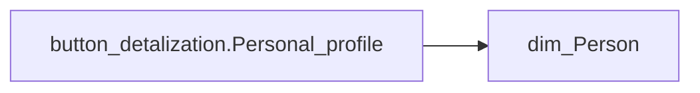

# button_detalization.Personal_profile

*тека `Navigation\Personal`*

## Технічний опис

| Властивість | Значення |
|---|---|
| Тип | міра |
| Home table | _Measures |
| displayFolder | `Navigation\Personal` |
| formatString | — |
| dataType | — |
| Прихована | ні |

### DAX

```dax
IF(
	ISBLANK(COUNTROWS('fact_Employee_List')),
	"ПОПЕРЕДЖЕННЯ! Застосовано некоректні відбори. Будь ласка, скиньте фільтр в рядку пошуку",
	IF(
		HASONEVALUE('dim_Person'[FULL_NAME]),
		"Перейти до персонального профілю "&SELECTEDVALUE('dim_Person'[FULL_NAME]),
		"Для переходу в персональний профіль, оберіть працівника зі списку"
	)
)
```

### Джерела даних

Вихідні таблиці: `DM.vw_R27_dim_Person_PDP`

Колонки: `FULL_NAME`

Power Query: `dim_Person`

### Залежності (таблиці й колонки)

Таблиці: `dim_Person`

Колонки: `dim_Person[FULL_NAME]`

### Схема



---

## Бізнес-суть

### Опис із ТЗ

`person_key`=`employee_id`

Поле зберігається в довіднику `dm.`vw_R27_dim_person` `   Це поле має бути доступне у візуалізаціях, побудованих на основі фактової таблиці `dm.vw_R27_fact_Employee_List`, через відповідний зв’язок за ключем `person_key`.   Поле завжди має значення, пусте поле не допускається   Якщо ПІБ не вміщається в одну строку, перенести на іншу

Поле зберігається в довіднику `dm.`vw_R27_dim_person` `   Це поле має бути доступне у візуалізаціях, побудованих на основі фактової таблиці `dm.vw_R27_fact_Employee_List`, через відповідний зв’язок за ключем `person_key`.   Поле завжди має значення, пусте поле не допускається   Якщо не вміщається в одну строку, перенести на іншу

Поле зберігається в довіднику ` dm.vw_R27_dim_person`   Це поле має бути доступне у візуалізаціях, побудованих на основі фактової таблиці `dm.vw_R27_fact_Employee_List_PDP` та таблиці dm.`vw_R27_dim_Employee_Special_Head_functional`, через відповідний зв’язок за ключем `emp_head_functional_id` = id, щоб із  таблиці dm.`vw_R27_dim_person` по ключу `emp_head_functional_id` =`person_key` витягти значення  `full_name`.   Якщо значення в полі відсутнє, то показати текст "Дані відсутні"   Якщо ПІБ керівника не вміщається в одну строку, перенести на іншу

Поле зберігається в довіднику ` dm.vw_R27_dim_person`   Це поле має бути доступне у візуалізаціях, побудованих на основі фактової таблиці `dm.vw_R27_fact_Employee_List_PDP` та таблиці dm.`vw_R27_dim_Employee_Special_Head_HRBP`, через відповідний зв’язок за ключем `emp_hrbp_id` = id, щоб із  таблиці dm.`vw_R27_dim_person` по ключу `emp_hrbp_id` =`person_key` витягти значення  `full_name`.   Якщо значення в полі відсутнє, то показати текст "Дані відсутні"   Якщо ПІБ HRBP не вміщається в одну строку, перенести на іншу

??? note "Поля-джерела та пов'язані бізнес-метрики (7)"
    | Поле | Бізнес-метрики |
    |---|---|
    | `FULL_NAME` | ПІБ співробітника · Прізвище, ім'я, по-батькові · Функціональний керівник · HRBP · FinBP · employee_name · ПІБ звільненого працівника |

**Вимоги (ТЗ):**

- [Індивідуальний профіль працівника › Історія по посадам](https://dev.azure.com/MHPITDepProjects/People%20Digital%20Profile%20%28PDP%29/_wiki/wikis/PDP.wiki?pagePath=/%D0%A4%D1%83%D0%BD%D0%BA%D1%86%D1%96%D0%BE%D0%BD%D0%B0%D0%BB%D1%8C%D0%BD%D1%96%20%D0%B2%D0%B8%D0%BC%D0%BE%D0%B3%D0%B8/%D0%92%D0%B8%D0%BC%D0%BE%D0%B3%D0%B8%20%D0%B4%D0%BE%20%D0%B7%D0%B2%D1%96%D1%82%D1%83%20People%20Digital%20Profile/%D0%86%D0%BD%D0%B4%D0%B8%D0%B2%D1%96%D0%B4%D1%83%D0%B0%D0%BB%D1%8C%D0%BD%D0%B8%D0%B9%20%D0%BF%D1%80%D0%BE%D1%84%D1%96%D0%BB%D1%8C%20%D0%BF%D1%80%D0%B0%D1%86%D1%96%D0%B2%D0%BD%D0%B8%D0%BA%D0%B0/%D0%86%D1%81%D1%82%D0%BE%D1%80%D1%96%D1%8F%20%D0%BF%D0%BE%20%D0%BF%D0%BE%D1%81%D0%B0%D0%B4%D0%B0%D0%BC)
- [Індивідуальний профіль працівника › Історія по посадам › Реліз 1. Історія по посадам](https://dev.azure.com/MHPITDepProjects/People%20Digital%20Profile%20%28PDP%29/_wiki/wikis/PDP.wiki?pagePath=/%D0%A4%D1%83%D0%BD%D0%BA%D1%86%D1%96%D0%BE%D0%BD%D0%B0%D0%BB%D1%8C%D0%BD%D1%96%20%D0%B2%D0%B8%D0%BC%D0%BE%D0%B3%D0%B8/%D0%92%D0%B8%D0%BC%D0%BE%D0%B3%D0%B8%20%D0%B4%D0%BE%20%D0%B7%D0%B2%D1%96%D1%82%D1%83%20People%20Digital%20Profile/%D0%86%D0%BD%D0%B4%D0%B8%D0%B2%D1%96%D0%B4%D1%83%D0%B0%D0%BB%D1%8C%D0%BD%D0%B8%D0%B9%20%D0%BF%D1%80%D0%BE%D1%84%D1%96%D0%BB%D1%8C%20%D0%BF%D1%80%D0%B0%D1%86%D1%96%D0%B2%D0%BD%D0%B8%D0%BA%D0%B0/%D0%86%D1%81%D1%82%D0%BE%D1%80%D1%96%D1%8F%20%D0%BF%D0%BE%20%D0%BF%D0%BE%D1%81%D0%B0%D0%B4%D0%B0%D0%BC/%D0%A0%D0%B5%D0%BB%D1%96%D0%B7%201.%20%D0%86%D1%81%D1%82%D0%BE%D1%80%D1%96%D1%8F%20%D0%BF%D0%BE%20%D0%BF%D0%BE%D1%81%D0%B0%D0%B4%D0%B0%D0%BC)
- [Індивідуальний профіль працівника › Паспортна частина індивідуального профілю співробітника](https://dev.azure.com/MHPITDepProjects/People%20Digital%20Profile%20%28PDP%29/_wiki/wikis/PDP.wiki?pagePath=/%D0%A4%D1%83%D0%BD%D0%BA%D1%86%D1%96%D0%BE%D0%BD%D0%B0%D0%BB%D1%8C%D0%BD%D1%96%20%D0%B2%D0%B8%D0%BC%D0%BE%D0%B3%D0%B8/%D0%92%D0%B8%D0%BC%D0%BE%D0%B3%D0%B8%20%D0%B4%D0%BE%20%D0%B7%D0%B2%D1%96%D1%82%D1%83%20People%20Digital%20Profile/%D0%86%D0%BD%D0%B4%D0%B8%D0%B2%D1%96%D0%B4%D1%83%D0%B0%D0%BB%D1%8C%D0%BD%D0%B8%D0%B9%20%D0%BF%D1%80%D0%BE%D1%84%D1%96%D0%BB%D1%8C%20%D0%BF%D1%80%D0%B0%D1%86%D1%96%D0%B2%D0%BD%D0%B8%D0%BA%D0%B0/%D0%9F%D0%B0%D1%81%D0%BF%D0%BE%D1%80%D1%82%D0%BD%D0%B0%20%D1%87%D0%B0%D1%81%D1%82%D0%B8%D0%BD%D0%B0%20%D1%96%D0%BD%D0%B4%D0%B8%D0%B2%D1%96%D0%B4%D1%83%D0%B0%D0%BB%D1%8C%D0%BD%D0%BE%D0%B3%D0%BE%20%D0%BF%D1%80%D0%BE%D1%84%D1%96%D0%BB%D1%8E%20%D1%81%D0%BF%D1%96%D0%B2%D1%80%D0%BE%D0%B1%D1%96%D1%82%D0%BD%D0%B8%D0%BA%D0%B0)
- [Індивідуальний профіль працівника › Паспортна частина індивідуального профілю співробітника › Сторінка Картка (паспорт) працівника](https://dev.azure.com/MHPITDepProjects/People%20Digital%20Profile%20%28PDP%29/_wiki/wikis/PDP.wiki?pagePath=/%D0%A4%D1%83%D0%BD%D0%BA%D1%86%D1%96%D0%BE%D0%BD%D0%B0%D0%BB%D1%8C%D0%BD%D1%96%20%D0%B2%D0%B8%D0%BC%D0%BE%D0%B3%D0%B8/%D0%92%D0%B8%D0%BC%D0%BE%D0%B3%D0%B8%20%D0%B4%D0%BE%20%D0%B7%D0%B2%D1%96%D1%82%D1%83%20People%20Digital%20Profile/%D0%86%D0%BD%D0%B4%D0%B8%D0%B2%D1%96%D0%B4%D1%83%D0%B0%D0%BB%D1%8C%D0%BD%D0%B8%D0%B9%20%D0%BF%D1%80%D0%BE%D1%84%D1%96%D0%BB%D1%8C%20%D0%BF%D1%80%D0%B0%D1%86%D1%96%D0%B2%D0%BD%D0%B8%D0%BA%D0%B0/%D0%9F%D0%B0%D1%81%D0%BF%D0%BE%D1%80%D1%82%D0%BD%D0%B0%20%D1%87%D0%B0%D1%81%D1%82%D0%B8%D0%BD%D0%B0%20%D1%96%D0%BD%D0%B4%D0%B8%D0%B2%D1%96%D0%B4%D1%83%D0%B0%D0%BB%D1%8C%D0%BD%D0%BE%D0%B3%D0%BE%20%D0%BF%D1%80%D0%BE%D1%84%D1%96%D0%BB%D1%8E%20%D1%81%D0%BF%D1%96%D0%B2%D1%80%D0%BE%D0%B1%D1%96%D1%82%D0%BD%D0%B8%D0%BA%D0%B0/%D0%A1%D1%82%D0%BE%D1%80%D1%96%D0%BD%D0%BA%D0%B0%20%D0%9A%D0%B0%D1%80%D1%82%D0%BA%D0%B0%20%28%D0%BF%D0%B0%D1%81%D0%BF%D0%BE%D1%80%D1%82%29%20%D0%BF%D1%80%D0%B0%D1%86%D1%96%D0%B2%D0%BD%D0%B8%D0%BA%D0%B0)
- [Індивідуальний профіль працівника › Сторінка Індивідуальний профіль працівника](https://dev.azure.com/MHPITDepProjects/People%20Digital%20Profile%20%28PDP%29/_wiki/wikis/PDP.wiki?pagePath=/%D0%A4%D1%83%D0%BD%D0%BA%D1%86%D1%96%D0%BE%D0%BD%D0%B0%D0%BB%D1%8C%D0%BD%D1%96%20%D0%B2%D0%B8%D0%BC%D0%BE%D0%B3%D0%B8/%D0%92%D0%B8%D0%BC%D0%BE%D0%B3%D0%B8%20%D0%B4%D0%BE%20%D0%B7%D0%B2%D1%96%D1%82%D1%83%20People%20Digital%20Profile/%D0%86%D0%BD%D0%B4%D0%B8%D0%B2%D1%96%D0%B4%D1%83%D0%B0%D0%BB%D1%8C%D0%BD%D0%B8%D0%B9%20%D0%BF%D1%80%D0%BE%D1%84%D1%96%D0%BB%D1%8C%20%D0%BF%D1%80%D0%B0%D1%86%D1%96%D0%B2%D0%BD%D0%B8%D0%BA%D0%B0/%D0%A1%D1%82%D0%BE%D1%80%D1%96%D0%BD%D0%BA%D0%B0%20%D0%86%D0%BD%D0%B4%D0%B8%D0%B2%D1%96%D0%B4%D1%83%D0%B0%D0%BB%D1%8C%D0%BD%D0%B8%D0%B9%20%D0%BF%D1%80%D0%BE%D1%84%D1%96%D0%BB%D1%8C%20%D0%BF%D1%80%D0%B0%D1%86%D1%96%D0%B2%D0%BD%D0%B8%D0%BA%D0%B0)
- [Індивідуальний профіль працівника › Сторінка Взаємодія Viva та залученість працівника › Сторінка Ефективність працівника › Вітрина Відвідування офісів](https://dev.azure.com/MHPITDepProjects/People%20Digital%20Profile%20%28PDP%29/_wiki/wikis/PDP.wiki?pagePath=/%D0%A4%D1%83%D0%BD%D0%BA%D1%86%D1%96%D0%BE%D0%BD%D0%B0%D0%BB%D1%8C%D0%BD%D1%96%20%D0%B2%D0%B8%D0%BC%D0%BE%D0%B3%D0%B8/%D0%92%D0%B8%D0%BC%D0%BE%D0%B3%D0%B8%20%D0%B4%D0%BE%20%D0%B7%D0%B2%D1%96%D1%82%D1%83%20People%20Digital%20Profile/%D0%86%D0%BD%D0%B4%D0%B8%D0%B2%D1%96%D0%B4%D1%83%D0%B0%D0%BB%D1%8C%D0%BD%D0%B8%D0%B9%20%D0%BF%D1%80%D0%BE%D1%84%D1%96%D0%BB%D1%8C%20%D0%BF%D1%80%D0%B0%D1%86%D1%96%D0%B2%D0%BD%D0%B8%D0%BA%D0%B0/%D0%A1%D1%82%D0%BE%D1%80%D1%96%D0%BD%D0%BA%D0%B0%20%D0%92%D0%B7%D0%B0%D1%94%D0%BC%D0%BE%D0%B4%D1%96%D1%8F%20Viva%20%D1%82%D0%B0%20%D0%B7%D0%B0%D0%BB%D1%83%D1%87%D0%B5%D0%BD%D1%96%D1%81%D1%82%D1%8C%20%D0%BF%D1%80%D0%B0%D1%86%D1%96%D0%B2%D0%BD%D0%B8%D0%BA%D0%B0/%D0%A1%D1%82%D0%BE%D1%80%D1%96%D0%BD%D0%BA%D0%B0%20%D0%95%D1%84%D0%B5%D0%BA%D1%82%D0%B8%D0%B2%D0%BD%D1%96%D1%81%D1%82%D1%8C%20%D0%BF%D1%80%D0%B0%D1%86%D1%96%D0%B2%D0%BD%D0%B8%D0%BA%D0%B0/%D0%92%D1%96%D1%82%D1%80%D0%B8%D0%BD%D0%B0%20%D0%92%D1%96%D0%B4%D0%B2%D1%96%D0%B4%D1%83%D0%B2%D0%B0%D0%BD%D0%BD%D1%8F%20%D0%BE%D1%84%D1%96%D1%81%D1%96%D0%B2)
- [Індивідуальний профіль працівника › Сторінка Загальна інформація про працівника](https://dev.azure.com/MHPITDepProjects/People%20Digital%20Profile%20%28PDP%29/_wiki/wikis/PDP.wiki?pagePath=/%D0%A4%D1%83%D0%BD%D0%BA%D1%86%D1%96%D0%BE%D0%BD%D0%B0%D0%BB%D1%8C%D0%BD%D1%96%20%D0%B2%D0%B8%D0%BC%D0%BE%D0%B3%D0%B8/%D0%92%D0%B8%D0%BC%D0%BE%D0%B3%D0%B8%20%D0%B4%D0%BE%20%D0%B7%D0%B2%D1%96%D1%82%D1%83%20People%20Digital%20Profile/%D0%86%D0%BD%D0%B4%D0%B8%D0%B2%D1%96%D0%B4%D1%83%D0%B0%D0%BB%D1%8C%D0%BD%D0%B8%D0%B9%20%D0%BF%D1%80%D0%BE%D1%84%D1%96%D0%BB%D1%8C%20%D0%BF%D1%80%D0%B0%D1%86%D1%96%D0%B2%D0%BD%D0%B8%D0%BA%D0%B0/%D0%A1%D1%82%D0%BE%D1%80%D1%96%D0%BD%D0%BA%D0%B0%20%D0%97%D0%B0%D0%B3%D0%B0%D0%BB%D1%8C%D0%BD%D0%B0%20%D1%96%D0%BD%D1%84%D0%BE%D1%80%D0%BC%D0%B0%D1%86%D1%96%D1%8F%20%D0%BF%D1%80%D0%BE%20%D0%BF%D1%80%D0%B0%D1%86%D1%96%D0%B2%D0%BD%D0%B8%D0%BA%D0%B0)
- [Допоміжні вітрини для звіту › Таблиця для розрахунку агрегованих метрик по звіту](https://dev.azure.com/MHPITDepProjects/People%20Digital%20Profile%20%28PDP%29/_wiki/wikis/PDP.wiki?pagePath=/%D0%A4%D1%83%D0%BD%D0%BA%D1%86%D1%96%D0%BE%D0%BD%D0%B0%D0%BB%D1%8C%D0%BD%D1%96%20%D0%B2%D0%B8%D0%BC%D0%BE%D0%B3%D0%B8/%D0%92%D0%B8%D0%BC%D0%BE%D0%B3%D0%B8%20%D0%B4%D0%BE%20%D0%B7%D0%B2%D1%96%D1%82%D1%83%20People%20Digital%20Profile/%D0%94%D0%BE%D0%BF%D0%BE%D0%BC%D1%96%D0%B6%D0%BD%D1%96%20%D0%B2%D1%96%D1%82%D1%80%D0%B8%D0%BD%D0%B8%20%D0%B4%D0%BB%D1%8F%20%D0%B7%D0%B2%D1%96%D1%82%D1%83/%D0%A2%D0%B0%D0%B1%D0%BB%D0%B8%D1%86%D1%8F%20%D0%B4%D0%BB%D1%8F%20%D1%80%D0%BE%D0%B7%D1%80%D0%B0%D1%85%D1%83%D0%BD%D0%BA%D1%83%20%D0%B0%D0%B3%D1%80%D0%B5%D0%B3%D0%BE%D0%B2%D0%B0%D0%BD%D0%B8%D1%85%20%D0%BC%D0%B5%D1%82%D1%80%D0%B8%D0%BA%20%D0%BF%D0%BE%20%D0%B7%D0%B2%D1%96%D1%82%D1%83)
- [Командний профіль › Паспортна частина групового профілю › Редизайн паспортної частини групового профілю](https://dev.azure.com/MHPITDepProjects/People%20Digital%20Profile%20%28PDP%29/_wiki/wikis/PDP.wiki?pagePath=/%D0%A4%D1%83%D0%BD%D0%BA%D1%86%D1%96%D0%BE%D0%BD%D0%B0%D0%BB%D1%8C%D0%BD%D1%96%20%D0%B2%D0%B8%D0%BC%D0%BE%D0%B3%D0%B8/%D0%92%D0%B8%D0%BC%D0%BE%D0%B3%D0%B8%20%D0%B4%D0%BE%20%D0%B7%D0%B2%D1%96%D1%82%D1%83%20People%20Digital%20Profile/%D0%9A%D0%BE%D0%BC%D0%B0%D0%BD%D0%B4%D0%BD%D0%B8%D0%B9%20%D0%BF%D1%80%D0%BE%D1%84%D1%96%D0%BB%D1%8C/%D0%9F%D0%B0%D1%81%D0%BF%D0%BE%D1%80%D1%82%D0%BD%D0%B0%20%D1%87%D0%B0%D1%81%D1%82%D0%B8%D0%BD%D0%B0%20%D0%B3%D1%80%D1%83%D0%BF%D0%BE%D0%B2%D0%BE%D0%B3%D0%BE%20%D0%BF%D1%80%D0%BE%D1%84%D1%96%D0%BB%D1%8E/%D0%A0%D0%B5%D0%B4%D0%B8%D0%B7%D0%B0%D0%B9%D0%BD%20%D0%BF%D0%B0%D1%81%D0%BF%D0%BE%D1%80%D1%82%D0%BD%D0%BE%D1%97%20%D1%87%D0%B0%D1%81%D1%82%D0%B8%D0%BD%D0%B8%20%D0%B3%D1%80%D1%83%D0%BF%D0%BE%D0%B2%D0%BE%D0%B3%D0%BE%20%D0%BF%D1%80%D0%BE%D1%84%D1%96%D0%BB%D1%8E)
- [Командний профіль › Сторінка Загальна інформація про команду](https://dev.azure.com/MHPITDepProjects/People%20Digital%20Profile%20%28PDP%29/_wiki/wikis/PDP.wiki?pagePath=/%D0%A4%D1%83%D0%BD%D0%BA%D1%86%D1%96%D0%BE%D0%BD%D0%B0%D0%BB%D1%8C%D0%BD%D1%96%20%D0%B2%D0%B8%D0%BC%D0%BE%D0%B3%D0%B8/%D0%92%D0%B8%D0%BC%D0%BE%D0%B3%D0%B8%20%D0%B4%D0%BE%20%D0%B7%D0%B2%D1%96%D1%82%D1%83%20People%20Digital%20Profile/%D0%9A%D0%BE%D0%BC%D0%B0%D0%BD%D0%B4%D0%BD%D0%B8%D0%B9%20%D0%BF%D1%80%D0%BE%D1%84%D1%96%D0%BB%D1%8C/%D0%A1%D1%82%D0%BE%D1%80%D1%96%D0%BD%D0%BA%D0%B0%20%D0%97%D0%B0%D0%B3%D0%B0%D0%BB%D1%8C%D0%BD%D0%B0%20%D1%96%D0%BD%D1%84%D0%BE%D1%80%D0%BC%D0%B0%D1%86%D1%96%D1%8F%20%D0%BF%D1%80%D0%BE%20%D0%BA%D0%BE%D0%BC%D0%B0%D0%BD%D0%B4%D1%83)
- [Командний профіль › Сторінка Плинність та Exits › ТЗ на вітрину Exits](https://dev.azure.com/MHPITDepProjects/People%20Digital%20Profile%20%28PDP%29/_wiki/wikis/PDP.wiki?pagePath=/%D0%A4%D1%83%D0%BD%D0%BA%D1%86%D1%96%D0%BE%D0%BD%D0%B0%D0%BB%D1%8C%D0%BD%D1%96%20%D0%B2%D0%B8%D0%BC%D0%BE%D0%B3%D0%B8/%D0%92%D0%B8%D0%BC%D0%BE%D0%B3%D0%B8%20%D0%B4%D0%BE%20%D0%B7%D0%B2%D1%96%D1%82%D1%83%20People%20Digital%20Profile/%D0%9A%D0%BE%D0%BC%D0%B0%D0%BD%D0%B4%D0%BD%D0%B8%D0%B9%20%D0%BF%D1%80%D0%BE%D1%84%D1%96%D0%BB%D1%8C/%D0%A1%D1%82%D0%BE%D1%80%D1%96%D0%BD%D0%BA%D0%B0%20%D0%9F%D0%BB%D0%B8%D0%BD%D0%BD%D1%96%D1%81%D1%82%D1%8C%20%D1%82%D0%B0%20Exits/%D0%A2%D0%97%20%D0%BD%D0%B0%20%D0%B2%D1%96%D1%82%D1%80%D0%B8%D0%BD%D1%83%20Exits)

## На сторінках звіту

_Не використовується на основних сторінках звіту._

## Пов'язані міри

_Прямих зв'язків з іншими мірами немає._

## Нотатки

_порожньо_
